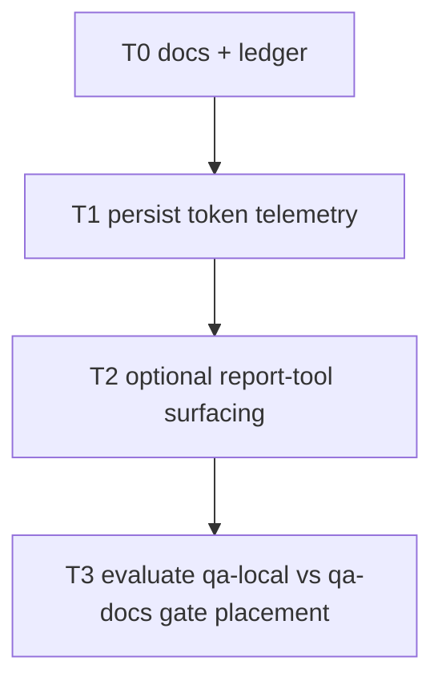

# Tasks: Gemma Audit Token Metrics

## Objective

Make Gemma audit history record meaningful token-usage telemetry for new
invocations by populating the existing token fields in the shared JSONL audit
schema and, optionally, exposing those values in the read-only report tool.

## Governing Documents

- `docs/plan/gemma-audit-token-metrics.md`
- `docs/adr/ADR-034-gemma-process-audit-and-reviewer-reconciliation.md`
- `docs/plan/gemma-audit-and-triple-pass.md`
- `docs/plan/gemma-push-reviewer-role.md`
- `docs/playbooks/AGENT_WORKFLOW_GUIDE.md`
- `docs/policies/HITL_AUTONOMY_POLICY.md`
- `docs/gemma-local-improve.md`

## Slice RRI

The implementation slice is **RRI 32 -> Moderate -> Effort M**.

**Score: 32 -> Moderate (26-40) -> Effort M -> thinking Off -> Gate: confirm
tests exist in the affected area and wait for explicit approval before code.**

| Variable | Score | Evidence | Confidence |
|---|---|---|---|
| C cyclomatic | 1 | helper return-shape and wrapper wiring, not new workflow branching | High |
| F files | 3 | wrapper + helper + tests span 8 files in the main task | High |
| D domain | 2 | local Ollama transport/audit tooling in Python | High |
| T coverage | 2 | helper and three wrappers need explicit presence/absence tests | High |
| A ambiguity | 0 | scope is narrow and the telemetry gap is already identified | High |
| K coupling | 2 | shared helper contract affects three Gemma roles | High |
| P impact | 1 | audit fidelity only; no authority or routing change | High |
| X context | 2 | requires context across helper, wrappers, and audit semantics | High |

No penalties apply. This is a bounded telemetry follow-up, not an architecture
decision or behavior-changing refactor.

## Behavioral Coverage Contract: unit-v1

Python script tasks use `python3 -m unittest` evidence. Development tasks below
must define and later certify `HP-#` / `EC-#` cases before closure.

## Task Order

---

## T0 - Plan and task ledger for token telemetry follow-up

- **Status:** [x] Done
- **Type:** documentation / planning
- **Effort:** S
- **RRI:** 2 -> Low
- **Scope:** `docs/plan/gemma-audit-token-metrics.md`,
  `docs/tasks/gemma-audit-token-metrics.md`
- **Depends on:** none

### Objective

Document the follow-up slice, its boundaries, its RRI basis, and its ordered
implementation tasks before any code changes begin.

### Acceptance Criteria

- Plan states why the token fields are currently empty and what the follow-up
  will and will not change.
- Task ledger defines ordered tasks, dependencies, RRI, and behavioral examples
  for development work.
- The plan preserves the existing authority boundaries from ADR-034.
- `make qa-docs` passes.

### Completion Evidence

- Created `docs/plan/gemma-audit-token-metrics.md`.
- Created `docs/tasks/gemma-audit-token-metrics.md`.
- `make qa-docs` passed.

### Agent Handoff Prompt

T0 - Document the token-telemetry follow-up only. Governing docs:
`docs/plan/gemma-audit-token-metrics.md`,
`docs/tasks/gemma-audit-token-metrics.md`. Do not change scripts. Stop after
`make qa-docs`.

---

## T1 - Persist token telemetry in Gemma audit records

- **Status:** [x] Done
- **Type:** development
- **Effort:** M
- **RRI:** 32 -> Moderate
- **Scope:** `scripts/gemma_local.py`, `scripts/delegate-low-rri.py`,
  `scripts/gemma-code-review.py`, `scripts/gemma-push-review.py`,
  `scripts/gemma_local_test.py`, `scripts/delegate_low_rri_test.py`,
  `scripts/gemma_code_review_test.py`, `scripts/gemma_push_review_test.py`
- **Depends on:** T0

### Objective

Extend the shared helper and the three Gemma wrappers so new audit-log records
persist meaningful token telemetry instead of always writing `null` or omitting
the token fields.

### Happy Path Examples

- **HP-1:** successful developer invocation with usage metadata available ->
  audit row records non-null `response_tokens` and deterministic prompt-size
  estimates.
- **HP-2:** successful reviewer invocation with usage metadata available ->
  aggregate audit row records non-null token telemetry without changing review
  findings or quorum semantics.
- **HP-3:** successful push-reviewer run with usage metadata available ->
  aggregate audit row includes push context plus token telemetry fields.

### Edge Case Examples

- **EC-1:** Ollama usage metadata is absent -> wrapper still writes a valid audit
  row and leaves only the unavailable measured field `null`.
- **EC-2:** `dry-run`, blocked, timeout, or quorum failure path -> no fabricated
  token counts are recorded.
- **EC-3:** file-level token estimation is not stable for a role -> that role
  keeps `file_tokens_est: null` and documents why.

### Acceptance Criteria

- `scripts/gemma_local.py` exposes usage metadata from the streamed Ollama
  response through a stable helper contract.
- `response_tokens` is populated only from real Ollama metadata, never from
  guessed character-length conversions.
- `packet_tokens_est` uses one deterministic estimation path shared across roles.
- `delegate-low-rri.py`, `gemma-code-review.py`, and `gemma-push-review.py`
  persist the token fields in their audit rows.
- Push Reviewer uses the same token-field names as the existing shared schema.
- Unit tests cover usage metadata present / absent behavior for all touched
  wrappers.

### Happy Paths Considered

- Developer, Reviewer, and Push Reviewer all emit audit rows with non-null token
  telemetry when metadata is available.
- Repeated runs of the same payload produce stable prompt-estimate values.

### Edge Cases Considered

- Missing usage counters do not fail the run.
- Historical rows with `null` token fields remain accepted by readers/tests.
- Aggregate-only audit rows do not claim per-pass token precision they do not
  actually have.

### Completion Evidence

- `scripts/gemma_local.py` now returns `StreamChatResult(content, usage)` and
  exposes deterministic helpers for payload estimation plus legacy-string
  compatibility.
- `scripts/delegate-low-rri.py`, `scripts/gemma-code-review.py`, and
  `scripts/gemma-push-review.py` now persist `packet_tokens_est` and
  `response_tokens`; `file_tokens_est` intentionally remains `null` where the
  file-level estimate is not stable or role-meaningful.
- Multi-pass reviewer aggregation sums measured `response_tokens` only when all
  pass attempts expose real metadata; otherwise it keeps the aggregate value
  `null`.
- Unit tests cover metadata present and metadata absent behavior across all
  touched wrappers.

### Gemma Reviewer evidence

- Model: local Gemma via Ollama
- Command: `make qa-gemma-review`
- Passes run / succeeded: `3/2`
- Quorum: `met`
- Aggregate status: `FINDINGS`
- Consensus findings: `0` | Pass-specific: `2` | Disagreement: `0`
- Blocking count: `0` | Major count: `0` | Minor count: `2` | Nit count: `0`
- Degraded: `true`
- Artifacts: `/tmp/dubbridge-gemma-review.pass1.json`, `/tmp/dubbridge-gemma-review.pass3.json`, `/tmp/dubbridge-gemma-review.json`
- Isolated adjudicator: not triggered
- disposition_divergence: none
- Primary-agent disposition: one in-scope minor finding on the token-estimate
  heuristic was addressed by clarifying the helper docstring that the estimate
  is comparative only and not billing-grade; one pass-specific minor finding on
  `crates/domain/src/artifact.rs` was outside this approved task scope and came
  from unrelated pre-existing worktree changes, so it was intentionally left
  untouched.

### Reflection log

Required passes: 2 (RRI 32 -> Moderate)

#### Pass 1

- **Draft verdict:** The helper should own both usage extraction and stable
  payload estimation so the three Gemma roles cannot drift.
- **Critique findings:** Returning a structured helper result risks breaking the
  many tests and wrapper mocks that still pass plain strings.
- **Revisions applied:** Added `stream_result_content()` and
  `stream_result_usage()` compatibility helpers so wrappers accept both the new
  structured result and existing legacy-string mocks.

#### Pass 2

- **Draft verdict:** Token telemetry should be useful without overstating
  precision.
- **Critique findings:** Aggregating reviewer token counts across multiple pass
  attempts could accidentally report a partial total as complete; the local
  estimate helper also needed a stronger warning about heuristic precision.
- **Revisions applied:** Reviewer aggregation now sums measured
  `response_tokens` only when every attempt reports real metadata; otherwise it
  keeps the aggregate `null`. The `estimate_text_tokens()` docstring now states
  explicitly that the estimate is comparative telemetry only, not a
  billing-grade count.

### Unit coverage certification

| Case ID | Type | Behavior | Unit test evidence | Result |
|---|---|---|---|---|
| HP-1 | Happy path | developer invocation with usage metadata records non-null `response_tokens` and deterministic prompt estimate | `scripts/delegate_low_rri_test.py::AuditEmission::test_patch_emits_one_record_with_developer_role` | passed |
| HP-2 | Happy path | reviewer invocations record token telemetry without changing single-pass or aggregate review behavior | `scripts/gemma_code_review_test.py::AuditEmission::test_pass_emits_one_record_with_reviewer_role`, `scripts/gemma_code_review_test.py::MultiPassCliAudit::test_multipass_pass_emits_one_record_with_d12_fields` | passed |
| HP-3 | Happy path | push-reviewer run records push context plus token telemetry fields | `scripts/gemma_push_review_test.py::RunPushAuditHappyPath::test_hp1_grounded_finding_written` | passed |
| EC-1 | Edge case | missing usage metadata keeps measured token fields `null` while preserving a valid audit row | `scripts/delegate_low_rri_test.py::AuditEmission::test_no_patch_emits_skipped_apply_result`, `scripts/gemma_code_review_test.py::AuditEmission::test_legacy_string_response_keeps_response_tokens_null`, `scripts/gemma_push_review_test.py::RunPushAuditHappyPath::test_legacy_string_response_keeps_response_tokens_null` | passed |
| EC-2 | Edge case | dry-run / blocked / timeout paths do not fabricate token counts | `scripts/gemma_push_review_test.py::RunPushAuditDryRun::test_dry_run_prints_model_payload`, `scripts/gemma_push_review_test.py::RunPushAuditOllamaUnavailable::test_ec4_no_audit_log_on_unavailable`, `scripts/delegate_low_rri_test.py::AuditEmission::test_blocked_emits_escalated_true` | passed |
| EC-3 | Edge case | unstable or partial multi-pass usage data does not claim a complete aggregate response-token total | `scripts/gemma_code_review_test.py::MultiPassCliAudit::test_multipass_partial_usage_keeps_response_tokens_null` | passed |

### Owner final verification

- Owner: `gpt-5.2-codex` (primary agent)
- Date: `2026-06-25`
- Statement: I verified every happy path and edge case defined for this task has
  unit test evidence that replicates the expected behavior. I also verified the
  mandatory Gemma Reviewer pass ran to quorum (`2/3`, degraded) and that the
  in-scope minor finding was addressed before closure.
- Commands run: `python3 -m unittest scripts.gemma_local_test`; `python3 -m unittest scripts.delegate_low_rri_test`; `python3 -m unittest scripts.gemma_code_review_test`; `python3 -m unittest scripts.gemma_push_review_test`; `make qa-gemma-review`; `make qa-docs`

### Agent Handoff Prompt

T1 - Persist token telemetry in Gemma audit records. Governing docs:
`docs/plan/gemma-audit-token-metrics.md`,
`docs/tasks/gemma-audit-token-metrics.md`. Files:
`scripts/gemma_local.py`, `scripts/delegate-low-rri.py`,
`scripts/gemma-code-review.py`, `scripts/gemma-push-review.py`, and their tests.
Acceptance: measured `response_tokens` from Ollama metadata where available,
deterministic prompt estimates, no guessed measured counts, no authority or
routing changes. Stop after the relevant Python unit tests pass.

---

## T2 - Optional report-tool surfacing for token telemetry

- **Status:** [x] Done
- **Type:** development
- **Effort:** S
- **RRI:** 18 -> Low
- **Scope:** `scripts/gemma-audit-report.py`,
  `scripts/gemma_audit_report_test.py`
- **Depends on:** T1

### Objective

Optionally expose the newly populated token fields in the read-only audit report
tool, so operators can inspect token-usage summaries without opening the raw
JSONL directly.

### Happy Path Examples

- **HP-1:** records include token telemetry -> report output includes aggregate
  counts or means without breaking existing metrics.
- **HP-2:** mixed historical data -> report still emits useful output even when
  only a subset of rows contain token telemetry.

### Edge Case Examples

- **EC-1:** all token fields are `null` -> report does not crash or print
  misleading zeroes as if they were measured values.
- **EC-2:** malformed or partial JSONL rows -> existing tolerant loading
  behavior remains unchanged.

### Acceptance Criteria

- Report output remains read-only and backward compatible.
- Token summaries distinguish absent data from measured zero.
- Existing metrics and anomaly thresholds remain unchanged unless explicitly
  extended.
- Unit tests cover mixed historical rows and no-data rows.

### Happy Paths Considered

- Text and/or JSON output can summarize token telemetry without losing the
  existing process metrics.

### Edge Cases Considered

- Old months with no token measurements remain readable.
- New token fields do not become implicit gates or failure conditions.

### Completion Evidence

- `scripts/gemma-audit-report.py` now computes read-only token summaries for
  `response_tokens` and `packet_tokens_est` using mixed-history tolerant
  aggregation that ignores missing measurements instead of coercing them to
  zero.
- Text output now emits a `token_telemetry` block only when at least one token
  field has measured data, preserving backward-compatible output for older
  months with all-null token telemetry.
- Existing threshold flags and anomaly logic remain unchanged; the change only
  surfaces additional summary fields.
- `scripts/gemma_audit_report_test.py` now covers mixed historical data,
  all-null token telemetry, visible text output when data exists, and omission
  of the token block when no data exists.

### Gemma Reviewer evidence

- Model: local Gemma via Ollama
- Command: `{ echo "# T2 Gemma Reviewer packet"; echo; echo "Task: T2 - Optional report-tool surfacing for token telemetry"; echo; echo "Acceptance criteria:"; echo "- Report output remains read-only and backward compatible."; echo "- Token summaries distinguish absent data from measured zero."; echo "- Existing metrics and anomaly thresholds remain unchanged unless explicitly extended."; echo "- Unit tests cover mixed historical rows and no-data rows."; echo; git diff -- scripts/gemma-audit-report.py scripts/gemma_audit_report_test.py; } | python3 scripts/gemma-code-review.py --out /tmp/dubbridge-gemma-review-t2.json -`
- Passes run / succeeded: `3/3`
- Quorum: `met`
- Aggregate status: `FINDINGS`
- Consensus findings: `1` | Pass-specific: `2` | Disagreement: `0`
- Degraded: `false`
- Artifacts: `/tmp/dubbridge-gemma-review-t2.pass1.json`, `/tmp/dubbridge-gemma-review-t2.pass2.json`, `/tmp/dubbridge-gemma-review-t2.pass3.json`, `/tmp/dubbridge-gemma-review-t2.json`
- Isolated adjudicator: not triggered
- disposition_divergence: none
- Primary-agent disposition: the aggregate consensus finding confirmed the
  intended contract rather than identifying a defect; it verified that the
  implementation preserves measured `0` values while excluding missing/`null`
  telemetry from the summary. The two pass-specific formatting suggestions were
  non-blocking cleanup ideas and were not required to satisfy the approved
  acceptance criteria, so no code change was made after reconciliation.

### Unit coverage certification

| Case ID | Type | Behavior | Unit test evidence | Result |
|---|---|---|---|---|
| HP-1 | Happy path | records with token telemetry produce aggregate token summaries and visible text output without disturbing existing metrics | `scripts/gemma_audit_report_test.py::ComputeMetrics::test_token_telemetry_summaries_ignore_nulls`, `scripts/gemma_audit_report_test.py::FormatText::test_token_telemetry_block_shown_when_data_present` | passed |
| HP-2 | Happy path | mixed historical rows with measured and unmeasured token fields remain readable and summarize only the measured subset | `scripts/gemma_audit_report_test.py::ComputeMetrics::test_token_telemetry_summaries_ignore_nulls` | passed |
| EC-1 | Edge case | all token fields `null` keep summary values absent and omit the telemetry text block instead of printing misleading zeroes | `scripts/gemma_audit_report_test.py::ComputeMetrics::test_token_telemetry_all_null_stays_none`, `scripts/gemma_audit_report_test.py::FormatText::test_token_telemetry_block_omitted_when_no_data` | passed |
| EC-2 | Edge case | malformed or partial JSONL rows preserve tolerant loading behavior | `scripts/gemma_audit_report_test.py::LoadRecords::test_ec1_malformed_line_skipped_with_count`, `scripts/gemma_audit_report_test.py::ComputeMetrics::test_ec2_null_optional_fields_tolerated` | passed |

### Owner final verification

- Owner: `gpt-5.2-codex` (primary agent)
- Date: `2026-06-25`
- Statement: I verified every happy path and edge case defined for this task has
  unit test evidence that replicates the expected read-only reporting behavior.
  I also verified the mandatory Gemma Reviewer pass reached full quorum (`3/3`)
  on the isolated T2 diff and that its aggregate finding did not require a code
  change for the approved acceptance criteria.
- Commands run: `python3 -m unittest scripts.gemma_audit_report_test`; `{ echo "# T2 Gemma Reviewer packet"; echo; echo "Task: T2 - Optional report-tool surfacing for token telemetry"; echo; echo "Acceptance criteria:"; echo "- Report output remains read-only and backward compatible."; echo "- Token summaries distinguish absent data from measured zero."; echo "- Existing metrics and anomaly thresholds remain unchanged unless explicitly extended."; echo "- Unit tests cover mixed historical rows and no-data rows."; echo; git diff -- scripts/gemma-audit-report.py scripts/gemma_audit_report_test.py; } | python3 scripts/gemma-code-review.py --out /tmp/dubbridge-gemma-review-t2.json -`

### Agent Handoff Prompt

T2 - Optionally surface token telemetry in the audit report tool. Governing
docs: `docs/plan/gemma-audit-token-metrics.md`,
`docs/tasks/gemma-audit-token-metrics.md`. Files:
`scripts/gemma-audit-report.py`, `scripts/gemma_audit_report_test.py`.
Acceptance: read-only reporting only, backward-compatible mixed-history handling,
no new gates. Stop after `python3 -m unittest scripts.gemma_audit_report_test`.

---

## T3 - Evaluate moving local Gemma triple-quorum review from `qa-docs` to `qa-local`

- **Status:** [x] Done
- **Type:** documentation / workflow evaluation
- **Effort:** S
- **RRI:** 6 -> Low
- **Scope:** `docs/plan/gemma-audit-token-metrics.md`,
  `docs/playbooks/AGENT_WORKFLOW_GUIDE.md`,
  `Makefile` and any directly-governing workflow docs if the evaluation is
  accepted for implementation
- **Depends on:** T2

### Objective

Evaluate whether the local Gemma triple-quorum code review that currently runs
through `make qa-docs` should instead be moved under `make qa-local`, so the
docs-validation path remains deterministic and non-Ollama-dependent by default
while local AI-assisted validation remains explicitly opt-in.

This task is documentation/evaluation only unless a separate approval later
authorizes changing the actual make targets or workflow wiring.

### Acceptance Criteria

- The evaluation captures the current behavior and its user-facing tradeoffs:
  deterministic docs validation vs local Gemma review cost and availability.
- The evaluation states whether `qa-docs` should remain as-is or delegate the
  Gemma review portion to `qa-local`.
- The evaluation lists affected commands and contracts, including any impact on
  `AGENT_WORKFLOW_GUIDE.md`, `HITL_AUTONOMY_POLICY.md`, and task-ledger closure
  expectations.
- No build or workflow command changes are made unless separately approved.

### Completion Evidence

- Documented the current wiring in `docs/plan/gemma-audit-token-metrics.md`:
  `qa-docs -> qa-gemma-review -> deterministic docs checks`,
  `qa-local -> Rust correctness checks`, and `qa-ci -> qa-local + qa-docs`.
- Recorded the recommendation not to keep the local Gemma quorum inside
  `qa-docs`, but also not to move it directly into `qa-local` while `qa-local`
  remains part of `qa-ci`.
- Recorded the preferred follow-up shape: keep `qa-docs` deterministic, keep
  `qa-local` focused on local correctness checks, and move the Gemma quorum only
  via a dedicated explicit local-only target or a coordinated `qa-local` +
  `qa-ci` contract change.
- No make targets, workflow scripts, or policy gates were changed in this task.

### Agent Handoff Prompt

T3 - Evaluate whether local Gemma triple-quorum review belongs under
`make qa-local` instead of `make qa-docs`. Governing docs:
`docs/plan/gemma-audit-token-metrics.md` and the workflow/policy files. Default
scope is documentation and recommendation only. Do not change make targets or
workflow behavior without a separate approved implementation task.
