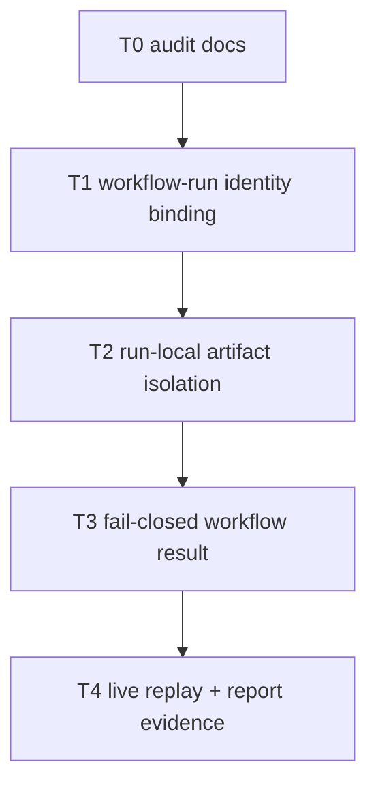

# Tasks: Gemma Push Review Hardening

## Objective

Make the advisory GitHub `push-review` runtime trustworthy by binding each run
to the correct triggering CI event, isolating run-local artifacts, and surfacing
blocked/degraded audits as visible workflow failures instead of silent green
success.

## Governing Documents

- `docs/plan/gemma-push-review-hardening.md`
- `docs/plan/gemma-push-reviewer-role.md`
- `docs/tasks/gemma-push-reviewer-role.md`
- `docs/playbooks/AGENT_WORKFLOW_GUIDE.md`
- `docs/policies/HITL_AUTONOMY_POLICY.md`
- `docs/policies/RRI_POLICY.md`
- `docs/daily/2026-06-25.md`

## Slice RRI

The hardening slice scores **RRI 43 -> Med-high -> Effort L**.

Evidence command:

```bash
python3 scripts/rri.py --auto-cc --T 2 --A 2 --X 3 --D 3 --K 3 --P 2 \
  --touches .github/workflows/push-review.yml \
  --touches scripts/gemma-push-review.py \
  --touches scripts/gemma_push_review_test.py \
  --touches scripts/gemma_push_ops_test.py \
  --platform python --json
```

Implementation requires explicit approval before code changes.

## Ground Truth

| ID | Area | Observed behavior | Evidence |
|---|---|---|---|
| H-PR-1 | workflow identity | `push-review` run for `main` audited SHA `50ba1b6` instead of pushed SHA `acdbeeb` | GitHub Actions run `28196951652` log |
| H-PR-2 | artifact isolation | uploaded artifact included stale reports `2026-06-25-9400b79.md` and `2026-06-25-c80bf06.md` from prior runs | artifact `7889486272` |
| H-PR-3 | failure signaling | audit script exited non-zero, but workflow still concluded `success` because `continue-on-error: true` masked the failure | `28196951652` summary + logs |
| H-PR-4 | blocked-report identity | blocked run emitted `2026-06-25-unknown.md` and `blocked.json` with null branch/head SHA | artifact `7889527338` |

## Task Order



---

## T0 - Capture the hardening plan and task ledger

- **Status:** done ✅
- **Type:** documentation / planning
- **Effort:** S
- **RRI:** 7 -> Low
- **Scope:** `docs/plan/gemma-push-review-hardening.md`,
  `docs/tasks/gemma-push-review-hardening.md`
- **Depends on:** none

### Objective

Record the hardening scope, live findings, and ordered tasks before modifying the
push-review runtime.

### Acceptance Criteria

1. The plan captures the live-failure evidence and remediation boundaries
2. The task ledger defines ordered development tasks with HP/EC examples
3. The slice RRI and approval gate are recorded

### Completion Evidence

- Created `docs/plan/gemma-push-review-hardening.md`
- Created `docs/tasks/gemma-push-review-hardening.md`
- Verified the new docs with `make qa-docs`

---

## T1 - Bind advisory runtime identity to the triggering `workflow_run`

- **Status:** done ✅
- **Type:** development
- **Effort:** L
- **RRI:** 43 -> Med-high
- **Scope:** `.github/workflows/push-review.yml`,
  `scripts/gemma-push-review.py`,
  `scripts/gemma_push_review_test.py`,
  `scripts/gemma_push_ops_test.py`
- **Depends on:** T0

### Objective

Ensure every advisory run uses the exact `workflow_run` identity that triggered
it for checkout, packet identity, blocked-report identity, and artifact naming.

### Happy Path Examples

- **HP-1:** completed `ci` run for SHA `X` triggers `push-review` -> workflow
  checks out SHA `X`, the packet records run id + SHA `X`, and the summary path
  is keyed to SHA `X`.
- **HP-2:** completed `ci` run on `main` fails in tests -> `push-review` still
  records the failed run context while preserving the correct branch and head SHA.

### Edge Case Examples

- **EC-1:** `workflow_run` event omits a local fallback field the script used to
  rely on -> the wrapper still prefers the event payload identity and does not
  collapse to null branch/head SHA.
- **EC-2:** a blocked parser/token failure occurs before final summary generation
  -> the blocked artifact still carries the triggering run id, branch, and head
  SHA instead of writing `unknown`.

### Acceptance Criteria

1. workflow env wiring and script identity normalization derive from the
   triggering `workflow_run`
2. blocked artifacts preserve non-null run identity when the event provided it
3. tests cover both success and blocked identity paths

### Completion Evidence

- Added `workflow_run` identity normalization for both GitHub event
  `snake_case` fields and `gh` CLI `camelCase` fields, including
  `run_attempt` / `attempt` compatibility
- Wired the workflow to pass explicit
  `DUBBRIDGE_PUSH_REVIEW_EVENT_PATH` and
  `DUBBRIDGE_PUSH_REVIEW_WORKFLOW` values from the triggering
  `workflow_run`
- Added tests for event-sourced identity resolution and blocked-report
  SHA retention
- Verified with:
  - `python3 -m unittest scripts/gemma_push_review_test.py`
  - `python3 scripts/gemma_push_ops_test.py`
  - `python3 -m py_compile scripts/gemma-push-review.py scripts/gemma_push_review_test.py scripts/gemma_push_ops_test.py`

---

## T2 - Isolate uploaded artifacts to the current advisory run

- **Status:** done ✅
- **Type:** development
- **Effort:** M
- **RRI:** 34 -> Moderate
- **Scope:** `.github/workflows/push-review.yml`,
  `scripts/gemma-push-review.py`,
  `scripts/gemma_push_review_test.py`,
  `scripts/gemma_push_ops_test.py`
- **Depends on:** T1

### Objective

Prevent stale committed summaries and prior-run files from being uploaded with
the current advisory artifact.

### Happy Path Examples

- **HP-1:** current run produces one SHA-scoped blocked or pass report -> upload
  artifact contains only files written by that run.

### Edge Case Examples

- **EC-1:** repository checkout already contains historical
  `docs/reports/push-review/*.md` files -> upload step excludes them.
- **EC-2:** prior runner state left `logs/gemma-push-review/` content on disk ->
  current run cleans or relocates outputs so only current-run files are uploaded.

### Acceptance Criteria

1. uploaded artifact paths are run-local and SHA-scoped
2. historical reports are not re-uploaded as current evidence
3. tests assert the workflow/upload path contract

### Completion Evidence

- Moved push-review Markdown summaries from checked-in
  `docs/reports/push-review/` into the advisory run output tree under
  `logs/gemma-push-review/<sha>/<advisory-run-id>/reports/`
- Scoped workflow upload to the current advisory run directory and named the
  artifact with both triggering SHA and advisory `github.run_id`
- Added tests that assert:
  - summary Markdown is written under the current `out_dir`
  - blocked summaries stay under the current `out_dir`
  - the workflow no longer uploads `docs/reports/push-review/`
- Verified with:
  - `python3 -m unittest scripts/gemma_push_review_test.py`
  - `python3 scripts/gemma_push_ops_test.py`
  - `python3 -m py_compile scripts/gemma-push-review.py scripts/gemma_push_review_test.py scripts/gemma_push_ops_test.py`

---

## T3 - Surface blocked/degraded audits as fail-closed workflow results

- **Status:** done ✅
- **Type:** development
- **Effort:** M
- **RRI:** 34 -> Moderate
- **Scope:** `.github/workflows/push-review.yml`,
  `scripts/gemma_push_ops_test.py`
- **Depends on:** T2

### Objective

Keep artifact upload and summaries, but stop reporting advisory runs as green
when the underlying audit blocked or degraded.

### Happy Path Examples

- **HP-1:** successful push audit with valid summary -> workflow concludes
  success and uploads the run-local artifact.

### Edge Case Examples

- **EC-1:** audit script exits non-zero after token-limit/parser failure ->
  upload still runs, but workflow result is failure.
- **EC-2:** blocked audit writes a fallback packet -> summary step runs and makes
  the blocked status visible without masking the job result.

### Acceptance Criteria

1. workflow no longer hides blocked/degraded audit failures behind
   `continue-on-error: true`
2. artifact upload remains `if: always()`
3. ops tests cover the fail-closed job contract

### Completion Evidence

- Removed `continue-on-error: true` from the advisory push-review step so the
  job result now reflects the actual `make qa-gemma-push-review` exit status
- Preserved both artifact upload and advisory summary under `if: always()`
  so blocked runs still emit evidence and a visible summary
- Expanded ops coverage to assert the workflow is fail-closed while still
  checking `steps.push_review.outcome` in the summary step
- Verified with:
  - `python3 scripts/gemma_push_ops_test.py`
  - `python3 -m unittest scripts/gemma_push_review_test.py`
  - `python3 -m py_compile scripts/gemma-push-review.py scripts/gemma_push_review_test.py scripts/gemma_push_ops_test.py`

---

## T4 - Live replay validation and status-doc synchronization

- **Status:** done ✅
- **Type:** documentation / validation
- **Effort:** M
- **RRI:** 22 -> Low
- **Scope:** `docs/daily/2026-06-25.md`, optional evaluation note, validation artifacts
- **Depends on:** T3

### Objective

Validate the fixed runtime against at least one completed run and update the
daily record with the final disposition.

### Acceptance Criteria

1. one local replay or live GitHub run proves correct SHA binding and clean
   artifact scoping
2. daily note records the disposition and any residual risks
3. `make qa-docs` passes

### Completion Evidence

- Fixed the remaining local `gh` CLI replay query to request `attempt`
  instead of unsupported `runAttempt`, while keeping parser compatibility for
  both shapes
- Replayed the real CI run `28196945867` locally with:
  `python3 scripts/gemma-push-review.py --run-id 28196945867 --after acdbeebbe59fcd27b590e095148e2e661fe4595f --collect-only --out-dir /tmp/gemma-push-replay.BNhq4h`
- Verified replay evidence:
  - `packet.json` recorded `pipeline.run_id = 28196945867`
  - `branch = main`
  - `after = acdbeebbe59fcd27b590e095148e2e661fe4595f`
  - output tree contained only run-local files under `/tmp/gemma-push-replay.BNhq4h/`
    with no `docs/reports/push-review/` checkout content
- Updated `docs/daily/2026-06-25.md` with the hardening disposition and replay note
- Verified with:
  - `python3 -m unittest scripts/gemma_push_review_test.py`
  - `python3 scripts/gemma_push_ops_test.py`
  - `python3 -m py_compile scripts/gemma-push-review.py scripts/gemma_push_review_test.py scripts/gemma_push_ops_test.py`
  - `make qa-docs`
