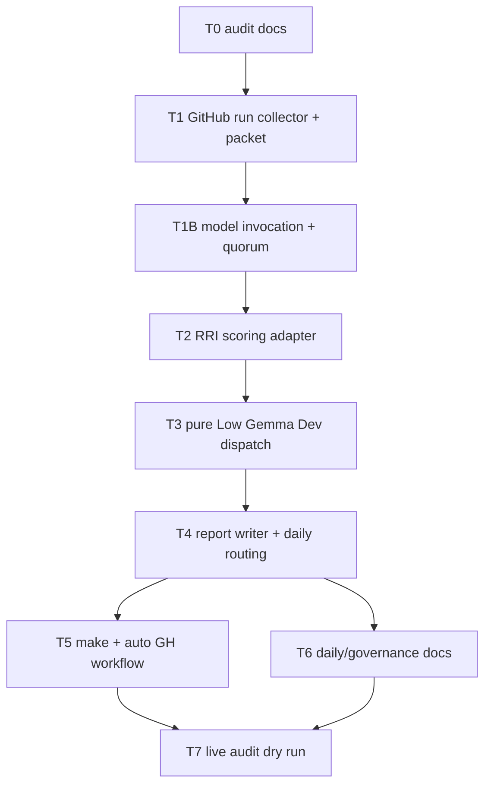

# Tasks: Gemma Push Reviewer Role

## Objective

Implement a Gemma Push Reviewer that audits the latest GitHub push after the
GitHub pipeline has executed, collects run metadata/logs/artifacts, routes
findings through canonical `scripts/rri.py` scoring, dispatches pure Low eligible
incidents to the existing Gemma Developer role, and emits reports that daily
agents can inspect for delegated, reviewed, deferred, and HITL-required work.

## Governing Documents

- `docs/plan/gemma-push-reviewer-role.md`
- `docs/adr/ADR-034-gemma-process-audit-and-reviewer-reconciliation.md`
- `docs/playbooks/AGENT_WORKFLOW_GUIDE.md`
- `docs/policies/RRI_POLICY.md`
- `docs/policies/HITL_AUTONOMY_POLICY.md`
- `docs/playbooks/LOW_RRI_LOCAL_MODEL_HANDOFF.md`
- `docs/gemma-local-improve.md`
- `docs/daily/README.md`

## Slice RRI

The slice is **RRI 66 -> Complex -> Effort L** because it introduces a new
agentic workflow around push events, Gemma push audit, canonical RRI scoring,
GitHub pipeline metadata/log collection, Gemma Developer dispatch, development
reporting, and daily-agent audit consumption.

Implementation must be decomposed and approved before any code changes. The tasks
below are the approved decomposition boundary once this slice is accepted.

> r2 note: the `rri: 66` value pre-dates the inserted **T1B** model-invocation
> task and the D11-D13 additions. Recompute the slice RRI before implementation;
> the band is expected to stay Complex, but `K`/`X` may rise.

## Behavioral Coverage Contract

Future implementation tasks must include unit evidence for every `HP-#` and
`EC-#` case below before they can be marked done. Python script tasks use
`python3 -m unittest` evidence in `scripts/gemma_push_review_test.py`. If any task
touches Rust code, use the standard Rust unit certification format required by
`AGENT_WORKFLOW_GUIDE.md`.

## Task Order

---

## T0 - Audit-review plan and task ledger

- **Status:** [x] Done
- **Type:** documentation / planning
- **Effort:** S
- **RRI:** 7 -> Low
- **Scope:** `docs/plan/gemma-push-reviewer-role.md`,
  `docs/tasks/gemma-push-reviewer-role.md`
- **Depends on:** none

### Objective

Create the audit-ready plan and task ledger for the Gemma Push Reviewer
role before implementation starts.

### Acceptance Criteria

- Plan defines objective, scope, design decisions, artifacts, authority boundary,
  and RRI source of truth.
- Task ledger defines ordered tasks, dependencies, acceptance criteria, RRI, and
  behavioral examples for development tasks.
- The plan states that final RRI values must come from `scripts/rri.py`.
- `make qa-docs` passes.

### Completion Evidence

- Created `docs/plan/gemma-push-reviewer-role.md`.
- Created `docs/tasks/gemma-push-reviewer-role.md`.
- Verified no non-ASCII characters in the new documents.
- `make qa-docs` passed.

### Agent Handoff Prompt

T0 - Create audit-ready docs for Gemma Push Reviewer. Governing docs:
`docs/plan/gemma-push-reviewer-role.md` and
`docs/tasks/gemma-push-reviewer-role.md`. Update only those files. Stop after
`make qa-docs`; do not implement scripts.

---

## T1 - GitHub post-pipeline collector and audit packet builder

- **Status:** [x] Done
- **Type:** development
- **Effort:** L
- **RRI:** 45 -> Med-high
- **Scope:** `scripts/gemma-push-review.py`,
  `scripts/gemma_push_review_test.py`
- **Depends on:** T0

### Objective

Add the initial wrapper that resolves the latest completed GitHub push pipeline
run, collects the available run metadata/logs/artifacts, and builds a push-audit
packet for the dedicated Push Reviewer role.

### Happy Path Examples

- **HP-1:** Completed GitHub Actions push run with run ID, head SHA, and
  conclusion -> wrapper downloads run metadata/log pointers, resolves the push
  diff, and builds an evidence-bounded audit packet.
- **HP-2:** Local daily run with explicit `--run-id` -> wrapper uses GitHub
  CLI/API data for that completed run and builds the same evidence bundle.

### Edge Case Examples

- **EC-1:** Latest GitHub run is queued or in progress -> wrapper writes
  `pipeline_pending` and performs no Gemma invocation.
- **EC-2:** Completed push contains docs-only changes -> wrapper reports
  `audit_skipped: docs_only` unless explicitly forced.
- **EC-3:** GitHub logs or artifacts are unavailable -> wrapper records
  `pipeline_evidence_partial: true` and continues only with available evidence.
- **EC-4:** GitHub run resolution fails -> wrapper returns an operational failure
  artifact, not an empty successful audit.

### Acceptance Criteria

- CLI supports `--run-id`, `--workflow`, `--branch`, `--before`, `--after`,
  `--event-path`, `--out-dir`, `--collect-only`, and `--dry-run`.
- Packet includes GitHub run metadata, job status, conclusion, annotations/log
  references, push metadata, changed paths, and unified diff.
- Packet excludes raw unrelated file bodies and development transcript.
- Packet uses the Push Reviewer audit contract, not the Gemma Reviewer
  code-review contract.
- Unit tests cover HP-1, HP-2, EC-1, EC-2, EC-3, and EC-4.
- No Gemma invocation is performed in `--dry-run`, `--collect-only`,
  `pipeline_pending`, or `pipeline_unavailable` states.

### Agent Handoff Prompt

T1 - Implement GitHub post-pipeline collection and audit packet building only.
Governing docs:
`docs/plan/gemma-push-reviewer-role.md`,
`docs/tasks/gemma-push-reviewer-role.md`. Files:
`scripts/gemma-push-review.py`, `scripts/gemma_push_review_test.py`. Acceptance:
completed GitHub run resolution, log/artifact metadata collection, push-audit
packet, docs-only skip, pending-run stop, clear blocked results. Stop after tests
for T1 pass; do not invoke the model or add RRI scoring yet (T1B/T2).

---

## T1B - Push-audit model invocation and quorum (added r2)

- **Status:** [x] Done
- **Type:** development
- **Effort:** L
- **RRI:** 45 -> Med-high (provisional; recompute before implementation)
- **Scope:** `scripts/gemma-push-review.py`,
  `scripts/gemma_push_review_test.py`, `scripts/gemma_local.py`
- **Depends on:** T1

### Objective

Send the audit packet to the local model and reconcile a quorum into push-audit
findings. The triple-pass quorum reuses the proven Gemma code-reviewer strategy
(`--passes 3` + `reconcile`, ADR-034 precedent); this task does not invent it. It
exists because that invocation was only referenced in Data Flow step 5 and T1's
guard criteria, with no task owning its positive scope, prompt contract, or
model-call config surface (plan D11 and "Model Invocation Contract").

### Happy Path Examples

- **HP-1:** Auditable packet, three passes succeed -> wrapper builds the chat
  payload via `gemma_local`, runs N passes, parses each with the push-audit
  parser, and reconciles into consensus findings with a reconciliation block.
- **HP-2:** `--dry-run` -> wrapper prints the assembled payload and emits no
  audit record and no findings.

### Edge Case Examples

- **EC-1:** Fewer than two passes parse -> wrapper records `quorum_failed: true`,
  writes partial findings plus a fallback packet, and emits a blocked/degraded
  artifact, never an empty PASS.
- **EC-2:** Model emits patch-like or JSON output -> parser rejects it as in the
  code-review contract.
- **EC-3:** Idle or wall timeout on a pass -> that pass is marked failed; the
  remaining passes still count toward quorum.
- **EC-4:** Local Ollama or model unavailable -> wrapper writes an explicit
  blocked artifact, not a silent skip.

### Acceptance Criteria

- CLI adds `--host`, `--model`, `--passes`, `--num-ctx`, `--num-predict`,
  `--temperature`, `--think/--no-think`, `--idle-timeout`, and `--max-wall`,
  honoring the D11 env namespace and fallbacks.
- The push-audit parser is a dedicated function and is not imported from
  `scripts/gemma-code-review.py`.
- `RRI_HINT` is parsed into `rri_input_proposal` only and is never used as a
  score.
- The deterministic reconciler is shared (promoted into `gemma_local` or a
  sibling helper) and reused, not re-implemented.
- Passes are **independent** local Gemma generations (fresh context each), not
  reflexive single-context refinement; per-pass reflection uses `think=true`. No
  Claude/Codex agent or subagent orchestrates the loop (plan D6a, D11).
- Collected log/annotation text is budget-bounded and redacted before it enters
  the packet (plan D12).
- Audit-log records follow the ADR-034 local-log contract (plan D13):
  `role: "push-reviewer"`, GitHub run context, quorum stats, and a
  `push-<sha>-F###` task_id that is forwarded to `delegate-low-rri.py --task-id`
  on dispatch; raw prompts stay git-ignored.
- Unit tests cover HP-1, HP-2, EC-1, EC-2, EC-3, EC-4, including payload
  construction from the env namespace.

### Agent Handoff Prompt

T1B - Implement push-audit model invocation, response contract, and quorum.
Governing docs: `docs/plan/gemma-push-reviewer-role.md` (D11, D12, Model
Invocation Contract), `docs/tasks/gemma-push-reviewer-role.md`. Files:
`scripts/gemma-push-review.py`, `scripts/gemma_push_review_test.py`,
`scripts/gemma_local.py`. Acceptance: reuse `gemma_local` transport and the
shared reconciler; dedicated push-audit parser; advisory `RRI_HINT` only; blocked
artifact on quorum failure or missing Ollama. Stop before RRI scoring (T2).

---

## T2 - Canonical RRI scoring adapter

- **Status:** [x] Done
- **Type:** development
- **Effort:** L
- **RRI:** 42 -> Med-high
- **Scope:** `scripts/gemma-push-review.py`,
  `scripts/gemma_push_review_test.py`
- **Depends on:** T1B

### Objective

Normalize push-audit findings into candidate tasks and compute each candidate's
final RRI by invoking `scripts/rri.py --json`.

### Happy Path Examples

- **HP-1:** Consensus finding on one code path -> wrapper creates one candidate,
  calls `scripts/rri.py --json --touches <path> ...`, and stores
  `canonical_rri.final` and `canonical_rri.band.label`.
- **HP-2:** Push-audit pass proposes subjective RRI inputs -> wrapper records the proposal
  separately as `rri_input_proposal` and uses `scripts/rri.py` output as final.

### Edge Case Examples

- **EC-1:** Model-proposed path is out of the audited push diff -> candidate is
  routed as `dismiss-candidate` or `observe` and is not scored as pure Low
  dispatch eligible.
- **EC-2:** `scripts/rri.py` exits non-zero -> candidate is marked
  `rri_unavailable` and requires primary-agent review.
- **EC-3:** Candidate touches auth/security/rights paths -> wrapper preserves
  anchor-rubric floors and applied penalties from `scripts/rri.py`.

### Acceptance Criteria

- Final report never labels model-proposed values as final RRI.
- `canonical_rri.source` is exactly `scripts/rri.py --json`.
- Unit tests assert that `scripts/rri.py` command arguments are built from the
  candidate path set and validated inputs.
- Unit tests cover RRI command failure and out-of-scope findings.
- The wrapper stores the full JSON output from `scripts/rri.py` under
  `canonical_rri.raw`.

### Agent Handoff Prompt

T2 - Add candidate normalization and canonical RRI scoring. Governing docs:
`docs/plan/gemma-push-reviewer-role.md`,
`docs/tasks/gemma-push-reviewer-role.md`. Files:
`scripts/gemma-push-review.py`, `scripts/gemma_push_review_test.py`. Acceptance:
`scripts/rri.py --json` is the only final RRI source; model RRI values are only
input proposals. Stop before Gemma Developer dispatch or report routing.

### Gemma Reviewer evidence

- Model: n/a — D14 trigger fired (band ≥ Med-high)
- Command: D14 context-isolated subagent (Balanced tier)
- Passes run / succeeded: 1/1
- Quorum: n/a (D14 path)
- Aggregate status: FINDINGS
- Consensus findings: 0 | Pass-specific: 0 | Disagreement: 0
- Blocking count: 0 | Major count: 1 | Minor count: 2 | Nit count: 1
- Degraded: false
- Artifacts: n/a
- Isolated adjudicator: spawned — trigger: band ≥ Med-high
- disposition_divergence: none
- Primary-agent disposition: major repaired (`cc=0` guard in `_build_rri_cmd`); minor fail-closed gap closed (non-dict JSON guard); docstring corrected (Pass 1 Reflection); nit (EC-1 invariant test) accepted as low-priority — defensive code is tested in isolation.

### Reflection log

Required passes: 3 (RRI 44 → Med-high)

#### Pass 1

- **Draft verdict:** Implementation correct post-D14 repairs; cc=0 fix and non-dict JSON guard applied.
- **Critique findings:** docstring on `score_candidates` still read "Returns (candidates, observe_findings)" — inaccurate.
- **Revisions applied:** docstring corrected to describe actual single-list return and observe-finding behavior.

#### Pass 2

- **Draft verdict:** Stable. Docstring repaired. All failure paths verified fail-closed.
- **Critique findings:** No issues found. EC-1 dead-code, `pure_low_eligible` semantics, and `candidates_scored_count` logic all verified correct.
- **Revisions applied:** none.

#### Pass 3

- **Draft verdict:** Stable. D1a isolation, canonical_rri source immutability, and side-effect freedom verified.
- **Critique findings:** No issues found. `score_candidates` is pure; `canonical_rri.source` is hardcoded; no contamination path from `rri_input_proposal` to `canonical_rri`.
- **Revisions applied:** none.

### Unit coverage certification

| Case ID | Type | Behavior | Unit test evidence | Result |
|---|---|---|---|---|
| HP-1 | Happy path | grounded finding → `scripts/rri.py --json` invoked → `canonical_rri.source`, `final`, `band`, `raw` populated | `scripts/gemma_push_review_test.py::ScoreCandidatesHP1::test_hp1_canonical_rri_source_is_rri_py`, `test_hp1_final_and_band_extracted`, `test_hp1_raw_contains_full_rri_json` | passed |
| HP-2 | Happy path | model proposal preserved as `rri_input_proposal`; rri.py output is final, never overwritten | `scripts/gemma_push_review_test.py::ScoreCandidatesHP1::test_hp1_rri_input_proposal_preserved`, `test_hp1_proposal_never_overwrites_canonical`; `ScoreCandidatesHP2::test_hp2_low_no_penalties_is_pure_low_eligible` | passed |
| EC-1 | Edge case | path not in `changed_paths` → `routing: dismiss-candidate`, no scoring, `subprocess.run` not called | `scripts/gemma_push_review_test.py::ScoreCandidatesEC1::test_ec1_out_of_scope_path_dismissed`, `test_ec1_observe_findings_skipped`, `test_ec1_mixed_findings_only_grounded_scored` | passed |
| EC-2 | Edge case | `scripts/rri.py` exits non-zero → `rri_unavailable: True`, `canonical_rri: None`, `routing: daily-non-gemma-review` | `scripts/gemma_push_review_test.py::ScoreCandidatesEC2::test_ec2_rri_failure_marks_unavailable`, `test_ec2_json_parse_error_marks_unavailable`, `test_ec2_non_dict_json_marks_unavailable` | passed |
| EC-3 | Edge case | auth path with penalties from rri.py preserved in `canonical_rri.raw`; `pure_low_eligible: False`; `canonical_rri.source` never set to model | `scripts/gemma_push_review_test.py::ScoreCandidatesEC3::test_ec3_penalties_from_rri_py_preserved`, `test_ec3_canonical_source_never_model` | passed |

### Owner final verification

- Owner: `claude-sonnet-4-6` (primary agent)
- Date: 2026-06-25
- Statement: I verified every happy path and edge case defined for this task has unit test evidence that replicates the expected behavior. D14 adjudicator major finding repaired and re-tested. 104 tests passing.
- Commands run: `python3 scripts/gemma_push_review_test.py -v` → `Ran 104 tests in 0.042s OK`

---

## T3 - Pure Low Gemma Developer dispatch and development report

- **Status:** [x] Done
- **Type:** development
- **Effort:** L
- **RRI:** 45 -> Med-high
- **Scope:** `scripts/gemma-push-review.py`,
  `scripts/gemma_push_review_test.py`,
  `scripts/delegate-low-rri.py`
- **Depends on:** T2

### Objective

Dispatch only pure Low eligible incidents to the existing Gemma Developer
delegation path, then write a development report that a non-Gemma agent can use
for post-implementation review.

### Happy Path Examples

- **HP-1:** Candidate has canonical RRI Low, no penalties, and a single narrow
  code path -> wrapper builds a Low-RRI handoff packet and invokes
  `scripts/delegate-low-rri.py`.
- **HP-2:** Gemma Developer returns an in-scope patch -> wrapper records the
  delegation artifact, changed files, apply result, and
  `post_development_review_required: true`.

### Edge Case Examples

- **EC-1:** Candidate is Low but touches docs, policy, task ledgers, or workflow
  files -> wrapper refuses Gemma Developer dispatch and routes to daily
  non-Gemma review.
- **EC-2:** Candidate has final RRI Low but active penalties -> wrapper refuses
  pure Low dispatch and records why.
- **EC-3:** Gemma Developer times out, returns out-of-scope paths, or fails
  verification -> wrapper writes a blocked development report and routes to
  non-Gemma review.

### Acceptance Criteria

- Pure Low eligibility requires canonical RRI Low, no penalties, narrow code/test
  scope, and all Low-RRI handoff preconditions.
- Dispatch uses `scripts/delegate-low-rri.py`; Push Reviewer does not invent a
  second Gemma Developer protocol.
- Every dispatch writes a development report with packet path, result path,
  allowed paths, apply result, verification intent, repair-cycle status, the
  post-development review requirement, and an explicit `review_status` that
  starts at `in_review` with `review_orchestrator: non-gemma-agent` (plan D6).
- Push Reviewer never marks delegated work accepted or complete, and never runs
  the post-development review quorum itself; that stage belongs to the non-Gemma
  agent (plan D6a, stage 2).
- Unit tests cover HP-1, HP-2, EC-1, EC-2, and EC-3, including that a dispatched
  patch is left in `review_status: in_review`.

### Agent Handoff Prompt

T3 - Add pure Low Gemma Developer dispatch and development reporting. Governing docs:
`docs/plan/gemma-push-reviewer-role.md`,
`docs/tasks/gemma-push-reviewer-role.md`. Files:
`scripts/gemma-push-review.py`, `scripts/gemma_push_review_test.py`. Acceptance:
only pure Low candidates invoke `scripts/delegate-low-rri.py`; every delegated
patch produces a development report and remains pending review. Stop before daily
Markdown report work.

### Completion notes

- Hardened `pure_low_eligible` so Low-band candidates are not dispatchable when the
  path is editorial/workflow or high-impact, even if `scripts/rri.py` returns Low.
- Added Low-RRI packet construction in `scripts/gemma-push-review.py` with explicit
  allowed paths, stop conditions, and current file content for narrow code/test
  patches.
- Added `dispatch_pure_low_candidates()` and development-report writing so delegated
  patches land in `review_status: in_review` with `review_orchestrator:
  non-gemma-agent`.
- Extended the aggregate artifact with `developer_dispatch`,
  `post_development_review`, and `deployer_followup` counts sourced from actual
  dispatch outcomes.

### Happy paths covered

- **HP-1:** Pure Low candidate on a narrow code path builds a packet and invokes the
  existing delegation wrapper. Code evidence:
  `scripts/gemma-push-review.py::_build_delegation_packet`,
  `dispatch_pure_low_candidates`; test evidence
  `scripts/gemma_push_review_test.py::DispatchPureLowCandidates::test_hp1_dispatch_writes_development_report`.
- **HP-2:** In-scope delegated patch records result/report artifacts and stays in
  `review_status: in_review`. Code evidence:
  `scripts/gemma-push-review.py::_build_development_report`,
  `dispatch_pure_low_candidates`; test evidence
  `scripts/gemma_push_review_test.py::DispatchPureLowCandidates::test_hp1_dispatch_writes_development_report`.

### Edge cases covered

- **EC-1:** Low-band candidates on docs/workflow scope are refused before dispatch
  and routed back to non-Gemma handling. Code evidence:
  `scripts/gemma-push-review.py::_is_editorial_or_workflow_path`,
  `dispatch_pure_low_candidates`; test evidence
  `scripts/gemma_push_review_test.py::ScoreCandidatesHP2::test_hp2_docs_path_is_not_pure_low`,
  `DispatchPureLowCandidates::test_ec1_editorial_path_refused_before_dispatch`.
- **EC-2:** Low-band candidates with active penalties are never treated as pure Low.
  Code evidence: `scripts/gemma-push-review.py::score_candidates`; test evidence
  `scripts/gemma_push_review_test.py::ScoreCandidatesHP2::test_hp2_low_with_penalties_not_pure_low`.
- **EC-3:** Delegate timeout/failure writes a blocked development report and routes
  the candidate to non-Gemma review while keeping `review_status: in_review`. Code
  evidence: `scripts/gemma-push-review.py::dispatch_pure_low_candidates`,
  `_build_development_report`; test evidence
  `scripts/gemma_push_review_test.py::DispatchPureLowCandidates::test_ec3_failed_delegate_writes_blocked_report`.

### Reflection log

Required passes: 3 (RRI 45 -> Med-high)

#### Pass 1

- **Draft verdict:** Implemented the dispatch path end-to-end: pure-Low gating,
  packet construction, delegate invocation, development report writing, and
  aggregate counters.
- **Critique findings:** Pure-Low routing was still too permissive if a Low result
  landed on docs/workflow or high-impact paths; dispatch needed fail-closed path
  guards before packet construction.
- **Revisions applied:** Added editorial/workflow and high-impact path filters in
  `score_candidates()` and `_build_delegation_packet()`.

#### Pass 2

- **Draft verdict:** Dispatch/report flow was correct, but closure evidence still
  needed direct tests for successful patch recording and blocked delegate behavior.
- **Critique findings:** Missing explicit tests for blocked reports and for the
  candidate transition from `gemma-developer-dispatch` to `daily-non-gemma-review`
  on delegate failure.
- **Revisions applied:** Added `DispatchPureLowCandidates` tests for successful
  dispatch, editorial refusal, and blocked delegate timeout handling.

#### Pass 3

- **Draft verdict:** Stable. Dispatch outcomes, review-state handoff, and aggregate
  bookkeeping are consistent with the plan boundary.
- **Critique findings:** No further issues found. Push Reviewer remains orchestration
  only; it never self-accepts or runs the post-development review quorum.
- **Revisions applied:** none.

### Unit coverage certification

| Case ID | Type | Behavior | Unit test evidence | Result |
|---|---|---|---|---|
| HP-1 | Happy path | canonical Low, narrow code path -> packet built and `scripts/delegate-low-rri.py` invoked | `scripts/gemma_push_review_test.py::DispatchPureLowCandidates::test_hp1_dispatch_writes_development_report` | passed |
| HP-2 | Happy path | delegated in-scope patch records result/report artifacts and remains `review_status: in_review` | `scripts/gemma_push_review_test.py::DispatchPureLowCandidates::test_hp1_dispatch_writes_development_report` | passed |
| EC-1 | Edge case | Low candidate touching docs/workflow scope is refused and routed to daily non-Gemma review | `scripts/gemma_push_review_test.py::ScoreCandidatesHP2::test_hp2_docs_path_is_not_pure_low`; `DispatchPureLowCandidates::test_ec1_editorial_path_refused_before_dispatch` | passed |
| EC-2 | Edge case | Low candidate with active penalties is not pure Low dispatch eligible | `scripts/gemma_push_review_test.py::ScoreCandidatesHP2::test_hp2_low_with_penalties_not_pure_low` | passed |
| EC-3 | Edge case | delegate timeout/failure writes a blocked development report and routes to non-Gemma review | `scripts/gemma_push_review_test.py::DispatchPureLowCandidates::test_ec3_failed_delegate_writes_blocked_report` | passed |

### Owner final verification

- Owner: `Codex`
- Date: `2026-06-25`
- Statement: I verified every happy path and edge case defined for this task has unit test evidence that replicates the expected behavior.
- Commands run: `python3 -m unittest scripts/gemma_push_review_test.py`; `python3 -m py_compile scripts/gemma-push-review.py scripts/gemma_push_review_test.py`; `make qa-docs`

---

## T4 - Push audit report writer and daily routing

- **Status:** [x] Done
- **Type:** development
- **Effort:** L
- **RRI:** 43 -> Med-high
- **Scope:** `scripts/gemma-push-review.py`,
  `scripts/gemma_push_review_test.py`,
  `docs/reports/push-review/`
- **Depends on:** T3

### Objective

Write local JSON artifacts and daily-readable Markdown summaries that show audit
outcome, candidate RRI, Gemma Developer dispatch results, post-development review
requirements, and non-Low incidents for daily non-Gemma review.

### Happy Path Examples

- **HP-1:** Push audit has one pure Low delegated candidate and one Moderate
  candidate -> report lists the development report for the delegated patch and
  routes the Moderate candidate to daily non-Gemma review.
- **HP-2:** Push audit has no findings -> report records quorum, changed paths,
  and `candidates: []` without creating issue rows.

### Edge Case Examples

- **EC-1:** Push-audit quorum succeeds with `degraded: true` -> report marks
  degraded audit and keeps routing visible.
- **EC-2:** Push-audit quorum fails -> report records blocked audit and writes a
  fallback packet path.
- **EC-3:** Candidate is Complex or higher -> report routes
  `daily-non-gemma-review` and states that deployer must not apply it directly.

### Acceptance Criteria

- Raw JSON artifact includes schema version, push range, audit quorum,
  candidates, canonical RRI, developer dispatch results, and daily follow-up
  counts.
- Markdown summary includes tables suitable for daily issues, optimizations, HITL
  decisions, delegated development reports, and non-Low deferred items.
- Reports do not embed raw prompts or full target file bodies.
- Unit tests cover delegated Low, non-pure Low, Moderate, Complex, no-finding,
  degraded, and quorum-failed report cases.
- Report paths are deterministic from date and short SHA.

### Agent Handoff Prompt

T4 - Add push-audit report writing and daily routing. Governing docs:
`docs/plan/gemma-push-reviewer-role.md`,
`docs/tasks/gemma-push-reviewer-role.md`. Files:
`scripts/gemma-push-review.py`, `scripts/gemma_push_review_test.py`, optional
fixtures under `docs/fixtures/`. Acceptance: JSON + Markdown reports show
canonical RRI, Gemma Developer dispatch status, post-development review
requirements, and daily non-Gemma routing. Stop before Makefile or GitHub
workflow.

### Completion notes

- Added canonical report writing in `scripts/gemma-push-review.py` so each push
  audit now emits `aggregate.json` plus a daily-readable Markdown summary under
  `docs/reports/push-review/YYYY-MM-DD-<short-sha>.md`.
- Extended the aggregate artifact with explicit `push_range`, `audit`, and
  `reports` sections so the raw JSON records quorum state, deterministic report
  paths, and follow-up routing in one place.
- Added blocked-report Markdown generation so blocked/quorum-failed audits still
  produce a readable fallback summary with the packet path visible to the
  non-Gemma daily agent.
- Hardened the shared reviewer wrapper during T4 verification: reviewer `think`
  now defaults off and `STATUS PASS` + finding blocks are coerced fail-closed to
  `FINDINGS`, which stabilized `make qa-docs` for this slice.

### Happy paths covered

- **HP-1:** Delegated pure Low + Moderate deferred candidate both appear in the
  Markdown summary with the delegated development report and the HITL-required
  Moderate row. Code evidence: `scripts/gemma-push-review.py::write_push_reports`,
  `_render_push_report_markdown`; test evidence
  `scripts/gemma_push_review_test.py::PushAuditReports::test_hp1_delegated_low_and_moderate_rendered`.
- **HP-2:** No-finding audit still writes deterministic JSON + Markdown outputs
  and renders empty sections without issue rows. Code evidence:
  `scripts/gemma-push-review.py::write_push_reports`,
  `_render_push_report_markdown`; test evidence
  `scripts/gemma_push_review_test.py::PushAuditReports::test_hp2_no_findings_renders_empty_sections`,
  `PushAuditReports::test_integration_run_push_audit_writes_markdown_summary`.

### Edge cases covered

- **EC-1:** Degraded quorum remains visible in both the raw artifact and the
  Markdown summary. Code evidence:
  `scripts/gemma-push-review.py::_audit_section_for_report`,
  `_render_push_report_markdown`; test evidence
  `scripts/gemma_push_review_test.py::PushAuditReports::test_ec1_degraded_report_marks_degraded_audit`.
- **EC-2:** Blocked/quorum-failed audits write a fallback packet path and a
  readable blocked summary instead of disappearing into logs. Code evidence:
  `scripts/gemma-push-review.py::write_blocked_report`,
  `_render_blocked_report_markdown`; test evidence
  `scripts/gemma_push_review_test.py::PushAuditReports::test_ec2_quorum_failed_blocked_report_writes_fallback_path`.
- **EC-3:** Complex candidates stay routed to `daily-non-gemma-review` and the
  report states they must not be auto-applied. Code evidence:
  `scripts/gemma-push-review.py::_render_push_report_markdown`; test evidence
  `scripts/gemma_push_review_test.py::PushAuditReports::test_ec3_complex_candidate_explicitly_not_auto_apply`.

### Reflection log

Required passes: 3 (RRI 43 -> Med-high)

#### Pass 1

- **Draft verdict:** Report writing belonged naturally next to the existing
  aggregate artifact, but the runtime path needed to avoid polluting repo docs
  during tests.
- **Critique findings:** Writing directly to `docs/reports/...` from integration
  tests would dirty the real worktree and make the suite non-hermetic.
- **Revisions applied:** Added `repo_root` plumbing so runtime writes to the repo
  while tests redirect Markdown output into temporary roots.

#### Pass 2

- **Draft verdict:** JSON + Markdown generation worked, but blocked/degraded
  cases still lacked a daily-readable surface and deterministic path coverage.
- **Critique findings:** Blocked audits were only emitting `blocked.json`, which
  left T4's quorum-failed report contract unmet.
- **Revisions applied:** Added blocked Markdown summaries plus explicit
  `reports.fallback_packet_path`, and covered degraded/quorum-failed cases with
  dedicated tests.

#### Pass 3

- **Draft verdict:** T4 logic was correct, but `make qa-docs` still failed in
  reviewer verification because the shared reviewer wrapper was unstable under
  malformed `PASS` + findings output.
- **Critique findings:** Reviewer truncation was fixed by disabling default
  thinking, but malformed tagged output could still break quorum unnecessarily.
- **Revisions applied:** Switched reviewer default `think` off and coerced
  `STATUS PASS` with findings to `FINDINGS`, then re-ran `make qa-docs`
  successfully.

### Unit coverage certification

| Case ID | Type | Behavior | Unit test evidence | Result |
|---|---|---|---|---|
| HP-1 | Happy path | delegated Low + Moderate deferred candidates render delegated development report and HITL routing in Markdown | `scripts/gemma_push_review_test.py::PushAuditReports::test_hp1_delegated_low_and_moderate_rendered` | passed |
| HP-2 | Happy path | no-finding audit writes deterministic reports with empty issue sections | `scripts/gemma_push_review_test.py::PushAuditReports::test_hp2_no_findings_renders_empty_sections`, `scripts/gemma_push_review_test.py::PushAuditReports::test_integration_run_push_audit_writes_markdown_summary` | passed |
| EC-1 | Edge case | degraded audit keeps quorum/degraded state visible in JSON + Markdown | `scripts/gemma_push_review_test.py::PushAuditReports::test_ec1_degraded_report_marks_degraded_audit` | passed |
| EC-2 | Edge case | quorum-failed/blocked audit writes fallback packet path and blocked Markdown summary | `scripts/gemma_push_review_test.py::PushAuditReports::test_ec2_quorum_failed_blocked_report_writes_fallback_path` | passed |
| EC-3 | Edge case | Complex candidate stays deferred and is marked do-not-auto-apply in the report | `scripts/gemma_push_review_test.py::PushAuditReports::test_ec3_complex_candidate_explicitly_not_auto_apply` | passed |

### Owner final verification

- Owner: `Codex`
- Date: `2026-06-25`
- Statement: I verified every happy path and edge case defined for this task has unit test evidence that replicates the expected behavior.
- Commands run: `python3 scripts/gemma_push_review_test.py`; `python3 -m py_compile scripts/gemma-push-review.py scripts/gemma_push_review_test.py`; `make qa-docs`

---

## T5 - Local make target and post-pipeline GitHub workflow

- **Status:** [x] Done
- **Type:** development / CI
- **Effort:** L
- **RRI:** 41 -> Med-high
- **Scope:** `Makefile`, `.github/workflows/push-review.yml`
- **Depends on:** T4

### Objective

Expose the Push Reviewer as a local make target and as a self-hosted GitHub
Actions `workflow_run` job that starts automatically after the primary pipeline
completes.

### Happy Path Examples

- **HP-1:** `make qa-gemma-push-review DUBBRIDGE_PUSH_REVIEW_RUN_ID=<run-id>` -> wrapper
  collects the completed GitHub run evidence and writes artifacts.
- **HP-2:** Self-hosted `workflow_run` receives a completed push or scheduled `ci`
  run -> workflow passes run ID, head SHA, branch, conclusion, and URL into the
  wrapper.

### Edge Case Examples

- **EC-1:** `DUBBRIDGE_SKIP_GEMMA_PUSH_REVIEW=1` -> make target exits 0 with a
  skip message.
- **EC-2:** Running on GitHub-hosted runner without Ollama -> workflow is not
  scheduled or exits with explicit unsupported-runner status.
- **EC-3:** Primary pipeline is still running -> make target writes a pending
  report and exits without model analysis.
- **EC-4:** Wrapper exits with quorum failure -> workflow uploads blocked report
  artifact but does not alter the primary pipeline result.

### Acceptance Criteria

- Make target is available for local replay/debug and remains skip-able.
- GitHub workflow uses `workflow_run` after the primary pipeline and runs on
  `self-hosted` runner labels.
- Push review starts automatically from GitHub when the `ci` workflow
  completes for a push or scheduled event.
- No existing CI job becomes dependent on Ollama.
- Documentation states the workflow is post-pipeline and advisory, while the
  primary CI result remains authoritative.
- Unit or shell-level tests cover make command construction and workflow wiring
  where practical.

### Agent Handoff Prompt

T5 - Add local make target and post-pipeline self-hosted workflow that runs
automatically after `ci` completes.
Governing docs:
`docs/plan/gemma-push-reviewer-role.md`,
`docs/tasks/gemma-push-reviewer-role.md`. Files: `Makefile`,
`.github/workflows/push-review.yml`. Acceptance: wrapper runs automatically
after a completed GitHub pipeline run, no GitHub-hosted CI dependency on
Ollama, and primary CI results remain authoritative. Stop after dry-run command
evidence.

### Completion notes

- Added `qa-gemma-push-review` to `Makefile` with explicit
  `DUBBRIDGE_SKIP_GEMMA_PUSH_REVIEW=1` skip behavior and env-to-CLI wiring for
  run ID, workflow, branch, push range, event path, output dir, collect-only,
  force, and dry-run usage.
- Added advisory workflow `.github/workflows/push-review.yml` using
  `workflow_run` after push or scheduled `ci` completes on a self-hosted runner
  so push review starts automatically from GitHub, with artifact upload and
  `continue-on-error: true` so the primary CI result remains authoritative.
- Added structural tests in `scripts/gemma_push_ops_test.py` to verify the
  target wiring and post-pipeline workflow contract.

### Happy paths covered

- **HP-1:** Local make target accepts `DUBBRIDGE_PUSH_REVIEW_RUN_ID` and related
  env vars and maps them to the wrapper CLI. Code evidence: `Makefile::qa-gemma-push-review`;
  test evidence
  `scripts/gemma_push_ops_test.py::PushReviewOpsWiring::test_make_target_maps_env_to_cli_flags`.
- **HP-2:** Self-hosted workflow receives completed push or scheduled `ci`
  context and forwards run ID, branch, and head SHA into the advisory make target. Code
  evidence: `.github/workflows/push-review.yml`; test evidence
  `scripts/gemma_push_ops_test.py::PushReviewOpsWiring::test_workflow_is_post_pipeline_self_hosted_and_advisory`.

### Edge cases covered

- **EC-1:** `DUBBRIDGE_SKIP_GEMMA_PUSH_REVIEW=1` exits 0 with a skip message.
  Code evidence: `Makefile::qa-gemma-push-review`; test evidence
  `scripts/gemma_push_ops_test.py::PushReviewOpsWiring::test_make_target_exists_and_is_skippable`.
- **EC-2:** GitHub-hosted CI does not become dependent on Ollama because the
  workflow is restricted to `self-hosted` runners. Code evidence:
  `.github/workflows/push-review.yml`; test evidence
  `scripts/gemma_push_ops_test.py::PushReviewOpsWiring::test_workflow_is_post_pipeline_self_hosted_and_advisory`.
- **EC-3:** Pending/in-progress pipeline state remains handled by the wrapper,
  which writes a pending sentinel and skips model analysis. Code evidence:
  `scripts/gemma-push-review.py::write_sentinel`; test evidence
  `scripts/gemma_push_review_test.py::PendingRun::test_in_progress_returns_sentinel_path`,
  `scripts/gemma_push_review_test.py::PendingRun::test_queued_status_is_pending`.
- **EC-4:** Advisory workflow preserves blocked artifacts and does not alter the
  primary CI truth because the review step is `continue-on-error` and artifacts
  upload under `if: always()`. Code evidence:
  `.github/workflows/push-review.yml`; test evidence
  `scripts/gemma_push_ops_test.py::PushReviewOpsWiring::test_workflow_is_post_pipeline_self_hosted_and_advisory`.

### Reflection log

Required passes: 3 (RRI 41 -> Med-high)

#### Pass 1

- **Draft verdict:** The local target belonged in `Makefile`, but it needed to
  stay a thin wrapper around the existing CLI rather than inventing another
  configuration surface.
- **Critique findings:** A new protocol in the make target would drift from the
  script flags and make local/GitHub usage diverge.
- **Revisions applied:** Mapped env vars directly onto the existing
  `scripts/gemma-push-review.py` flags and kept the target shell-only.

#### Pass 2

- **Draft verdict:** The workflow could be added safely only if it stayed fully
  advisory and self-hosted.
- **Critique findings:** A normal failing workflow step could be mistaken for a
  primary CI gate and would blur the authority boundary.
- **Revisions applied:** Added `workflow_run`, self-hosted runner labels,
  `continue-on-error: true`, and unconditional artifact upload plus an advisory
  summary step.

#### Pass 3

- **Draft verdict:** Wiring was complete, but T5 still needed explicit evidence
  that the target/workflow contract existed and preserved the post-pipeline
  boundary.
- **Critique findings:** Without a small structural test, the task would rely
  mostly on inspection rather than repeatable verification.
- **Revisions applied:** Added `scripts/gemma_push_ops_test.py` and re-ran the
  skip path plus `make qa-docs`.

### Unit coverage certification

| Case ID | Type | Behavior | Unit test evidence | Result |
|---|---|---|---|---|
| HP-1 | Happy path | local make target maps run-id/env inputs into the push-review CLI | `scripts/gemma_push_ops_test.py::PushReviewOpsWiring::test_make_target_maps_env_to_cli_flags` | passed |
| HP-2 | Happy path | post-pipeline workflow starts automatically after completed push or scheduled `ci` runs and forwards run context on self-hosted runner | `scripts/gemma_push_ops_test.py::PushReviewOpsWiring::test_workflow_is_post_pipeline_self_hosted_and_advisory`, `scripts/gemma_push_ops_test.py::PushReviewOpsWiring::test_workflow_audits_push_and_schedule_but_not_pull_requests` | passed |
| EC-1 | Edge case | skip env exits cleanly with a skip message | `scripts/gemma_push_ops_test.py::PushReviewOpsWiring::test_make_target_exists_and_is_skippable` | passed |
| EC-2 | Edge case | workflow stays self-hosted and does not impose GitHub-hosted Ollama dependency | `scripts/gemma_push_ops_test.py::PushReviewOpsWiring::test_workflow_is_post_pipeline_self_hosted_and_advisory` | passed |
| EC-3 | Edge case | pending/queued pipeline writes pending sentinel and avoids model analysis | `scripts/gemma_push_review_test.py::PendingRun::test_in_progress_returns_sentinel_path`, `scripts/gemma_push_review_test.py::PendingRun::test_queued_status_is_pending` | passed |
| EC-4 | Edge case | workflow preserves blocked artifacts without becoming primary CI truth | `scripts/gemma_push_ops_test.py::PushReviewOpsWiring::test_workflow_is_post_pipeline_self_hosted_and_advisory` | passed |

### Owner final verification

- Owner: `Codex`
- Date: `2026-06-25`
- Statement: I verified every happy path and edge case defined for this task has unit test evidence that replicates the expected behavior.
- Commands run: `python3 scripts/gemma_push_ops_test.py`; `DUBBRIDGE_SKIP_GEMMA_PUSH_REVIEW=1 make qa-gemma-push-review`; `python3 -m py_compile scripts/gemma_push_ops_test.py`; `make qa-docs`

---

## T6 - Governance and daily-agent documentation sync

- **Status:** [x] Done
- **Type:** documentation
- **Effort:** S
- **RRI:** 11 -> Low
- **Scope:** `docs/playbooks/AGENT_WORKFLOW_GUIDE.md`,
  `docs/gemma-local-improve.md`, `docs/daily/README.md`,
  `docs/daily/TEMPLATE.md`
- **Depends on:** T4

### Objective

Document the Push Reviewer authority boundary, post-pipeline GitHub evidence
collection, pure Low Gemma Developer dispatch, post-development review handoff,
and the daily-agent responsibility to review reports, especially items not
applied by the deployer due to RRI complexity.

### Acceptance Criteria

- Workflow docs state that Push Reviewer is audit/dispatch orchestration, not
  final approval.
- Workflow docs state that Push Reviewer starts after GitHub pipeline execution
  and records run metadata/log availability before model analysis.
- Workflow docs state that Push Reviewer is separate from Gemma Reviewer code
  review.
- Docs state that final RRI values in push-review reports must come from
  `scripts/rri.py`.
- Docs state that pure Low delegated patches require a post-development review
  report before acceptance.
- Daily docs instruct agents to inspect newest push-review reports during opening
  and close, including delegated patches still awaiting review and non-Low
  findings deferred to daily non-Gemma review.
- Daily template has a place to record deferred complexity findings or references
  to the report.
- `make qa-docs` passes.

### Agent Handoff Prompt

T6 - Sync governance and daily docs for Push Reviewer. Governing docs:
`docs/plan/gemma-push-reviewer-role.md`,
`docs/tasks/gemma-push-reviewer-role.md`. Files:
`docs/playbooks/AGENT_WORKFLOW_GUIDE.md`, `docs/gemma-local-improve.md`,
`docs/daily/README.md`, `docs/daily/TEMPLATE.md`. Acceptance: docs describe
audit/dispatch authority, `scripts/rri.py` final RRI source, pure Low Gemma
Developer dispatch, required development reports, post-pipeline GitHub evidence,
and daily non-Gemma review duties. Stop after `make qa-docs`.

### Completion Evidence

- Updated `docs/playbooks/AGENT_WORKFLOW_GUIDE.md` with a dedicated Push Reviewer
  section covering authority boundary, completed-pipeline GitHub evidence, final
  RRI ownership in `scripts/rri.py`, and daily consumption expectations.
- Updated `docs/gemma-local-improve.md` to document Push Reviewer as a separate
  local Gemma role, distinct from Gemma Reviewer and Gemma Developer.
- Updated `docs/daily/README.md` and `docs/daily/TEMPLATE.md` so daily opening
  and close now explicitly inspect push-review reports, carry forward non-pure-Low
  findings, and keep delegated patches visible while `in_review`.
- Verified `make qa-docs` passed.

---

## T7 - Live audit review dry run and close-out evidence

- **Status:** [x] Done
- **Type:** validation / documentation
- **Effort:** S
- **RRI:** 7 -> Low
- **Scope:** `docs/evaluations/gemma-push-reviewer-live-test.md`,
  current daily note
- **Depends on:** T5, T6

### Objective

Run the Push Reviewer against an explicit completed GitHub pipeline run and
document whether the reports are usable by daily agents, safe for pure Low Gemma
Developer dispatch, and explicit about non-Low items that require daily
non-Gemma review.

### Acceptance Criteria

- Dry-run evidence shows GitHub run collection and packet construction without
  Gemma invocation.
- Live local run records GitHub workflow conclusion, failed jobs/log evidence
  when present, audit pass/quorum status, candidate count, RRI outputs, Gemma
  Developer dispatch status, development report paths, and routing counts.
- Any findings not dispatched because they are not pure Low are listed explicitly.
- Daily note references the report under issues, optimizations, or HITL gate as
  appropriate.
- Full verification commands from T1-T6 are listed.

### Agent Handoff Prompt

T7 - Run and document live audit review. Governing docs:
`docs/plan/gemma-push-reviewer-role.md`,
`docs/tasks/gemma-push-reviewer-role.md`. Files:
`docs/evaluations/gemma-push-reviewer-live-test.md` and today's daily note.
Acceptance: dry-run + live GitHub run evidence, pipeline result summary,
candidate RRI outputs, pure Low dispatch results, development reports awaiting
review, and non-Low deferred items visible. Stop after reporting close-out
evidence; do not start another slice.

### Completion Evidence

- Added `docs/evaluations/gemma-push-reviewer-live-test.md` with:
  - dry-run evidence (`payload.json`, `packet.json`);
  - a blocked live replay showing fail-closed visibility;
  - a successful live replay producing `aggregate.json` and a daily-usable
    Markdown summary;
  - a carried-forward verification command list from T1-T6.
- Updated today's daily note to reference the successful push-review summary and
  the blocked exploratory replay, plus follow-up operational items.
- Verified a successful live replay against GitHub run `28156296888` and a
  blocked-but-visible replay against run `28157583084`.
