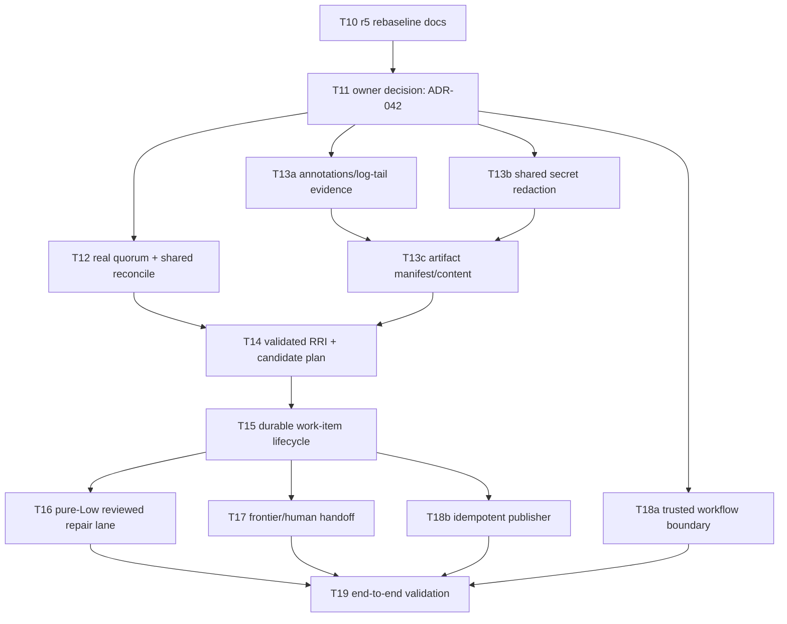

# Tasks: Gemma Push Reviewer Role

## Objective

Remediate the existing Gemma Push Reviewer baseline so it performs real
evidence-bound evaluation, creates durable approval-ready remediation plans,
produces a reviewed patch artifact only for eligible pure Low work, and routes
everything else through a packet-bound frontier/human handoff without weakening
HITL, reviewer independence, or publisher trust boundaries.

## Governing Documents

- `docs/plan/gemma-push-reviewer-role.md`
- `docs/adr/ADR-034-gemma-process-audit-and-reviewer-reconciliation.md`
- `docs/adr/ADR-039-human-selected-fallback-model-checkpoint.md`
- `docs/adr/ADR-042-push-review-remediation-controller-and-escalation-lifecycle.md`
- `docs/playbooks/AGENT_WORKFLOW_GUIDE.md`
- `docs/policies/RRI_POLICY.md`
- `docs/policies/HITL_AUTONOMY_POLICY.md`
- `docs/playbooks/LOW_RRI_LOCAL_MODEL_HANDOFF.md`
- `docs/gemma-local-improve.md`
- `docs/daily/README.md`

## Slice RRI

The original slice score was RRI 66. The r5 remediation is **RRI 96 -> Very high
-> Effort XL** because it combines agent orchestration, secret-bearing CI
evidence, self-hosted workflow permissions, durable state/publication, local
implementation, and frontier/human authorization. The exact command and
variable table are in the linked plan.

RRI 96 prohibits a single implementation. ADR-042 must be accepted and the
program must run through the T12-T19 decomposition below. Every development task
is rescored individually (RRI 35-53), requires the band's phase-1 review and
approval card, and may start only after explicit approval for that task. T10 is
the documentation-only rebaseline; it authorizes no runtime change.

### Audit rebaseline

T1, T1B, T2, T3, T4, T5, and T7 are reopened as of 2026-08-24. Their historical
completion records remain below for traceability, but their `[x] Done` closure no
longer applies because live/runtime evidence contradicts acceptance. T8 is
superseded by the decomposed r5 tasks. T9 is superseded by completed LRPC-3 in
`docs/tasks/local-role-prompt-canonicalization.md`.

## Behavioral Coverage Contract

Future implementation tasks must include unit evidence for every `HP-#` and
`EC-#` case below before they can be marked done. Python script tasks use
`python3 -m unittest` evidence in `scripts/gemma_push_review_test.py`. If any task
touches Rust code, use the standard Rust unit certification format required by
`AGENT_WORKFLOW_GUIDE.md`.

## Task Order

```mermaid
flowchart TD
    T10["T10 r5 rebaseline docs"] --> T11["T11 owner decision: ADR-042"]
    T11 --> T12["T12 real quorum + shared reconcile"]
    T11 --> T13A["T13a annotations/log-tail evidence"]
    T11 --> T13B["T13b shared secret redaction"]
    T13A --> T13C["T13c artifact manifest/content"]
    T13B --> T13C
    T12 --> T14["T14 validated RRI + candidate plan"]
    T13C --> T14
    T14 --> T15["T15 durable work-item lifecycle"]
    T15 --> T16["T16 pure-Low reviewed repair lane"]
    T15 --> T17["T17 frontier/human handoff"]
    T11 --> T18A["T18a trusted workflow boundary"]
    T15 --> T18B["T18b idempotent publisher"]
    T16 --> T19["T19 end-to-end validation"]
    T17 --> T19
    T18A --> T19
    T18B --> T19
```

---

## T0 - Audit-review plan and task ledger

- **Status:** [x] Done
- **Type:** documentation / planning
- **Effort:** S
- **RRI:** 7 -> Low
- **Scope:** `docs/plan/gemma-push-reviewer-role.md`,
  `docs/tasks/gemma-push-reviewer-role.md`
- **Depends on:** none

### Objective

Create the audit-ready plan and task ledger for the Gemma Push Reviewer
role before implementation starts.

### Acceptance Criteria

- Plan defines objective, scope, design decisions, artifacts, authority boundary,
  and RRI source of truth.
- Task ledger defines ordered tasks, dependencies, acceptance criteria, RRI, and
  behavioral examples for development tasks.
- The plan states that final RRI values must come from `scripts/rri.py`.
- `make qa-docs` passes.

### Completion Evidence

- Created `docs/plan/gemma-push-reviewer-role.md`.
- Created `docs/tasks/gemma-push-reviewer-role.md`.
- Verified no non-ASCII characters in the new documents.
- `make qa-docs` passed.

### Agent Handoff Prompt

T0 - Create audit-ready docs for Gemma Push Reviewer. Governing docs:
`docs/plan/gemma-push-reviewer-role.md` and
`docs/tasks/gemma-push-reviewer-role.md`. Update only those files. Stop after
`make qa-docs`; do not implement scripts.

---

## T1 - GitHub post-pipeline collector and audit packet builder

- **Status:** [ ] Reopened r5 — annotation/log/artifact evidence does not meet
  T1/D12 packet requirements; remediated by T13a-T13c
- **Type:** development
- **Effort:** L
- **RRI:** 45 -> Med-high
- **Scope:** `scripts/gemma-push-review.py`,
  `scripts/gemma_push_review_test.py`
- **Depends on:** T0

### Objective

Add the initial wrapper that resolves the latest completed GitHub push pipeline
run, collects the available run metadata/logs/artifacts, and builds a push-audit
packet for the dedicated Push Reviewer role.

### Happy Path Examples

- **HP-1:** Completed GitHub Actions push run with run ID, head SHA, and
  conclusion -> wrapper downloads run metadata/log pointers, resolves the push
  diff, and builds an evidence-bounded audit packet.
- **HP-2:** Local daily run with explicit `--run-id` -> wrapper uses GitHub
  CLI/API data for that completed run and builds the same evidence bundle.

### Edge Case Examples

- **EC-1:** Latest GitHub run is queued or in progress -> wrapper writes
  `pipeline_pending` and performs no Gemma invocation.
- **EC-2:** Completed push contains docs-only changes -> wrapper reports
  `audit_skipped: docs_only` unless explicitly forced.
- **EC-3:** GitHub logs or artifacts are unavailable -> wrapper records
  `pipeline_evidence_partial: true` and continues only with available evidence.
- **EC-4:** GitHub run resolution fails -> wrapper returns an operational failure
  artifact, not an empty successful audit.

### Acceptance Criteria

- CLI supports `--run-id`, `--workflow`, `--branch`, `--before`, `--after`,
  `--event-path`, `--out-dir`, `--collect-only`, and `--dry-run`.
- Packet includes GitHub run metadata, job status, conclusion, annotations/log
  references, push metadata, changed paths, and unified diff.
- Packet excludes raw unrelated file bodies and development transcript.
- Packet uses the Push Reviewer audit contract, not the Gemma Reviewer
  code-review contract.
- Unit tests cover HP-1, HP-2, EC-1, EC-2, EC-3, and EC-4.
- No Gemma invocation is performed in `--dry-run`, `--collect-only`,
  `pipeline_pending`, or `pipeline_unavailable` states.

### Agent Handoff Prompt

T1 - Implement GitHub post-pipeline collection and audit packet building only.
Governing docs:
`docs/plan/gemma-push-reviewer-role.md`,
`docs/tasks/gemma-push-reviewer-role.md`. Files:
`scripts/gemma-push-review.py`, `scripts/gemma_push_review_test.py`. Acceptance:
completed GitHub run resolution, log/artifact metadata collection, push-audit
packet, docs-only skip, pending-run stop, clear blocked results. Stop after tests
for T1 pass; do not invoke the model or add RRI scoring yet (T1B/T2).

---

## T1B - Push-audit model invocation and quorum (added r2)

- **Status:** [ ] Reopened r5 — runtime is single-pass with hard-coded quorum;
  remediated by T12
- **Type:** development
- **Effort:** L
- **RRI:** 45 -> Med-high (provisional; recompute before implementation)
- **Scope:** `scripts/gemma-push-review.py`,
  `scripts/gemma_push_review_test.py`, `scripts/gemma_local.py`
- **Depends on:** T1

### Objective

Send the audit packet to the local model and reconcile a quorum into push-audit
findings. The triple-pass quorum reuses the proven Gemma code-reviewer strategy
(`--passes 3` + `reconcile`, ADR-034 precedent); this task does not invent it. It
exists because that invocation was only referenced in Data Flow step 5 and T1's
guard criteria, with no task owning its positive scope, prompt contract, or
model-call config surface (plan D11 and "Model Invocation Contract").

### Happy Path Examples

- **HP-1:** Auditable packet, three passes succeed -> wrapper builds the chat
  payload via `gemma_local`, runs N passes, parses each with the push-audit
  parser, and reconciles into consensus findings with a reconciliation block.
- **HP-2:** `--dry-run` -> wrapper prints the assembled payload and emits no
  audit record and no findings.

### Edge Case Examples

- **EC-1:** Fewer than two passes parse -> wrapper records `quorum_failed: true`,
  writes partial findings plus a fallback packet, and emits a blocked/degraded
  artifact, never an empty PASS.
- **EC-2:** Model emits patch-like or JSON output -> parser rejects it as in the
  code-review contract.
- **EC-3:** Idle or wall timeout on a pass -> that pass is marked failed; the
  remaining passes still count toward quorum.
- **EC-4:** Local Ollama or model unavailable -> wrapper writes an explicit
  blocked artifact, not a silent skip.

### Acceptance Criteria

- CLI adds `--host`, `--model`, `--passes`, `--num-ctx`, `--num-predict`,
  `--temperature`, `--think/--no-think`, `--idle-timeout`, and `--max-wall`,
  honoring the D11 env namespace and fallbacks.
- The push-audit parser is a dedicated function and is not imported from
  `scripts/gemma-code-review.py`.
- `RRI_HINT` is parsed into `rri_input_proposal` only and is never used as a
  score.
- The deterministic reconciler is shared (promoted into `gemma_local` or a
  sibling helper) and reused, not re-implemented.
- Passes are **independent** local Gemma generations (fresh context each), not
  reflexive single-context refinement; per-pass reflection uses `think=true`. No
  Claude/Codex agent or subagent orchestrates the loop (plan D6a, D11).
- Collected log/annotation text is budget-bounded and redacted before it enters
  the packet (plan D12).
- Audit-log records follow the ADR-034 local-log contract (plan D13):
  `role: "push-reviewer"`, GitHub run context, quorum stats, and a
  `push-<sha>-F###` task_id that is forwarded to `delegate-low-rri.py --task-id`
  on dispatch; raw prompts stay git-ignored.
- Unit tests cover HP-1, HP-2, EC-1, EC-2, EC-3, EC-4, including payload
  construction from the env namespace.

### Agent Handoff Prompt

T1B - Implement push-audit model invocation, response contract, and quorum.
Governing docs: `docs/plan/gemma-push-reviewer-role.md` (D11, D12, Model
Invocation Contract), `docs/tasks/gemma-push-reviewer-role.md`. Files:
`scripts/gemma-push-review.py`, `scripts/gemma_push_review_test.py`,
`scripts/gemma_local.py`. Acceptance: reuse `gemma_local` transport and the
shared reconciler; dedicated push-audit parser; advisory `RRI_HINT` only; blocked
artifact on quorum failure or missing Ollama. Stop before RRI scoring (T2).

---

## T2 - Canonical RRI scoring adapter

- **Status:** [ ] Reopened r5 — invalid/missing inputs are not fail-closed and
  candidate planning/provenance is incomplete; remediated by T14
- **Type:** development
- **Effort:** L
- **RRI:** 42 -> Med-high
- **Scope:** `scripts/gemma-push-review.py`,
  `scripts/gemma_push_review_test.py`
- **Depends on:** T1B

### Objective

Normalize push-audit findings into candidate tasks and compute each candidate's
final RRI by invoking `scripts/rri.py --json`.

### Happy Path Examples

- **HP-1:** Consensus finding on one code path -> wrapper creates one candidate,
  calls `scripts/rri.py --json --touches <path> ...`, and stores
  `canonical_rri.final` and `canonical_rri.band.label`.
- **HP-2:** Push-audit pass proposes subjective RRI inputs -> wrapper records the proposal
  separately as `rri_input_proposal` and uses `scripts/rri.py` output as final.

### Edge Case Examples

- **EC-1:** Model-proposed path is out of the audited push diff -> candidate is
  routed as `dismiss-candidate` or `observe` and is not scored as pure Low
  dispatch eligible.
- **EC-2:** `scripts/rri.py` exits non-zero -> candidate is marked
  `rri_unavailable` and requires primary-agent review.
- **EC-3:** Candidate touches auth/security/rights paths -> wrapper preserves
  anchor-rubric floors and applied penalties from `scripts/rri.py`.

### Acceptance Criteria

- Final report never labels model-proposed values as final RRI.
- `canonical_rri.source` is exactly `scripts/rri.py --json`.
- Unit tests assert that `scripts/rri.py` command arguments are built from the
  candidate path set and validated inputs.
- Unit tests cover RRI command failure and out-of-scope findings.
- The wrapper stores the full JSON output from `scripts/rri.py` under
  `canonical_rri.raw`.

### Agent Handoff Prompt

T2 - Add candidate normalization and canonical RRI scoring. Governing docs:
`docs/plan/gemma-push-reviewer-role.md`,
`docs/tasks/gemma-push-reviewer-role.md`. Files:
`scripts/gemma-push-review.py`, `scripts/gemma_push_review_test.py`. Acceptance:
`scripts/rri.py --json` is the only final RRI source; model RRI values are only
input proposals. Stop before Gemma Developer dispatch or report routing.

### Gemma Reviewer evidence

- Model: n/a — D14 trigger fired (band ≥ Med-high)
- Command: D14 context-isolated subagent (Balanced tier)
- Passes run / succeeded: 1/1
- Quorum: n/a (D14 path)
- Aggregate status: FINDINGS
- Consensus findings: 0 | Pass-specific: 0 | Disagreement: 0
- Blocking count: 0 | Major count: 1 | Minor count: 2 | Nit count: 1
- Degraded: false
- Artifacts: n/a
- Isolated adjudicator: spawned — trigger: band ≥ Med-high
- disposition_divergence: none
- Primary-agent disposition: major repaired (`cc=0` guard in `_build_rri_cmd`); minor fail-closed gap closed (non-dict JSON guard); docstring corrected (Pass 1 Reflection); nit (EC-1 invariant test) accepted as low-priority — defensive code is tested in isolation.

### Reflection log

Required passes: 3 (RRI 44 → Med-high)

#### Pass 1

- **Draft verdict:** Implementation correct post-D14 repairs; cc=0 fix and non-dict JSON guard applied.
- **Critique findings:** docstring on `score_candidates` still read "Returns (candidates, observe_findings)" — inaccurate.
- **Revisions applied:** docstring corrected to describe actual single-list return and observe-finding behavior.

#### Pass 2

- **Draft verdict:** Stable. Docstring repaired. All failure paths verified fail-closed.
- **Critique findings:** No issues found. EC-1 dead-code, `pure_low_eligible` semantics, and `candidates_scored_count` logic all verified correct.
- **Revisions applied:** none.

#### Pass 3

- **Draft verdict:** Stable. D1a isolation, canonical_rri source immutability, and side-effect freedom verified.
- **Critique findings:** No issues found. `score_candidates` is pure; `canonical_rri.source` is hardcoded; no contamination path from `rri_input_proposal` to `canonical_rri`.
- **Revisions applied:** none.

### Unit coverage certification

| Case ID | Type | Behavior | Unit test evidence | Result |
|---|---|---|---|---|
| HP-1 | Happy path | grounded finding → `scripts/rri.py --json` invoked → `canonical_rri.source`, `final`, `band`, `raw` populated | `scripts/gemma_push_review_test.py::ScoreCandidatesHP1::test_hp1_canonical_rri_source_is_rri_py`, `test_hp1_final_and_band_extracted`, `test_hp1_raw_contains_full_rri_json` | passed |
| HP-2 | Happy path | model proposal preserved as `rri_input_proposal`; rri.py output is final, never overwritten | `scripts/gemma_push_review_test.py::ScoreCandidatesHP1::test_hp1_rri_input_proposal_preserved`, `test_hp1_proposal_never_overwrites_canonical`; `ScoreCandidatesHP2::test_hp2_low_no_penalties_is_pure_low_eligible` | passed |
| EC-1 | Edge case | path not in `changed_paths` → `routing: dismiss-candidate`, no scoring, `subprocess.run` not called | `scripts/gemma_push_review_test.py::ScoreCandidatesEC1::test_ec1_out_of_scope_path_dismissed`, `test_ec1_observe_findings_skipped`, `test_ec1_mixed_findings_only_grounded_scored` | passed |
| EC-2 | Edge case | `scripts/rri.py` exits non-zero → `rri_unavailable: True`, `canonical_rri: None`, `routing: daily-non-gemma-review` | `scripts/gemma_push_review_test.py::ScoreCandidatesEC2::test_ec2_rri_failure_marks_unavailable`, `test_ec2_json_parse_error_marks_unavailable`, `test_ec2_non_dict_json_marks_unavailable` | passed |
| EC-3 | Edge case | auth path with penalties from rri.py preserved in `canonical_rri.raw`; `pure_low_eligible: False`; `canonical_rri.source` never set to model | `scripts/gemma_push_review_test.py::ScoreCandidatesEC3::test_ec3_penalties_from_rri_py_preserved`, `test_ec3_canonical_source_never_model` | passed |

### Owner final verification

- Owner: `claude-sonnet-4-6` (primary agent)
- Date: 2026-06-25
- Statement: I verified every happy path and edge case defined for this task has unit test evidence that replicates the expected behavior. D14 adjudicator major finding repaired and re-tested. 104 tests passing.
- Commands run: `python3 scripts/gemma_push_review_test.py -v` → `Ran 104 tests in 0.042s OK`

---

## T3 - Pure Low Gemma Developer dispatch and development report

- **Status:** [ ] Reopened r5 — phase-1 review, bounded repair, durable patch
  handoff, and no-patch status semantics are incomplete; remediated by T16
- **Type:** development
- **Effort:** L
- **RRI:** 45 -> Med-high
- **Scope:** `scripts/gemma-push-review.py`,
  `scripts/gemma_push_review_test.py`,
  `scripts/delegate-low-rri.py`
- **Depends on:** T2

### Objective

Dispatch only pure Low eligible incidents to the existing Gemma Developer
delegation path, then write a development report that a non-Gemma agent can use
for post-implementation review.

### Happy Path Examples

- **HP-1:** Candidate has canonical RRI Low, no penalties, and a single narrow
  code path -> wrapper builds a Low-RRI handoff packet and invokes
  `scripts/delegate-low-rri.py`.
- **HP-2:** Gemma Developer returns an in-scope patch -> wrapper records the
  delegation artifact, changed files, apply result, and
  `post_development_review_required: true`.

### Edge Case Examples

- **EC-1:** Candidate is Low but touches docs, policy, task ledgers, or workflow
  files -> wrapper refuses Gemma Developer dispatch and routes to daily
  non-Gemma review.
- **EC-2:** Candidate has final RRI Low but active penalties -> wrapper refuses
  pure Low dispatch and records why.
- **EC-3:** Gemma Developer times out, returns out-of-scope paths, or fails
  verification -> wrapper writes a blocked development report and routes to
  non-Gemma review.

### Acceptance Criteria

- Pure Low eligibility requires canonical RRI Low, no penalties, narrow code/test
  scope, and all Low-RRI handoff preconditions.
- Dispatch uses `scripts/delegate-low-rri.py`; Push Reviewer does not invent a
  second Gemma Developer protocol.
- Every dispatch writes a development report with packet path, result path,
  allowed paths, apply result, verification intent, repair-cycle status, the
  post-development review requirement, and an explicit `review_status` that
  starts at `in_review` with `review_orchestrator: non-gemma-agent` (plan D6).
- Push Reviewer never marks delegated work accepted or complete, and never runs
  the post-development review quorum itself; that stage belongs to the non-Gemma
  agent (plan D6a, stage 2).
- Unit tests cover HP-1, HP-2, EC-1, EC-2, and EC-3, including that a dispatched
  patch is left in `review_status: in_review`.

### Agent Handoff Prompt

T3 - Add pure Low Gemma Developer dispatch and development reporting. Governing docs:
`docs/plan/gemma-push-reviewer-role.md`,
`docs/tasks/gemma-push-reviewer-role.md`. Files:
`scripts/gemma-push-review.py`, `scripts/gemma_push_review_test.py`. Acceptance:
only pure Low candidates invoke `scripts/delegate-low-rri.py`; every delegated
patch produces a development report and remains pending review. Stop before daily
Markdown report work.

### Completion notes

- Hardened `pure_low_eligible` so Low-band candidates are not dispatchable when the
  path is editorial/workflow or high-impact, even if `scripts/rri.py` returns Low.
- Added Low-RRI packet construction in `scripts/gemma-push-review.py` with explicit
  allowed paths, stop conditions, and current file content for narrow code/test
  patches.
- Added `dispatch_pure_low_candidates()` and development-report writing so delegated
  patches land in `review_status: in_review` with `review_orchestrator:
  non-gemma-agent`.
- Extended the aggregate artifact with `developer_dispatch`,
  `post_development_review`, and `deployer_followup` counts sourced from actual
  dispatch outcomes.

### Happy paths covered

- **HP-1:** Pure Low candidate on a narrow code path builds a packet and invokes the
  existing delegation wrapper. Code evidence:
  `scripts/gemma-push-review.py::_build_delegation_packet`,
  `dispatch_pure_low_candidates`; test evidence
  `scripts/gemma_push_review_test.py::DispatchPureLowCandidates::test_hp1_dispatch_writes_development_report`.
- **HP-2:** In-scope delegated patch records result/report artifacts and stays in
  `review_status: in_review`. Code evidence:
  `scripts/gemma-push-review.py::_build_development_report`,
  `dispatch_pure_low_candidates`; test evidence
  `scripts/gemma_push_review_test.py::DispatchPureLowCandidates::test_hp1_dispatch_writes_development_report`.

### Edge cases covered

- **EC-1:** Low-band candidates on docs/workflow scope are refused before dispatch
  and routed back to non-Gemma handling. Code evidence:
  `scripts/gemma-push-review.py::_is_editorial_or_workflow_path`,
  `dispatch_pure_low_candidates`; test evidence
  `scripts/gemma_push_review_test.py::ScoreCandidatesHP2::test_hp2_docs_path_is_not_pure_low`,
  `DispatchPureLowCandidates::test_ec1_editorial_path_refused_before_dispatch`.
- **EC-2:** Low-band candidates with active penalties are never treated as pure Low.
  Code evidence: `scripts/gemma-push-review.py::score_candidates`; test evidence
  `scripts/gemma_push_review_test.py::ScoreCandidatesHP2::test_hp2_low_with_penalties_not_pure_low`.
- **EC-3:** Delegate timeout/failure writes a blocked development report and routes
  the candidate to non-Gemma review while keeping `review_status: in_review`. Code
  evidence: `scripts/gemma-push-review.py::dispatch_pure_low_candidates`,
  `_build_development_report`; test evidence
  `scripts/gemma_push_review_test.py::DispatchPureLowCandidates::test_ec3_failed_delegate_writes_blocked_report`.

### Reflection log

Required passes: 3 (RRI 45 -> Med-high)

#### Pass 1

- **Draft verdict:** Implemented the dispatch path end-to-end: pure-Low gating,
  packet construction, delegate invocation, development report writing, and
  aggregate counters.
- **Critique findings:** Pure-Low routing was still too permissive if a Low result
  landed on docs/workflow or high-impact paths; dispatch needed fail-closed path
  guards before packet construction.
- **Revisions applied:** Added editorial/workflow and high-impact path filters in
  `score_candidates()` and `_build_delegation_packet()`.

#### Pass 2

- **Draft verdict:** Dispatch/report flow was correct, but closure evidence still
  needed direct tests for successful patch recording and blocked delegate behavior.
- **Critique findings:** Missing explicit tests for blocked reports and for the
  candidate transition from `gemma-developer-dispatch` to `daily-non-gemma-review`
  on delegate failure.
- **Revisions applied:** Added `DispatchPureLowCandidates` tests for successful
  dispatch, editorial refusal, and blocked delegate timeout handling.

#### Pass 3

- **Draft verdict:** Stable. Dispatch outcomes, review-state handoff, and aggregate
  bookkeeping are consistent with the plan boundary.
- **Critique findings:** No further issues found. Push Reviewer remains orchestration
  only; it never self-accepts or runs the post-development review quorum.
- **Revisions applied:** none.

### Unit coverage certification

| Case ID | Type | Behavior | Unit test evidence | Result |
|---|---|---|---|---|
| HP-1 | Happy path | canonical Low, narrow code path -> packet built and `scripts/delegate-low-rri.py` invoked | `scripts/gemma_push_review_test.py::DispatchPureLowCandidates::test_hp1_dispatch_writes_development_report` | passed |
| HP-2 | Happy path | delegated in-scope patch records result/report artifacts and remains `review_status: in_review` | `scripts/gemma_push_review_test.py::DispatchPureLowCandidates::test_hp1_dispatch_writes_development_report` | passed |
| EC-1 | Edge case | Low candidate touching docs/workflow scope is refused and routed to daily non-Gemma review | `scripts/gemma_push_review_test.py::ScoreCandidatesHP2::test_hp2_docs_path_is_not_pure_low`; `DispatchPureLowCandidates::test_ec1_editorial_path_refused_before_dispatch` | passed |
| EC-2 | Edge case | Low candidate with active penalties is not pure Low dispatch eligible | `scripts/gemma_push_review_test.py::ScoreCandidatesHP2::test_hp2_low_with_penalties_not_pure_low` | passed |
| EC-3 | Edge case | delegate timeout/failure writes a blocked development report and routes to non-Gemma review | `scripts/gemma_push_review_test.py::DispatchPureLowCandidates::test_ec3_failed_delegate_writes_blocked_report` | passed |

### Owner final verification

- Owner: `Codex`
- Date: `2026-06-25`
- Statement: I verified every happy path and edge case defined for this task has unit test evidence that replicates the expected behavior.
- Commands run: `python3 -m unittest scripts/gemma_push_review_test.py`; `python3 -m py_compile scripts/gemma-push-review.py scripts/gemma_push_review_test.py`; `make qa-docs`

---

## T4 - Push audit report writer and daily routing

- **Status:** [ ] Reopened r5 — observe/blocker findings can disappear and no
  durable work-item source of truth exists; remediated by T15/T18b
- **Type:** development
- **Effort:** L
- **RRI:** 43 -> Med-high
- **Scope:** `scripts/gemma-push-review.py`,
  `scripts/gemma_push_review_test.py`,
  `docs/reports/push-review/`
- **Depends on:** T3

### Objective

Write local JSON artifacts and daily-readable Markdown summaries that show audit
outcome, candidate RRI, Gemma Developer dispatch results, post-development review
requirements, and non-Low incidents for daily non-Gemma review.

### Happy Path Examples

- **HP-1:** Push audit has one pure Low delegated candidate and one Moderate
  candidate -> report lists the development report for the delegated patch and
  routes the Moderate candidate to daily non-Gemma review.
- **HP-2:** Push audit has no findings -> report records quorum, changed paths,
  and `candidates: []` without creating issue rows.

### Edge Case Examples

- **EC-1:** Push-audit quorum succeeds with `degraded: true` -> report marks
  degraded audit and keeps routing visible.
- **EC-2:** Push-audit quorum fails -> report records blocked audit and writes a
  fallback packet path.
- **EC-3:** Candidate is Complex or higher -> report routes
  `daily-non-gemma-review` and states that deployer must not apply it directly.

### Acceptance Criteria

- Raw JSON artifact includes schema version, push range, audit quorum,
  candidates, canonical RRI, developer dispatch results, and daily follow-up
  counts.
- Markdown summary includes tables suitable for daily issues, optimizations, HITL
  decisions, delegated development reports, and non-Low deferred items.
- Reports do not embed raw prompts or full target file bodies.
- Unit tests cover delegated Low, non-pure Low, Moderate, Complex, no-finding,
  degraded, and quorum-failed report cases.
- Report paths are deterministic from date and short SHA.

### Agent Handoff Prompt

T4 - Add push-audit report writing and daily routing. Governing docs:
`docs/plan/gemma-push-reviewer-role.md`,
`docs/tasks/gemma-push-reviewer-role.md`. Files:
`scripts/gemma-push-review.py`, `scripts/gemma_push_review_test.py`, optional
fixtures under `docs/fixtures/`. Acceptance: JSON + Markdown reports show
canonical RRI, Gemma Developer dispatch status, post-development review
requirements, and daily non-Gemma routing. Stop before Makefile or GitHub
workflow.

### Completion notes

- Added canonical report writing in `scripts/gemma-push-review.py` so each push
  audit now emits `aggregate.json` plus a daily-readable Markdown summary under
  `docs/reports/push-review/YYYY-MM-DD-<short-sha>.md`.
- Extended the aggregate artifact with explicit `push_range`, `audit`, and
  `reports` sections so the raw JSON records quorum state, deterministic report
  paths, and follow-up routing in one place.
- Added blocked-report Markdown generation so blocked/quorum-failed audits still
  produce a readable fallback summary with the packet path visible to the
  non-Gemma daily agent.
- Hardened the shared reviewer wrapper during T4 verification: reviewer `think`
  now defaults off and `STATUS PASS` + finding blocks are coerced fail-closed to
  `FINDINGS`, which stabilized `make qa-docs` for this slice.

### Happy paths covered

- **HP-1:** Delegated pure Low + Moderate deferred candidate both appear in the
  Markdown summary with the delegated development report and the HITL-required
  Moderate row. Code evidence: `scripts/gemma-push-review.py::write_push_reports`,
  `_render_push_report_markdown`; test evidence
  `scripts/gemma_push_review_test.py::PushAuditReports::test_hp1_delegated_low_and_moderate_rendered`.
- **HP-2:** No-finding audit still writes deterministic JSON + Markdown outputs
  and renders empty sections without issue rows. Code evidence:
  `scripts/gemma-push-review.py::write_push_reports`,
  `_render_push_report_markdown`; test evidence
  `scripts/gemma_push_review_test.py::PushAuditReports::test_hp2_no_findings_renders_empty_sections`,
  `PushAuditReports::test_integration_run_push_audit_writes_markdown_summary`.

### Edge cases covered

- **EC-1:** Degraded quorum remains visible in both the raw artifact and the
  Markdown summary. Code evidence:
  `scripts/gemma-push-review.py::_audit_section_for_report`,
  `_render_push_report_markdown`; test evidence
  `scripts/gemma_push_review_test.py::PushAuditReports::test_ec1_degraded_report_marks_degraded_audit`.
- **EC-2:** Blocked/quorum-failed audits write a fallback packet path and a
  readable blocked summary instead of disappearing into logs. Code evidence:
  `scripts/gemma-push-review.py::write_blocked_report`,
  `_render_blocked_report_markdown`; test evidence
  `scripts/gemma_push_review_test.py::PushAuditReports::test_ec2_quorum_failed_blocked_report_writes_fallback_path`.
- **EC-3:** Complex candidates stay routed to `daily-non-gemma-review` and the
  report states they must not be auto-applied. Code evidence:
  `scripts/gemma-push-review.py::_render_push_report_markdown`; test evidence
  `scripts/gemma_push_review_test.py::PushAuditReports::test_ec3_complex_candidate_explicitly_not_auto_apply`.

### Reflection log

Required passes: 3 (RRI 43 -> Med-high)

#### Pass 1

- **Draft verdict:** Report writing belonged naturally next to the existing
  aggregate artifact, but the runtime path needed to avoid polluting repo docs
  during tests.
- **Critique findings:** Writing directly to `docs/reports/...` from integration
  tests would dirty the real worktree and make the suite non-hermetic.
- **Revisions applied:** Added `repo_root` plumbing so runtime writes to the repo
  while tests redirect Markdown output into temporary roots.

#### Pass 2

- **Draft verdict:** JSON + Markdown generation worked, but blocked/degraded
  cases still lacked a daily-readable surface and deterministic path coverage.
- **Critique findings:** Blocked audits were only emitting `blocked.json`, which
  left T4's quorum-failed report contract unmet.
- **Revisions applied:** Added blocked Markdown summaries plus explicit
  `reports.fallback_packet_path`, and covered degraded/quorum-failed cases with
  dedicated tests.

#### Pass 3

- **Draft verdict:** T4 logic was correct, but `make qa-docs` still failed in
  reviewer verification because the shared reviewer wrapper was unstable under
  malformed `PASS` + findings output.
- **Critique findings:** Reviewer truncation was fixed by disabling default
  thinking, but malformed tagged output could still break quorum unnecessarily.
- **Revisions applied:** Switched reviewer default `think` off and coerced
  `STATUS PASS` with findings to `FINDINGS`, then re-ran `make qa-docs`
  successfully.

### Unit coverage certification

| Case ID | Type | Behavior | Unit test evidence | Result |
|---|---|---|---|---|
| HP-1 | Happy path | delegated Low + Moderate deferred candidates render delegated development report and HITL routing in Markdown | `scripts/gemma_push_review_test.py::PushAuditReports::test_hp1_delegated_low_and_moderate_rendered` | passed |
| HP-2 | Happy path | no-finding audit writes deterministic reports with empty issue sections | `scripts/gemma_push_review_test.py::PushAuditReports::test_hp2_no_findings_renders_empty_sections`, `scripts/gemma_push_review_test.py::PushAuditReports::test_integration_run_push_audit_writes_markdown_summary` | passed |
| EC-1 | Edge case | degraded audit keeps quorum/degraded state visible in JSON + Markdown | `scripts/gemma_push_review_test.py::PushAuditReports::test_ec1_degraded_report_marks_degraded_audit` | passed |
| EC-2 | Edge case | quorum-failed/blocked audit writes fallback packet path and blocked Markdown summary | `scripts/gemma_push_review_test.py::PushAuditReports::test_ec2_quorum_failed_blocked_report_writes_fallback_path` | passed |
| EC-3 | Edge case | Complex candidate stays deferred and is marked do-not-auto-apply in the report | `scripts/gemma_push_review_test.py::PushAuditReports::test_ec3_complex_candidate_explicitly_not_auto_apply` | passed |

### Owner final verification

- Owner: `Codex`
- Date: `2026-06-25`
- Statement: I verified every happy path and edge case defined for this task has unit test evidence that replicates the expected behavior.
- Commands run: `python3 scripts/gemma_push_review_test.py`; `python3 -m py_compile scripts/gemma-push-review.py scripts/gemma_push_review_test.py`; `make qa-docs`

---

## T5 - Local make target and post-pipeline GitHub workflow

- **Status:** [ ] Reopened r5 — self-hosted trust/permission boundary and
  idempotent publication are incomplete; remediated by T18a/T18b
- **Type:** development / CI
- **Effort:** L
- **RRI:** 41 -> Med-high
- **Scope:** `Makefile`, `.github/workflows/push-review.yml`
- **Depends on:** T4

### Objective

Expose the Push Reviewer as a local make target and as a self-hosted GitHub
Actions `workflow_run` job that starts automatically after the primary pipeline
completes.

### Happy Path Examples

- **HP-1:** `make qa-gemma-push-review DUBBRIDGE_PUSH_REVIEW_RUN_ID=<run-id>` -> wrapper
  collects the completed GitHub run evidence and writes artifacts.
- **HP-2:** Self-hosted `workflow_run` receives a completed push or scheduled `ci`
  run -> workflow passes run ID, head SHA, branch, conclusion, and URL into the
  wrapper.

### Edge Case Examples

- **EC-1:** `DUBBRIDGE_SKIP_GEMMA_PUSH_REVIEW=1` -> make target exits 0 with a
  skip message.
- **EC-2:** Running on GitHub-hosted runner without Ollama -> workflow is not
  scheduled or exits with explicit unsupported-runner status.
- **EC-3:** Primary pipeline is still running -> make target writes a pending
  report and exits without model analysis.
- **EC-4:** Wrapper exits with quorum failure -> workflow uploads blocked report
  artifact but does not alter the primary pipeline result.

### Acceptance Criteria

- Make target is available for local replay/debug and remains skip-able.
- GitHub workflow uses `workflow_run` after the primary pipeline and runs on
  `self-hosted` runner labels.
- Push review starts automatically from GitHub when the `ci` workflow
  completes for a push or scheduled event.
- No existing CI job becomes dependent on Ollama.
- Documentation states the workflow is post-pipeline and advisory, while the
  primary CI result remains authoritative.
- Unit or shell-level tests cover make command construction and workflow wiring
  where practical.

### Agent Handoff Prompt

T5 - Add local make target and post-pipeline self-hosted workflow that runs
automatically after `ci` completes.
Governing docs:
`docs/plan/gemma-push-reviewer-role.md`,
`docs/tasks/gemma-push-reviewer-role.md`. Files: `Makefile`,
`.github/workflows/push-review.yml`. Acceptance: wrapper runs automatically
after a completed GitHub pipeline run, no GitHub-hosted CI dependency on
Ollama, and primary CI results remain authoritative. Stop after dry-run command
evidence.

### Completion notes

- Added `qa-gemma-push-review` to `Makefile` with explicit
  `DUBBRIDGE_SKIP_GEMMA_PUSH_REVIEW=1` skip behavior and env-to-CLI wiring for
  run ID, workflow, branch, push range, event path, output dir, collect-only,
  force, and dry-run usage.
- Added advisory workflow `.github/workflows/push-review.yml` using
  `workflow_run` after push or scheduled `ci` completes on a self-hosted runner
  so push review starts automatically from GitHub, with artifact upload and
  `continue-on-error: true` so the primary CI result remains authoritative.
- Added structural tests in `scripts/gemma_push_ops_test.py` to verify the
  target wiring and post-pipeline workflow contract.

### Happy paths covered

- **HP-1:** Local make target accepts `DUBBRIDGE_PUSH_REVIEW_RUN_ID` and related
  env vars and maps them to the wrapper CLI. Code evidence: `Makefile::qa-gemma-push-review`;
  test evidence
  `scripts/gemma_push_ops_test.py::PushReviewOpsWiring::test_make_target_maps_env_to_cli_flags`.
- **HP-2:** Self-hosted workflow receives completed push or scheduled `ci`
  context and forwards run ID, branch, and head SHA into the advisory make target. Code
  evidence: `.github/workflows/push-review.yml`; test evidence
  `scripts/gemma_push_ops_test.py::PushReviewOpsWiring::test_workflow_is_post_pipeline_self_hosted_and_advisory`.

### Edge cases covered

- **EC-1:** `DUBBRIDGE_SKIP_GEMMA_PUSH_REVIEW=1` exits 0 with a skip message.
  Code evidence: `Makefile::qa-gemma-push-review`; test evidence
  `scripts/gemma_push_ops_test.py::PushReviewOpsWiring::test_make_target_exists_and_is_skippable`.
- **EC-2:** GitHub-hosted CI does not become dependent on Ollama because the
  workflow is restricted to `self-hosted` runners. Code evidence:
  `.github/workflows/push-review.yml`; test evidence
  `scripts/gemma_push_ops_test.py::PushReviewOpsWiring::test_workflow_is_post_pipeline_self_hosted_and_advisory`.
- **EC-3:** Pending/in-progress pipeline state remains handled by the wrapper,
  which writes a pending sentinel and skips model analysis. Code evidence:
  `scripts/gemma-push-review.py::write_sentinel`; test evidence
  `scripts/gemma_push_review_test.py::PendingRun::test_in_progress_returns_sentinel_path`,
  `scripts/gemma_push_review_test.py::PendingRun::test_queued_status_is_pending`.
- **EC-4:** Advisory workflow preserves blocked artifacts and does not alter the
  primary CI truth because the review step is `continue-on-error` and artifacts
  upload under `if: always()`. Code evidence:
  `.github/workflows/push-review.yml`; test evidence
  `scripts/gemma_push_ops_test.py::PushReviewOpsWiring::test_workflow_is_post_pipeline_self_hosted_and_advisory`.

### Reflection log

Required passes: 3 (RRI 41 -> Med-high)

#### Pass 1

- **Draft verdict:** The local target belonged in `Makefile`, but it needed to
  stay a thin wrapper around the existing CLI rather than inventing another
  configuration surface.
- **Critique findings:** A new protocol in the make target would drift from the
  script flags and make local/GitHub usage diverge.
- **Revisions applied:** Mapped env vars directly onto the existing
  `scripts/gemma-push-review.py` flags and kept the target shell-only.

#### Pass 2

- **Draft verdict:** The workflow could be added safely only if it stayed fully
  advisory and self-hosted.
- **Critique findings:** A normal failing workflow step could be mistaken for a
  primary CI gate and would blur the authority boundary.
- **Revisions applied:** Added `workflow_run`, self-hosted runner labels,
  `continue-on-error: true`, and unconditional artifact upload plus an advisory
  summary step.

#### Pass 3

- **Draft verdict:** Wiring was complete, but T5 still needed explicit evidence
  that the target/workflow contract existed and preserved the post-pipeline
  boundary.
- **Critique findings:** Without a small structural test, the task would rely
  mostly on inspection rather than repeatable verification.
- **Revisions applied:** Added `scripts/gemma_push_ops_test.py` and re-ran the
  skip path plus `make qa-docs`.

### Unit coverage certification

| Case ID | Type | Behavior | Unit test evidence | Result |
|---|---|---|---|---|
| HP-1 | Happy path | local make target maps run-id/env inputs into the push-review CLI | `scripts/gemma_push_ops_test.py::PushReviewOpsWiring::test_make_target_maps_env_to_cli_flags` | passed |
| HP-2 | Happy path | post-pipeline workflow starts automatically after completed push or scheduled `ci` runs and forwards run context on self-hosted runner | `scripts/gemma_push_ops_test.py::PushReviewOpsWiring::test_workflow_is_post_pipeline_self_hosted_and_advisory`, `scripts/gemma_push_ops_test.py::PushReviewOpsWiring::test_workflow_audits_push_and_schedule_but_not_pull_requests` | passed |
| EC-1 | Edge case | skip env exits cleanly with a skip message | `scripts/gemma_push_ops_test.py::PushReviewOpsWiring::test_make_target_exists_and_is_skippable` | passed |
| EC-2 | Edge case | workflow stays self-hosted and does not impose GitHub-hosted Ollama dependency | `scripts/gemma_push_ops_test.py::PushReviewOpsWiring::test_workflow_is_post_pipeline_self_hosted_and_advisory` | passed |
| EC-3 | Edge case | pending/queued pipeline writes pending sentinel and avoids model analysis | `scripts/gemma_push_review_test.py::PendingRun::test_in_progress_returns_sentinel_path`, `scripts/gemma_push_review_test.py::PendingRun::test_queued_status_is_pending` | passed |
| EC-4 | Edge case | workflow preserves blocked artifacts without becoming primary CI truth | `scripts/gemma_push_ops_test.py::PushReviewOpsWiring::test_workflow_is_post_pipeline_self_hosted_and_advisory` | passed |

### Owner final verification

- Owner: `Codex`
- Date: `2026-06-25`
- Statement: I verified every happy path and edge case defined for this task has unit test evidence that replicates the expected behavior.
- Commands run: `python3 scripts/gemma_push_ops_test.py`; `DUBBRIDGE_SKIP_GEMMA_PUSH_REVIEW=1 make qa-gemma-push-review`; `python3 -m py_compile scripts/gemma_push_ops_test.py`; `make qa-docs`

---

## T6 - Governance and daily-agent documentation sync

- **Status:** [x] Done
- **Type:** documentation
- **Effort:** S
- **RRI:** 11 -> Low
- **Scope:** `docs/playbooks/AGENT_WORKFLOW_GUIDE.md`,
  `docs/gemma-local-improve.md`, `docs/daily/README.md`,
  `docs/daily/TEMPLATE.md`
- **Depends on:** T4

### Objective

Document the Push Reviewer authority boundary, post-pipeline GitHub evidence
collection, pure Low Gemma Developer dispatch, post-development review handoff,
and the daily-agent responsibility to review reports, especially items not
applied by the deployer due to RRI complexity.

### Acceptance Criteria

- Workflow docs state that Push Reviewer is audit/dispatch orchestration, not
  final approval.
- Workflow docs state that Push Reviewer starts after GitHub pipeline execution
  and records run metadata/log availability before model analysis.
- Workflow docs state that Push Reviewer is separate from Gemma Reviewer code
  review.
- Docs state that final RRI values in push-review reports must come from
  `scripts/rri.py`.
- Docs state that pure Low delegated patches require a post-development review
  report before acceptance.
- Daily docs instruct agents to inspect newest push-review reports during opening
  and close, including delegated patches still awaiting review and non-Low
  findings deferred to daily non-Gemma review.
- Daily template has a place to record deferred complexity findings or references
  to the report.
- `make qa-docs` passes.

### Agent Handoff Prompt

T6 - Sync governance and daily docs for Push Reviewer. Governing docs:
`docs/plan/gemma-push-reviewer-role.md`,
`docs/tasks/gemma-push-reviewer-role.md`. Files:
`docs/playbooks/AGENT_WORKFLOW_GUIDE.md`, `docs/gemma-local-improve.md`,
`docs/daily/README.md`, `docs/daily/TEMPLATE.md`. Acceptance: docs describe
audit/dispatch authority, `scripts/rri.py` final RRI source, pure Low Gemma
Developer dispatch, required development reports, post-pipeline GitHub evidence,
and daily non-Gemma review duties. Stop after `make qa-docs`.

### Completion Evidence

- Updated `docs/playbooks/AGENT_WORKFLOW_GUIDE.md` with a dedicated Push Reviewer
  section covering authority boundary, completed-pipeline GitHub evidence, final
  RRI ownership in `scripts/rri.py`, and daily consumption expectations.
- Updated `docs/gemma-local-improve.md` to document Push Reviewer as a separate
  local Gemma role, distinct from Gemma Reviewer and Gemma Developer.
- Updated `docs/daily/README.md` and `docs/daily/TEMPLATE.md` so daily opening
  and close now explicitly inspect push-review reports, carry forward non-pure-Low
  findings, and keep delegated patches visible while `in_review`.
- Verified `make qa-docs` passed.

---

## T7 - Live audit review dry run and close-out evidence

- **Status:** [ ] Reopened r5 — evidence did not validate real 3/3, degraded 2/3,
  quorum failure, durable routing, or authorized escalation; remediated by T19
- **Type:** validation / documentation
- **Effort:** S
- **RRI:** 7 -> Low
- **Scope:** `docs/evaluations/gemma-push-reviewer-live-test.md`,
  current daily note
- **Depends on:** T5, T6

### Objective

Run the Push Reviewer against an explicit completed GitHub pipeline run and
document whether the reports are usable by daily agents, safe for pure Low Gemma
Developer dispatch, and explicit about non-Low items that require daily
non-Gemma review.

### Acceptance Criteria

- Dry-run evidence shows GitHub run collection and packet construction without
  Gemma invocation.
- Live local run records GitHub workflow conclusion, failed jobs/log evidence
  when present, audit pass/quorum status, candidate count, RRI outputs, Gemma
  Developer dispatch status, development report paths, and routing counts.
- Any findings not dispatched because they are not pure Low are listed explicitly.
- Daily note references the report under issues, optimizations, or HITL gate as
  appropriate.
- Full verification commands from T1-T6 are listed.

### Agent Handoff Prompt

T7 - Run and document live audit review. Governing docs:
`docs/plan/gemma-push-reviewer-role.md`,
`docs/tasks/gemma-push-reviewer-role.md`. Files:
`docs/evaluations/gemma-push-reviewer-live-test.md` and today's daily note.
Acceptance: dry-run + live GitHub run evidence, pipeline result summary,
candidate RRI outputs, pure Low dispatch results, development reports awaiting
review, and non-Low deferred items visible. Stop after reporting close-out
evidence; do not start another slice.

### Completion Evidence

- Added `docs/evaluations/gemma-push-reviewer-live-test.md` with:
  - dry-run evidence (`payload.json`, `packet.json`);
  - a blocked live replay showing fail-closed visibility;
  - a successful live replay producing `aggregate.json` and a daily-usable
    Markdown summary;
  - a carried-forward verification command list from T1-T6.
- Updated today's daily note to reference the successful push-review summary and
  the blocked exploratory replay, plus follow-up operational items.
- Verified a successful live replay against GitHub run `28156296888` and a
  blocked-but-visible replay against run `28157583084`.

---

## T8 - Escalation follow-through for blocked/deferred push-review findings (proposed r3)

- **Status:** [~] Superseded by T15-T17 — retained as the live diagnosis that
  motivated the r5 decomposition; do not implement T8 as one task
- **Type:** development
- **Effort:** L
- **RRI:** 55 -> Med-high (`scripts/rri.py --touches scripts/gemma-push-review.py
  --touches scripts/gemma_push_review_test.py --touches docs/daily/README.md
  --touches scripts/push_review_commit.py --cc 10 --D 4 --K 3 --P 2 --T 1 --A 2
  --X 3 --penalty arch_decision`; D/K/P have no anchor-rubric match for scripts/,
  agent judgment governs per RRI_POLICY.md §How to obtain each variable)
- **Scope:** `scripts/gemma-push-review.py`, `scripts/gemma_push_review_test.py`,
  `scripts/push_review_commit.py`, `docs/daily/README.md`
- **Depends on:** T3, T4 (both Done)

### Context — gap found during a functioning review (2026-08-17)

T3/T4 are marked Done and pass their own unit tests, but a live-behavior review
of the last 3 days of production reports found that findings routinely reach a
markdown report and then stop — they never reach a phase-1-reviewer re-diagnosis
or a local-dev fix attempt, contradicting the slice's own stated purpose ("Why
This Slice": *"what evidence should be carried into the daily ledger"*).
Concretely, grounded in repo evidence:

1. **Pure-Low dispatch is single-shot with zero repair.** `dispatch_pure_low_candidates`
   (`scripts/gemma-push-review.py:1345-1443`) calls `delegate-low-rri.py` exactly
   once per candidate; on any failure (timeout, out-of-scope, verification
   failure) it immediately sets `candidate["routing"] = "daily-non-gemma-review"`
   (line 1440) with no retry and no phase-1-reviewer re-diagnosis of *why* the
   delegation failed. This is a stricter contract than the general Low-RRI
   delegation protocol elsewhere in the repo, which allows "at most one bounded
   repair cycle before escalating" (`docs/policies/HITL_AUTONOMY_POLICY.md §
   Local delegation (RRI 0-25)`). Observed live: `docs/reports/push-review/2026-08-16-2b98da8.md`
   — dispatch `blocked`, immediately deferred, no second attempt.
2. **A blocked dispatch is mislabeled `review_status: "in_review"`.** Both
   `_build_development_report` (line 1336) and `dispatch_pure_low_candidates`
   (line 1427) set `review_status: "in_review"` unconditionally, even when
   `developer_status == "blocked"` (no patch exists to review). This is asserted
   as intentional by `test_ec3_failed_delegate_writes_blocked_report`
   (`scripts/gemma_push_review_test.py:1514-1534`), but it means a human/agent
   scanning `developer_dispatch.review_status` cannot distinguish "a real patch
   is waiting for post-development review" from "nothing was produced, this
   needs someone to act." `docs/daily/README.md:27-28` tells the daily agent to
   register that the patch "sigue `in_review`" — which is misleading for the
   blocked case and likely contributes to these rows being read as "already
   being handled" and skipped.
3. **Moderate/Med-high/Complex findings correctly never auto-implement**
   (HITL gate, RRI > 25) — that part of the design is sound. But the only
   mechanism that is supposed to turn them into an approved task card is a
   **manual** step: `docs/daily/README.md:12` assigns "Completar §4 issues + §5
   mejoras + §7 reconciliación" to "orquestador/humano" at cierre, and line 68
   says push-review findings with non-Low RRI need "task o decisión explícita."
   `push_review_commit.py` (the CI bot that runs automatically after every push)
   only ever writes to daily §3 ("Push-review post-pipeline") — it never touches
   §5 (Issues ledger) or creates a task stub. Checked against the actual last 3
   daily ledgers:
   - `docs/daily/2026-08-15.md` — §3 lists 1 `findings`/Moderate row
     (`fae2dd2`, "approval before implementation"); §5 Issues ledger: **empty**.
   - `docs/daily/2026-08-16.md` — §3 lists 2 `findings` rows (`241591a`,
     `2b98da8`); §5 Issues ledger: **empty**.
   - `docs/daily/2026-08-17.md` — §3 lists 2 `blocked` rows (whole-audit
     failures, e.g. `a985239` "empty content" from Gemma) and 2 `findings`
     rows; §5 Issues ledger: **empty**.
   Three consecutive days show the exact failure mode reported by the user:
   reports come down, but nothing ever reaches a task card, phase-1 review, or
   an implementation attempt — the hand-off step the design assumes never fires.

### Objective

Close the escalation gap without weakening the HITL approval gate for
Moderate+ findings: give a failed pure-Low dispatch one bounded, evidence-backed
repair attempt before it dead-ends; stop mislabeling blocked dispatches as
`in_review`; and make the daily hand-off for HITL-gated findings
machine-assisted so a finding cannot silently expire once its day's note is
closed.

### Happy Path Examples

- **HP-1:** Pure-Low dispatch to `delegate-low-rri.py` fails on the first
  attempt for a diagnosable reason (e.g. stale packet content, transient
  Ollama stall) -> wrapper performs exactly one bounded repair attempt with a
  corrected/re-fetched packet before falling back to `daily-non-gemma-review`,
  and both attempts are recorded in the development report.
- **HP-2:** A Moderate/Med-high/Complex finding is written to the push-review
  report -> a machine-generated draft task-ledger stub is emitted (or an
  explicit §5 Issues-ledger row is pre-populated) so the finding cannot be
  closed out of a daily note without an explicit human/orchestrator
  disposition recorded against it.

### Edge Case Examples

- **EC-1:** The bounded repair attempt also fails -> candidate routes to
  `daily-non-gemma-review` exactly as today; no silent retry loop, no
  escalation beyond the one repair attempt.
- **EC-2:** A dispatch produces no patch (timeout / out-of-scope / verification
  failure) -> `developer_dispatch.review_status` must not be `in_review`; it
  must be a value that is unambiguous about "no patch exists" (e.g.
  `not_applicable` or `needs_retry`), reserving `in_review` for dispatches that
  actually produced a patch pending post-development review.
- **EC-3:** A finding is still unresolved (`daily-non-gemma-review` or a
  blocked whole-audit sentinel) after N days with no recorded disposition ->
  daily tooling must surface it as still-open on the next day's note instead of
  letting it silently disappear when the day rolls over (mirrors the existing
  drift-check pattern in `scripts/daily-open.sh`).

### Acceptance Criteria

- The single pure-Low dispatch attempt in `dispatch_pure_low_candidates`
  becomes at most two attempts (one bounded repair), consistent with the
  general Low-RRI delegation contract; the repair attempt is only taken for a
  diagnosable failure class, never for a rejection on scope/editorial/
  high-impact grounds (those stay hard refusals, per T3 EC-1/EC-2).
- `review_status` distinguishes "no patch produced" from "patch pending
  review"; existing tests asserting the old blocked-implies-`in_review`
  behavior (`gemma_push_review_test.py:1533-1534`) are updated to the new
  contract, not left contradicting it.
- Every Moderate+ (non-pure-Low) finding and every whole-audit `blocked`
  sentinel produces a durable, greppable artifact that daily tooling can
  enumerate as "still open" until a human/orchestrator disposition is
  recorded — this may not weaken or bypass the RRI 26+ HITL approval gate; it
  only ensures the finding is not lost before that gate is reached.
- `docs/daily/README.md` is corrected so it no longer instructs the daily
  agent to record a blocked dispatch as `in_review`.
- Unit tests cover HP-1, HP-2, EC-1, EC-2, EC-3.

### Evidence to emit

- Updated `docs/reports/push-review/*.md` samples (or fixtures) showing the
  new repair-attempt count and corrected `review_status` values.
- A short before/after comparison against the three dead-end reports cited
  above (`fae2dd2`, `2b98da8`, `a985239`) demonstrating each now produces a
  durable "still open" artifact instead of a dead markdown row.

### Status artifacts affected

- `docs/plan/gemma-push-reviewer-role.md` (add Revision r3 note once approved).
- `docs/daily/README.md` §Push Reviewer (§3) and §Taxonomía de issues (§4).
- `docs/playbooks/AGENT_WORKFLOW_GUIDE.md` § Push Reviewer, if the daily
  hand-off mechanism changes materially.

### Agent Handoff Prompt

T8 - Close the push-review escalation gap. Governing docs:
`docs/plan/gemma-push-reviewer-role.md`, `docs/tasks/gemma-push-reviewer-role.md`
§T8, `docs/daily/README.md`. Files: `scripts/gemma-push-review.py`,
`scripts/gemma_push_review_test.py`, `scripts/push_review_commit.py`,
`docs/daily/README.md`. Acceptance: bounded repair attempt for failed pure-Low
dispatch (HP-1, EC-1); corrected `review_status` semantics (EC-2); durable
still-open surfacing for Moderate+/blocked findings until human disposition
(HP-2, EC-3). Stop after acceptance criteria are met; do not touch T0-T7 scope
beyond what EC-2's test correction requires.

---

## T9 - Gemma Reviewer authority-boundary text drift (`scripts/gemma-code-review.py`)

- **Status:** [~] Superseded — resolved by completed LRPC-3 canonical prompt
  extraction in `docs/tasks/local-role-prompt-canonicalization.md`
- **Type:** development
- **Effort:** S
- **RRI:** 23 -> Low (`scripts/rri.py --cc 2 --D 1 --K 1 --P 2 --T 4 --A 0 --X 1
  --touches scripts/gemma-code-review.py`)
- **Scope:** `scripts/gemma-code-review.py`
- **Depends on:** none

### Context — gap found while researching a separate initiative (2026-08-19)

While grounding a discussion about canonicalizing local-role system prompts
(`docs/plan/local-role-prompt-canonicalization.md`), a direct read of
`scripts/gemma-code-review.py:186-204` found its hardcoded authority-boundary
sentence has drifted from its own canonical source. **Note the role
boundary:** this is the **Gemma Reviewer / Muse Glimmer Reviewer**
code-solution review role (`scripts/gemma-code-review.py`), not the Gemma
Push Reviewer role this ledger otherwise tracks — D1a keeps the two
deliberately separate and non-reused. Filed here, not in a new ledger,
because it is a concrete instance of the same failure class T8 diagnosed
(review-pipeline governance text silently drifting from its own canonical
source and no one noticing until a live-behavior read), not because it
touches push-review code.

`AGENT_WORKFLOW_GUIDE.md § Gemma Reviewer / Muse Glimmer Reviewer §
Authority boundary` states the role:

> "may not write files, apply patches, approve tasks, **certify coverage**,
> or **mark tasks complete**."

`scripts/gemma-code-review.py:188-189`'s actual hardcoded prompt reads:

> "Do not approve, **close tasks**, modify files, emit patches, emit unified
> diffs, or output file bodies."

"certify coverage" is missing entirely; "mark tasks complete" was
paraphrased to "close tasks" — a different phrase, introduced by manual
edit, not a deliberate wording change. This sits in the text that governs
the review role every RRI 26-55 task's phase-1/phase-2 gate depends on
(`docs/policies/RRI_POLICY.md § Local pipeline phase-1/phase-2 reviewer
bindings`).

### Objective

Align the hardcoded boundary sentence with its canonical source: restore
"certify coverage" and correct "close tasks" to "mark tasks complete".

### Happy Path Examples

- **HP-1:** after the fix, the boundary sentence contains both "certify
  coverage" and "mark tasks complete" as substrings, matching
  `AGENT_WORKFLOW_GUIDE.md`'s canonical sentence exactly.

### Edge Case Examples

- **EC-1:** the tagged-block output-format contract below the boundary
  sentence (`STATUS`/`FINDING` shape, lines 190-203) is byte-identical before
  and after — this task touches only the one sentence, nothing else.

### Acceptance Criteria

- `scripts/gemma-code-review.py`'s `system_prompt` boundary sentence is an
  exact match (not a paraphrase) of the canonical "may not write files,
  apply patches, approve tasks, certify coverage, or mark tasks complete"
  clause.
- No other line in `build_review_payload` changes.

### Evidence to emit

- Diff; a one-line before/after quote pair in the completion record.

### Status artifacts affected

- None beyond this ledger entry — no ADR, roadmap, or slice status changes.
  Superseded automatically if/when
  `docs/tasks/local-role-prompt-canonicalization.md`'s LRPC-3 (builder-sourced
  prompt refactor) lands: the sentence would then be generated from a
  provenance-tracked canonical anchor instead of hardcoded, so this manual
  fix is an immediate correction of the one live instance, not the durable
  fix for the drift class.

### Agent Handoff Prompt

T9 - Fix the one boundary sentence in `scripts/gemma-code-review.py:188-189`
to match `AGENT_WORKFLOW_GUIDE.md`'s canonical "may not write files, apply
patches, approve tasks, certify coverage, or mark tasks complete" clause
exactly. Governing docs: `docs/tasks/gemma-push-reviewer-role.md` §T9,
`docs/playbooks/AGENT_WORKFLOW_GUIDE.md` § Gemma Reviewer / Muse Glimmer
Reviewer § Authority boundary. File: `scripts/gemma-code-review.py`.
Acceptance: HP-1, EC-1. Stop after the one-sentence fix; do not touch the
tagged-block contract or any other part of the file.

---

## R5 Remediation Tasks

The tasks below are the only executable remediation sequence. RRI scores are
planning-time values and must be recomputed against the current diff before each
approval card. Every development task is RRI 26+, so it requires:

- `Restart Ollama + local-stack precheck` before its first local reviewer/model
  call;
- band-routed phase-1 review of the exact packet;
- Compact Approval Task Card v2 and explicit owner approval;
- the band-resolved implementation route and Reflection passes;
- phase-2 independent review, unit coverage certification, owner final
  verification, and synchronized status artifacts.

`Task-analysis review: n/a` applies only to T10/T11 because they are
plan/task-ledger/ADR/decision-only. No r5 development task has started.

## T10 - R5 implementation-audit rebaseline and remediation plan

- **Status:** [x] Done — documentation only; no runtime execution
- **Type:** plan / task-ledger / ADR proposal / roadmap
- **Effort:** M
- **RRI:** 27 -> Moderate (documentation decision; explicitly requested by the
  owner; phase-1/code-solution review exempt)
- **Scope:** `docs/plan/gemma-push-reviewer-role.md`,
  `docs/tasks/gemma-push-reviewer-role.md`, `docs/plan/roadmap.md`,
  `docs/adr/ADR-042-push-review-remediation-controller-and-escalation-lifecycle.md`,
  `docs/adr/README.md`
- **Depends on:** implementation audit dated 2026-08-24

### Objective

Replace the false “proposed/not implemented” status with an evidence-backed
baseline, define the evaluator/controller/implementer/acceptor boundary, record
the RRI-96 risk decision as proposed ADR-042, and decompose remediation into
individually approvable tasks.

### Acceptance Criteria

- Plan lists every material audit gap and D14-D20 remediation contract.
- ADR-042 contains the authority/state/trust decision and risk analysis.
- Ledger reopens the incomplete historical tasks and supersedes T8/T9 correctly.
- Roadmap reports “baseline implemented, remediation proposed”, with ADR-042 and
  T11 as the next gate.
- `make qa-docs qa-rri qa-roadmap-drift` passes and the worktree contains only
  the authorized documentation changes.

### Evidence to emit

- RRI result: 27 Moderate for this five-file documentation/decision task.
- Deterministic QA output and final diff summary.

### Completion Evidence

- Added proposed ADR-042 and synchronized its ADR index row.
- Rebased the plan to r5, reopened incomplete historical tasks, decomposed the
  RRI-96 program into T12-T19, and updated roadmap X27.
- Task-analysis review: n/a — plan/task-ledger/ADR/roadmap-only exemption.
- Code-solution review: n/a — no runtime/config/workflow implementation changed.
- `make qa-docs qa-rri qa-roadmap-drift` passed.
- `make qa-docs-review` passed; `qa-gemma-review` correctly skipped because
  `git diff HEAD` contains no code changes.

### Status artifacts affected

- This plan and ledger, X27 in `docs/plan/roadmap.md`, ADR index.

### Agent Handoff Prompt

T10 - Rebaseline X27 documentation from the 2026-08-24 audit. Do not modify
runtime code, workflow code, daily files, reports, or generated artifacts. Stop
after deterministic documentation/RRI/roadmap checks pass.

---

## T11 - Owner decision and ADR-042 acceptance gate

- **Status:** [ ] Awaiting owner decision — no implementation authorized
- **Type:** ADR / decision / planning
- **Effort:** M
- **RRI:** 27 -> Moderate (documentation/decision only; phase-1/code-solution
  review exempt)
- **Scope:** ADR-042 status/decision propagation, plan/task/roadmap approval state
- **Depends on:** T10

### Objective

Let the owner accept, revise, or reject the four-authority remediation
controller, lifecycle, bounded Low lane, frontier/HITL route, and trusted
publisher before any r5 runtime task starts.

### Acceptance Criteria

- Owner explicitly decides ADR-042 and the r5 sequence.
- If accepted, ADR frontmatter/prose/index and every affected plan/task/roadmap
  reference are synchronized in the same change.
- Each next development task is rescored and presented separately; accepting
  ADR-042 is not blanket implementation approval.

### Evidence to emit

- Owner decision text and synchronized ADR/status diff.

### Status artifacts affected

- ADR-042, ADR index, this plan/ledger, X27 roadmap row.

### Agent Handoff Prompt

T11 - Apply the owner's ADR-042 decision and propagate its status. Stop before
runtime implementation; present T12 separately with a current RRI and phase-1
artifact.

---

## T12 - Real push-audit passes, quorum, and shared reconciliation

- **Status:** [ ] Proposed — not approved
- **Type:** development
- **Effort:** L
- **RRI:** 50 -> Med-high (`--cc 18 --T 1 --A 0 --X 3 --D 4 --K 3
  --P 2`, 4 files, `refactor_and_behavior`)
- **Scope:** `scripts/gemma-push-review.py`,
  `scripts/gemma_push_review_test.py`, `scripts/gemma_local.py`,
  `scripts/gemma-code-review.py` and focused tests
- **Depends on:** accepted T11/ADR-042

### Objective

Replace the single reflexive call and hard-coded 1/1 quorum with N independent
fresh-context passes, shared deterministic reconciliation, truthful audit/report
statistics, and typed diagnostic one-pass behavior.

### Happy Path Examples

- **HP-1:** Three parseable passes -> 3/3 quorum, reconciled finding buckets, and
  one aggregate/audit record containing real pass metrics.
- **HP-2:** Exactly two parseable passes -> usable aggregate with `degraded: true`
  and preserved failed-pass reasons.

### Edge Case Examples

- **EC-1:** Fewer than two parseable passes, `BLOCKED`, empty terminal content,
  or malformed output -> blocked fallback item; never `quorum: met` or exit 0.
- **EC-2:** `--passes 1` -> `single_pass_no_quorum`; no consensus claim.

### Acceptance Criteria

- D11 CLI/env surface exists and each pass calls `stream_chat` with a fresh
  context and identical packet.
- One shared reconciler is imported by push/code review; no copied classifier.
- Audit emission covers PASS/FINDINGS/BLOCKED and operational/parser failures,
  including pass counts, failure reasons, consensus/disagreement counts.
- Unit tests cover HP-1/HP-2/EC-1/EC-2 and assert no hard-coded success fields.

### Evidence to emit

- Per-pass fixtures/artifacts plus aggregate/audit examples for 3/3, 2/3, <2/3,
  and diagnostic 1-pass.

### Status artifacts affected

- T1B/T7 closure status, plan D6a/D11/D13, live-test evaluation.

### Agent Handoff Prompt

T12 - Implement real push-audit pass accounting and shared reconciliation only.
Do not change evidence collection, RRI routing, dispatch, daily state, or workflow
publication. Stop after band-required review and focused tests.

---

## T13a - Model-visible annotation and bounded failed-log evidence

- **Status:** [ ] Proposed — not approved
- **Type:** development
- **Effort:** M
- **RRI:** 35 -> Moderate (`--cc 10 --T 2 --A 0 --X 2 --D 3 --K 3
  --P 2`, 2 files)
- **Scope:** `scripts/gemma-push-review.py`,
  `scripts/gemma_push_review_test.py`
- **Depends on:** accepted T11/ADR-042

### Objective

Collect actual check annotations and non-duplicated failed-job log tails, enforce
the configured byte budget, and place the redacted evidence text—not only paths
or counts—inside the audit packet.

### Happy Path Examples

- **HP-1:** Failed job with annotations/log -> packet contains structured
  annotations and the failing tail with provenance and byte counts.
- **HP-2:** Multiple failed jobs -> each job receives only its own evidence; the
  same full-run log is not copied to every job.

### Edge Case Examples

- **EC-1:** Log exceeds budget -> retain tail, mark truncation and original/kept
  sizes.
- **EC-2:** GitHub denies one evidence class -> mark it `unavailable`/`partial`
  while preserving other evidence; never fabricate empty completeness.

### Acceptance Criteria

- D12 byte cap is configurable, validated, and tested at exact boundary values.
- Packet and persisted evidence share structured per-job provenance.
- No annotation collector path unconditionally returns `[]` after a successful
  GitHub query.
- Unit tests cover HP-1/HP-2/EC-1/EC-2 without live GitHub writes.

### Evidence to emit

- Sanitized packet fixtures showing annotations, per-job log tails, truncation,
  and partial evidence.

### Status artifacts affected

- T1 closure status, plan D0/D12/D14, live-test evaluation.

### Agent Handoff Prompt

T13a - Implement annotation and bounded failed-log evidence only. Preserve raw
secret-bearing fixture isolation; do not add artifact download or routing.

---

## T13b - Shared secret redaction before model/persistence/publication

- **Status:** [ ] Proposed — not approved
- **Type:** development / security
- **Effort:** L
- **RRI:** 49 -> Med-high (`--cc 8 --T 2 --A 0 --X 2 --D 3 --K 2
  --P 4`, 4 files, `auth_security`)
- **Scope:** `scripts/gemma_local.py`, `scripts/gemma_local_test.py`,
  `scripts/gemma-push-review.py`, `scripts/gemma_push_review_test.py`
- **Depends on:** accepted T11/ADR-042

### Objective

Provide one recursively applied secret-redaction boundary for annotation, log,
artifact, prompt/audit, work-item, and Markdown text before any model or
committed/local artifact can observe it.

### Happy Path Examples

- **HP-1:** Known credential/token patterns in nested evidence -> every sink
  receives only redacted text while non-secret context remains useful.

### Edge Case Examples

- **EC-1:** Redactor raises or encounters an unsupported value -> evidence class
  becomes partial and original text is not forwarded or persisted.
- **EC-2:** Secret spans an artifact/annotation/log field not previously covered
  -> recursive traversal still redacts it.

### Acceptance Criteria

- Shared helper is imported rather than reimplemented per sink.
- Tests prove pre-model, local JSON/audit, work-item, and Markdown boundaries.
- Failure is fail-closed and records only safe metadata about the failure.

### Evidence to emit

- Security fixture matrix and redacted outputs for every sink.

### Status artifacts affected

- T1/T1B closure status, plan D12-D14, ADR-042 risk evidence.

### Agent Handoff Prompt

T13b - Implement and verify the shared redaction boundary. Do not weaken D12 or
log real secrets in test output. Stop after security fixtures and band review.

---

## T13c - Bounded artifact manifest and content collection

- **Status:** [ ] Proposed — not approved
- **Type:** development / integration
- **Effort:** M
- **RRI:** 37 -> Moderate (`--cc 10 --T 2 --A 0 --X 2 --D 3 --K 3
  --P 2`, 3 files)
- **Scope:** `scripts/gemma-push-review.py`,
  `scripts/gemma_push_review_test.py`, `.github/workflows/push-review.yml`
- **Depends on:** T13a, T13b

### Objective

Collect a deterministic artifact manifest and only allow-listed, size-bounded,
redacted text content that materially helps evaluate the failed pipeline.

### Happy Path Examples

- **HP-1:** Completed run has a small allow-listed test report -> manifest and
  bounded redacted content appear in the packet with name/id/size provenance.

### Edge Case Examples

- **EC-1:** Binary, oversized, expired, or unavailable artifact -> retain safe
  manifest metadata and a typed skip/failure; never forward arbitrary bytes.
- **EC-2:** Artifact extraction attempts path traversal -> reject the entry and
  mark evidence partial.

### Acceptance Criteria

- Artifact type/size/count budgets are explicit and tested.
- Extraction is path-safe and content passes T13b before model/persistence.
- `artifact_paths=[]` is no longer hard-coded on the normal collection path.

### Evidence to emit

- Manifest/content fixtures for accepted, skipped, unavailable, and unsafe
  artifacts.

### Status artifacts affected

- T1 closure status, plan D0/D12/D14, workflow artifact contract.

### Agent Handoff Prompt

T13c - Implement bounded safe artifact evidence only after T13a/T13b. Do not
change evaluation, RRI, dispatch, or publisher behavior.

---

## T14 - Validated RRI inputs and approval-ready candidate plans

- **Status:** [ ] Proposed — not approved
- **Type:** development
- **Effort:** M
- **RRI:** 39 -> Moderate (`--cc 15 --T 1 --A 0 --X 3 --D 4 --K 3
  --P 2`, 2 files)
- **Scope:** `scripts/gemma-push-review.py`,
  `scripts/gemma_push_review_test.py`
- **Depends on:** T12, T13c

### Objective

Turn reconciled evidence into a bounded candidate plan and fail-closed canonical
RRI invocation with typed inputs, measured objective values, provenance, and
confidence.

### Happy Path Examples

- **HP-1:** Grounded finding with valid inputs -> plan contains acceptance,
  HP/EC, allowed paths, verification/stop conditions and canonical RRI raw output.
- **HP-2:** Objective CC/files/path floors are measured by controller and cannot
  be replaced by lower model proposals.

### Edge Case Examples

- **EC-1:** Missing/non-numeric/out-of-range input -> item becomes
  `needs_planning`; no zero default, crash, or pure-Low dispatch.
- **EC-2:** Ungrounded `observe` finding -> durable observation item with evidence
  and disposition requirement; it is not silently omitted from Markdown/daily.
- **EC-3:** One candidate's RRI subprocess fails -> only that item routes
  `rri_unavailable`; the remaining audit continues.

### Acceptance Criteria

- Input schema validates type/range/provenance/confidence before command build.
- Canonical source remains exactly `scripts/rri.py --json`; full raw result and
  invoked arguments are preserved.
- Candidate planning fields satisfy the workflow's task-definition requirements.
- Unit tests cover HP-1/HP-2/EC-1/EC-2/EC-3.

### Evidence to emit

- Candidate-plan fixtures with valid, uncertain, invalid, observation, and
  per-item subprocess-failure routes.

### Status artifacts affected

- T2/T4 closure status, plan D2-D5/D15, report schema.

### Agent Handoff Prompt

T14 - Implement validated candidate planning and canonical RRI adapter only.
Never invent final RRI or default uncertainty to zero. Stop before durable state
or implementation routing.

---

## T15 - Durable remediation work-item lifecycle and daily projection

- **Status:** [ ] Proposed — not approved
- **Type:** development / state management
- **Effort:** L
- **RRI:** 47 -> Med-high (`--cc 18 --T 2 --A 0 --X 3 --D 4 --K 4
  --P 2`, 4 files)
- **Scope:** `scripts/gemma-push-review.py`,
  `scripts/gemma_push_review_test.py`, `scripts/push_review_commit.py`,
  `docs/daily/README.md`, `docs/reports/push-review/items/`
- **Depends on:** T14

### Objective

Persist every actionable finding/observation/blocker as an idempotent stateful
work item and make reports/daily notes project unresolved state until explicit
acceptor disposition.

### Happy Path Examples

- **HP-1:** Moderate finding -> `awaiting_approval` item and daily row persist on
  later days until actor/date/reason/evidence disposition is recorded.
- **HP-2:** Patch-backed item -> transition to `in_review` only after patch path
  and digest exist.

### Edge Case Examples

- **EC-1:** Blocked whole audit with no candidate path/RRI -> durable blocker item
  routes to evidence recovery/human rather than disappearing.
- **EC-2:** Delegation returns no patch -> `blocked`/`needs_retry`, never
  `in_review`.
- **EC-3:** Rerun of the same run/finding -> same item key updates idempotently;
  no duplicate daily row.

### Acceptance Criteria

- Versioned schema and allowed transitions fail closed on invalid transitions.
- Terminal states require actor/timestamp/reason/evidence.
- Renderer includes observations and pipeline blockers, not only scored
  candidates.
- Daily guidance names the durable item as source of truth and corrects the old
  blocked=`in_review` instruction.

### Evidence to emit

- State-transition tests and before/after replay of `fae2dd2`, `2b98da8`,
  `a985239`, plus the 2026-08-24 findings-with-empty-sections report.

### Status artifacts affected

- T4/T6/T8 status, plan D10/D16/D20, daily README/template if schema changes,
  roadmap X27.

### Agent Handoff Prompt

T15 - Implement durable work-item state and daily projection only. Preserve
historical reports; do not invoke local/frontier implementers yet.

---

## T16 - Phase-1-reviewed pure-Low patch and bounded repair lane

- **Status:** [ ] Proposed — not approved
- **Type:** development / agent orchestration
- **Effort:** L
- **RRI:** 50 -> Med-high (`--cc 18 --T 2 --A 0 --X 3 --D 4 --K 3
  --P 2`, 2 files, `refactor_and_behavior`)
- **Scope:** `scripts/gemma-push-review.py`,
  `scripts/gemma_push_review_test.py`; reuse existing reviewer/delegation CLIs
- **Depends on:** T15

### Objective

For pure Low only, run the Low-band phase-1 reviewer on the exact packet, invoke
Qwen Developer in isolation, allow one evidence-backed diagnosable repair, and
emit a patch artifact for phase-2/acceptor review without committing it.

### Happy Path Examples

- **HP-1:** Pure Low packet gets phase-1 PASS and first delegation succeeds ->
  patch path/digest, verification output, attempt receipt, and `in_review` handoff.
- **HP-2:** First attempt has a repairable stale-packet failure -> corrected
  packet gets a new phase-1 PASS, second/last attempt succeeds, both receipts kept.

### Edge Case Examples

- **EC-1:** Hard scope/editorial/security/penalty refusal -> zero repair attempts;
  route to non-local handoff.
- **EC-2:** Repair also fails -> `blocked`, exactly two recorded attempts, no loop
  and no patch review state.
- **EC-3:** Reviewer chain unusable and no ADR-039 D14 selection ->
  `awaiting_fallback_selection`, no developer call.

### Acceptance Criteria

- Each material packet version has its own phase-1 artifact/PASS.
- Delegation reuses `scripts/delegate-low-rri.py`; no second developer protocol.
- Patch is produced in disposable isolation and never committed/pushed by this
  lane.
- `in_review` requires patch digest; phase-2/acceptor remains external.
- Unit tests cover HP-1/HP-2/EC-1/EC-2/EC-3.

### Evidence to emit

- Phase-1 and delegation receipts for first-success, repaired-success,
  hard-refusal, exhausted, and missing-fallback-selection cases.

### Status artifacts affected

- T3/T8 closure status, plan D4/D6/D17, work-item attempts/review schema.

### Agent Handoff Prompt

T16 - Implement the reviewed pure-Low patch-artifact lane. Never write the patch
to main, skip phase-1, exceed one repair, or self-accept the result.

---

## T17 - Approval-ready frontier/human handoff and ADR-039 receipt

- **Status:** [ ] Proposed — not approved
- **Type:** development / agent orchestration / HITL
- **Effort:** L
- **RRI:** 49 -> Med-high (`--cc 15 --T 2 --A 0 --X 3 --D 4 --K 3
  --P 4`, 4 files)
- **Scope:** `scripts/gemma-push-review.py`,
  `scripts/gemma_push_review_test.py`, `scripts/fallback_selection.py`,
  `docs/daily/README.md`
- **Depends on:** T15

### Objective

Produce a complete, hash-bound handoff for RRI 26+, local exhaustion, D14, or
human-only decisions, and allow frontier invocation only after the normal task
approval plus a valid ADR-039 selection receipt.

### Happy Path Examples

- **HP-1:** Moderate+ item -> approval-ready draft packet and
  `awaiting_approval`; explicit approval advances it to the canonical band route.
- **HP-2:** Approved cloud-required item with matching authorized selection ->
  exact selected model/effort packet becomes `frontier_ready` for the primary
  orchestrator to invoke.

### Edge Case Examples

- **EC-1:** Missing human model/effort/selector ->
  `awaiting_fallback_selection`, human daily row, zero frontier calls.
- **EC-2:** Packet changes after selection -> digest mismatch invalidates receipt
  and returns to selection.
- **EC-3:** Receipt selects D14 -> role stays read-only; it cannot authorize code
  implementation or item closure.

### Acceptance Criteria

- RRI 26+ never crosses implementation boundary without explicit task approval.
- Existing `scripts/fallback_selection.py` schema/validation is reused.
- Handoff contains evidence, plan, RRI, allowed paths, verification, stop
  conditions, review requirements, and state/item correlation.
- Runtime code emits/validates receipts but does not silently choose or spawn a
  frontier model.
- Unit tests cover HP-1/HP-2/EC-1/EC-2/EC-3.

### Evidence to emit

- Awaiting/authorized/stale/role-mismatch receipt fixtures and the corresponding
  durable daily projection.

### Status artifacts affected

- Plan D5/D9/D18, ADR-039/ADR-042 implementation references, daily guidance,
  work-item approval/fallback schema.

### Agent Handoff Prompt

T17 - Implement the packet-bound frontier/human handoff only. Preserve HITL and
ADR-039 fail-closed behavior; do not invoke a frontier agent without the primary
orchestrator and exact authorized receipt.

---

## T18a - Trusted-base self-hosted workflow boundary

- **Status:** [ ] Proposed — not approved
- **Type:** development / CI security
- **Effort:** L
- **RRI:** 53 -> Med-high (`--cc 5 --T 2 --A 0 --X 2 --D 4 --K 4
  --P 4`, 3 files, `auth_security`)
- **Scope:** `.github/workflows/push-review.yml`,
  `scripts/gemma_push_ops_test.py`, minimal controller entrypoint wiring
- **Depends on:** accepted T11/ADR-042

### Objective

Ensure arbitrary reviewed branch/PR code cannot execute on the self-hosted runner
with write credentials; split read-only audit from trusted-base publication and
apply least privilege/branch allow-list/action pinning.

### Happy Path Examples

- **HP-1:** Completed allow-listed default-branch push -> trusted controller
  audits the reviewed SHA as data; publisher receives only SHA-bound artifacts.

### Edge Case Examples

- **EC-1:** Feature-branch or PR-origin run -> no write-capable job and no
  execution of that SHA's repository scripts.
- **EC-2:** Artifact SHA/digest does not match event -> publisher fails closed.

### Acceptance Criteria

- Trusted default-branch source is explicit; reviewed SHA is never executable
  control-plane code in the write job.
- Permissions are declared per job and minimized; write exists only where needed.
- Third-party Actions are pinned immutably.
- Ops tests assert the relevant step/job, not workflow-global strings, fixing the
  current Antares `continue-on-error` false failure.

### Evidence to emit

- Workflow permission/branch/event matrix and structural test output.

### Status artifacts affected

- T5 closure status, plan D8/D19, ADR-042 implementation references.

### Agent Handoff Prompt

T18a - Harden the self-hosted workflow trust boundary. Do not publish or test via
an external write; use structural/unit evidence until separately authorized.

---

## T18b - Idempotent report/work-item publisher and race recovery

- **Status:** [ ] Proposed — not approved
- **Type:** development / CI publication
- **Effort:** L
- **RRI:** 45 -> Med-high (`--cc 15 --T 2 --A 0 --X 2 --D 3 --K 4
  --P 4`, 2 files)
- **Scope:** `scripts/push_review_commit.py`,
  `scripts/push_review_commit_test.py`
- **Depends on:** T15

### Objective

Publish deterministic reports/work items/daily projections exactly once across
reruns and safely recover when the default branch moves concurrently.

### Happy Path Examples

- **HP-1:** New item -> one report/item/daily projection commit is prepared from
  current default branch.
- **HP-2:** Same run is replayed -> publisher detects identical deterministic keys
  and produces no duplicate row/commit.

### Edge Case Examples

- **EC-1:** Default branch moves before publish -> bounded fetch/reapply/retry
  preserves unrelated work or exits blocked; no force push/overwrite.
- **EC-2:** Same item content changes without a valid state transition -> fail
  closed rather than silently replacing history.

### Acceptance Criteria

- Deterministic keys and concurrency behavior are explicit and unit-tested.
- No force push, broad checkout overwrite, duplicate daily rows, or loss of
  unrelated work.
- Publication result records created/updated/no-op/blocked with item IDs.

### Evidence to emit

- Unit fixtures for first publish, rerun no-op, concurrent-main retry, conflict,
  and invalid transition.

### Status artifacts affected

- T4/T5 closure status, plan D7/D16/D19, report/work-item schema.

### Agent Handoff Prompt

T18b - Implement idempotent local publication logic and tests. Do not commit or
push externally during task verification without separate explicit approval.

---

## T19 - End-to-end replay, live evidence, and X27 close-out

- **Status:** [ ] Proposed — not approved
- **Type:** validation / documentation with local-model and GitHub-read evidence
- **Effort:** M
- **RRI:** 30 -> Moderate (`--C 0 --T 2 --A 0 --X 3 --D 3 --K 3
  --P 1`, 2 status files; implementation diffs already reviewed in dependencies)
- **Scope:** `docs/evaluations/gemma-push-reviewer-live-test.md`, current daily
  note/template if required, plan/task/roadmap closure state
- **Depends on:** T12-T18b

### Objective

Prove the repaired layer can evaluate, plan, produce a bounded Low patch
artifact, and hand off frontier/human work while preserving state, approvals,
review independence, secrets, and trusted publication.

### Acceptance Criteria

- Replays cover 3/3, degraded 2/3, <2/3 blocked, one-pass diagnostic, evidence
  partial, invalid RRI, observation persistence, local success, repaired success,
  repair exhaustion, Moderate+ approval wait, missing/authorized/stale fallback
  selection, publisher rerun, branch exclusion, and publication race.
- Live read-only run against an explicit completed GitHub run records real
  evidence/quorum/RRI/work-item/route data; no external write is required.
- All targeted unit/ops/security suites and `make qa-docs qa-rri
  qa-roadmap-drift` pass.
- Every reopened task is closed only with new evidence; plan/task/roadmap/ADR and
  daily status agree.

### Evidence to emit

- Updated live-test evaluation, per-scenario artifact index, exact commands,
  review report lines, coverage certification, and owner verification for each
  development dependency.

### Status artifacts affected

- T1/T1B/T2/T3/T4/T5/T7 and T12-T19 completion records, X27 roadmap, plan
  status, ADR-042 implementation references, daily ledger.

### Agent Handoff Prompt

T19 - Run the full repaired X27 replay/live validation and synchronize closure
artifacts. Start with the mandatory Ollama restart/precheck. Do not mark X27 done
from mocked tests alone or perform any commit/push without explicit approval.
