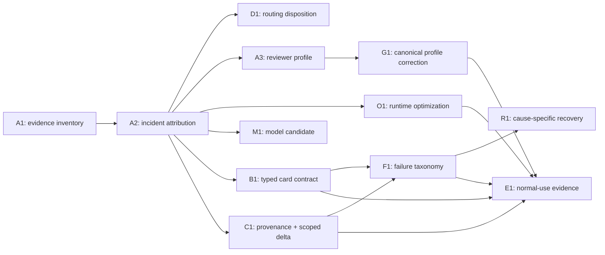

# Tasks: Local-Execution Routing Decision and Evidence Hardening

> **Plan:** `docs/plan/local-agent-packet-hardening.md`
> **Evidence:** `docs/audit/local-execution-routing-evidence-2026-09-14.md`

## Status legend

- [ ] Not started · [x] Done · [~] In progress · [!] Blocked

## Dependency graph

## Task summary

| Task | Type | Status | Outcome |
|---|---|---|---|
| A1 — inventory post-migration local execution | analysis/docs | [x] Done | available runtime corpus delimited and corroborated |
| A2 — classify the observed incidents | analysis/docs | [x] Done | model, packet, runner, transport, and provenance claims separated |
| D1 — publish routing disposition | policy analysis/docs | [x] Done | existing routes retained; no whole-task expansion above 45 |
| A3 — evaluate the Complex reviewer profile | analysis/docs | [x] Done | medium recommended; high rejected as the proven default |
| O1 — evaluate Flash Attention and KV `q8_0` | analysis/docs | [x] Done | retain as capacity baseline; no routing credit |
| M1 — evaluate an uninstalled coding alternative | analysis/docs | [x] Done | Qwen3-Coder 30B selected as first future candidate; no swap |
| G1 — correct the canonical Complex-review profile | policy/docs | [ ] Not started | approval-gated propagation of the medium profile |
| B1 — versioned typed task-card contract | development | [ ] Not started | prose criteria cannot be executed as commands |
| C1 — immutable run provenance and session-owned scope | development | [ ] Not started | card/state/model identity bound to every result |
| F1 — normalized failure taxonomy | development | [ ] Not started | failures identify the responsible layer and cause |
| R1 — cause-specific edit recovery | development | [ ] Not started | recovery reduces payload/ambiguity without full-file default |
| E1 — normal-use evidence aggregation | development/docs | [ ] Not started | future routing decisions query ordinary execution evidence |

Development tasks below are deliberately **not** approval cards. Before any
one starts, its exact files and behavior boundary must be frozen, its RRI must
be computed from that scope, the required review route must pass, and the
repository's task-specific approval checkpoint must be satisfied. The
analysis/docs tasks completed here are exempt from phase-2 code review.

---

## A1 — Inventory post-ADR-045 local execution

- **Status:** [x] Done — 2026-09-14
- **Type:** analysis / documentation
- **Output:** `docs/audit/local-execution-routing-evidence-2026-09-14.md`

### Objective

Identify executions after the ADR-045 merge using the runtime audit log as
the primary index, then corroborate each relevant row against its terminal
artifact and task-ledger history.

### Acceptance

- The corpus distinguishes a task from an invocation and a parent from the
  executable leaf that actually ran.
- Each row records model identity, actual band, terminal class, whether a
  model turn occurred, whether tests ran, and whether usable authorship can be
  assessed.
- Missing, partial, mutable, or non-terminal evidence is stated as such.

### Completion record

The only post-merge RRI 26–45 local-implementer records are two invocations
of `P2.T2c-r1` with Devstral. Both are `TRANSPORT_ERROR`, with zero total
turns, zero repair attempts, and no acceptance result. The `P2.T3c-S1b`
records are RRI 25 Low and name Qwen, so they are excluded from the Devstral
capability corpus and retained only as runner-hardening evidence.

Task-analysis review: n/a — analysis/docs-only task.
Code-solution review: n/a — analysis/docs-only task.

---

## A2 — Classify the observed incidents

- **Status:** [x] Done — 2026-09-14
- **Type:** analysis / documentation
- **Depends on:** A1
- **Output:** plan § Evidence-based incident classification; evidence report

### Objective

Determine what each cited artifact proves without converting correlation,
filenames, or an incomplete checkpoint into a model-capability conclusion.

### Acceptance

- The prose-as-command incident is classified as a confirmed packet/schema
  defect.
- The scope incident is classified as a confirmed provenance gap and an
  unproven `scope_check.py` defect.
- The malformed JSON incident is classified as one confirmed full-response
  decode failure, not as proven repeated exhaustion.
- A forced full-file fallback is rejected unless later cause-specific
  evidence supports it.

### Completion record

All four acceptance points are reflected in the plan and evidence report.
The current card matcher accepts the disputed `lib.rs` path; the current card
was modified after the transcript, so the original loaded scope is not
recoverable. The tree-comparison artifact contains one malformed event and
remains `in_progress`. Another transcript demonstrates that whole-file repair
can erase unrelated valid content, so `write_file` is not a safe generic
fallback.

Task-analysis review: n/a — analysis/docs-only task.
Code-solution review: n/a — analysis/docs-only task.

---

## D1 — Publish the routing disposition

- **Status:** [x] Done — 2026-09-14
- **Type:** policy analysis / documentation
- **Depends on:** A2
- **Output:** plan § Routing disposition

### Objective

End the review with an operational choice for each band instead of deferring
the original question to an unspecified later governance task.

### Acceptance

- `LOCAL_FIRST`: 0–25 and 26–40.
- `CONDITIONAL_LOCAL_FIRST`: 41–45 after a valid `GO_LOCAL` decision.
- `LOCAL_DECOMPOSITION_ONLY`: 46–55.
- `LOCAL_ADVISORY_REVIEW_ONLY`: 56–70.
- `CLOUD_REQUIRED`: 71+ implementation.
- The disposition explicitly separates implementation capability from local
  reviewer or architect capability.

### Completion record

The disposition is published in the plan. It retains current ADR/policy
boundaries, so no ADR amendment is needed. It explicitly declines a broader
whole-task local implementation route because the post-migration corpus has
no completed Devstral authoring outcome to support one.

Task-analysis review: n/a — policy-analysis/docs-only task.
Code-solution review: n/a — policy-analysis/docs-only task.

---

## A3 — Evaluate the `gpt-oss:20b` Complex-review profile

- **Status:** [x] Done — 2026-09-14
- **Type:** analysis / documentation
- **Depends on:** A2
- **Output:** plan § Reviewer-profile disposition; evidence report

### Objective

Determine whether the canonical RRI 56+ `think=high` profile is supported by
real repository review outcomes, independently of the decision to keep
`gpt-oss:20b` as the local reviewer.

### Completion record

Four recorded high-reasoning attempts across two Complex/Very-high review
packets consumed their generation budgets and returned empty visible content.
The one completed review in the directly comparable `P2.T3c-Integ` sequence
used `think=medium`, `num_ctx=49152`, and `num_predict=10240`, and returned a
parsed `PASS` with `done_reason: stop`. Medium is therefore the recommended
default; the policy propagation remains G1 because it changes a governance-
critical binding.

Task-analysis review: n/a — analysis/docs-only task.
Code-solution review: n/a — analysis/docs-only task.

---

## O1 — Evaluate Flash Attention and KV-cache `q8_0`

- **Status:** [x] Done — 2026-09-14
- **Type:** analysis / documentation
- **Depends on:** A2
- **Output:** plan § Runtime-capacity disposition; evidence report

### Objective

Determine whether the two Ollama settings should be adopted as process
optimizers and whether they change the routing recommendation.

### Completion record

Ollama 0.34.0 is already configured with
`OLLAMA_FLASH_ATTENTION=1`, `OLLAMA_KV_CACHE_TYPE=q8_0`, and
`OLLAMA_MAX_LOADED_MODELS=1`. Retain these as the 32 GB host's capacity
baseline. They reduce attention/KV-cache memory pressure but neither correct
packet and provenance defects nor prevent `think=high` from consuming the
visible-output budget. No routing-band expansion is credited to them. E1 must
record their effective per-run use because configuration alone does not prove
that a loaded session used the intended path.

Task-analysis review: n/a — analysis/docs-only task.
Code-solution review: n/a — analysis/docs-only task.

---

## M1 — Evaluate a not-installed local coding alternative

- **Status:** [x] Done — 2026-09-14
- **Type:** analysis / documentation
- **Depends on:** A2
- **Output:** plan § Alternative local-implementer disposition; evidence report

### Objective

Select the best-fit candidate for a future ordinary bounded task without
converting vendor specifications into a routing decision or opening a pilot.

### Completion record

`qwen3-coder:30b` is the first candidate by memory fit, active-parameter
shape, context, and agentic-coding focus. It is not installed or promoted:
Devstral has zero assessable post-migration outcomes, so replacing it now
would evade rather than resolve the evidence problem.

Task-analysis review: n/a — analysis/docs-only task.
Code-solution review: n/a — analysis/docs-only task.

---

## G1 — Correct the canonical Complex-review profile

- **Status:** [ ] Not started — explicit approval required
- **Type:** policy / documentation
- **Depends on:** A3

### Objective

Replace `think=high`/`num_predict=8192` with
`think=medium`/`num_predict=10240` for the RRI 56+ `gpt-oss:20b` primary
reviewer while retaining `num_ctx=49152`, the sampling values, and the current
reviewer/fallback order.

### Approval boundary

This changes a governance-critical workflow invariant. The present assignment
authorizes the conceptual evaluation and planning correction, not silent
mutation of the canonical workflow guide and RRI policy. Before execution,
freeze the exact affected policy/history files and obtain explicit approval.

---

## B1 — Introduce a versioned typed task-card contract

- **Status:** [ ] Not started — not approved
- **Type:** development
- **Depends on:** A2

### Objective

Replace the ambiguous `acceptance_tests: list[str]` contract for new cards
with a versioned representation that cannot execute descriptive acceptance
text.

### Required behavior

- New cards carry `schema_version` and immutable card identity.
- `acceptance_criteria` contains stable IDs and prose statements; it is never
  passed to a subprocess.
- `verification_commands` contains explicit argv arrays and the criterion IDs
  each command proves; the runner does not reconstruct shell syntax from
  prose.
- Each argv is still checked by the existing command capability boundary.
- Legacy cards use an explicit compatibility path with a visible provenance
  marker. Invalid legacy entries fail before context retrieval or model
  invocation.
- Card producers and consumers share one parser/schema rather than duplicating
  interpretation.

### Verification scenarios

- A v2 card with prose criteria and structured commands loads; only the
  structured argv is executed.
- The historical `Validation code uses...` shape is rejected before a model
  call when presented through legacy compatibility.
- Environment assignments and explicitly requested shells retain their
  current safe argv behavior.
- Escalation and normalized-execution artifacts preserve criterion/command
  identity without flattening them back into ambiguous strings.

### Presentation note

Freeze the producer/consumer migration boundary before scoring. Avoid an
executable-name allow-list or `which`-based prose heuristic: both confuse host
availability with packet validity and reject legitimate repository-local
tools.

---

## C1 — Bind immutable run provenance and session-owned scope

- **Status:** [ ] Not started — not approved
- **Type:** development
- **Depends on:** A2

### Objective

Make the exact card and starting repository state used by a run recoverable,
and make scope results describe changes caused by that session rather than an
unattributed accumulated worktree diff.

### Required behavior

- Before the model call, record the loaded card SHA-256, schema version,
  resolved model/runtime preset, HEAD/base revision, and a deterministic
  snapshot of pre-existing changed paths and content identities.
- Bind checkpoints, terminal results, audit rows, and fallback packets to the
  same execution-session ID and card hash.
- Record the top-level model identity in every terminal and in-progress
  transcript, not only in a separate audit log or fallback packet.
- Scope checking compares the session end against the attested start state.
  Pre-existing unchanged dirt is not attributed to the model; new or changed
  out-of-scope content fails closed.
- If the start state cannot be attested or the card/result binding is broken,
  emit a provenance failure rather than a path-policy verdict.

### Verification scenarios

- A card edited after execution no longer appears to explain the earlier
  transcript: the hash mismatch is explicit.
- An unchanged pre-existing out-of-scope file does not become a model scope
  violation.
- A model modification to that same out-of-scope file is detected.
- An allowed path changed during the session is reported in-scope with its
  before/after identity.

---

## F1 — Normalize failure causes and evidence

- **Status:** [ ] Not started — not approved
- **Type:** development
- **Depends on:** B1, C1

### Objective

Replace terminal labels that conflate cause and consequence with a stable
failure taxonomy usable by recovery and routing analysis.

### Required behavior

At minimum, distinguish:

- transport idle/wall timeout and resource/capacity failure;
- full model-response JSON decode failure;
- tool-arguments JSON decode failure;
- schema, unknown-tool, missing-argument, and wrong-type failure;
- boundary violation, provenance failure, scope failure;
- formatter failure, verification-command failure;
- total-turn and repair-budget exhaustion.

For a response failure, record turn number, response byte/token length when
available, Ollama completion reason, configured generation/context budgets,
and whether a target path can be established from a valid envelope. Preserve
bounded raw evidence without turning secrets into diagnostics.

### Verification scenarios

- The historical unterminated full response is classified separately from an
  invalid JSON string inside otherwise valid tool arguments.
- Unknown tool and missing path do not increment a JSON-decode counter.
- A partial checkpoint and a terminal exhaustion artifact cannot share the
  same lifecycle status.
- Transport with zero model turns is never counted as a model-authorship
  failure.

---

## R1 — Add cause-specific bounded edit recovery

- **Status:** [ ] Not started — not approved
- **Type:** development
- **Depends on:** F1

### Objective

Recover from an observed edit-transport failure by reducing payload size or
operation ambiguity while preserving scope and existing content.

### Required behavior

- Recovery selection consumes F1's exact failure class.
- A whole-response decode failure does not invent a target path.
- The recovery instruction/tool reduces the failing representation (for
  example, a smaller range/line-oriented replacement or idempotent insertion)
  rather than increasing it to a complete-file JSON payload.
- Full-file overwrite remains available only when it was already the correct
  bounded operation, not as the generic response to malformed JSON.
- Existing turn/repair ceilings and fail-closed boundary behavior remain in
  force.

### Verification scenarios

- Long-anchor recovery can complete through a smaller bounded operation.
- Retrying an idempotent one-line insertion cannot duplicate the inserted
  line.
- Recovery cannot alter unrelated valid content in the same file.
- If the cause or target is unknown, the session remains fail-closed and emits
  enough evidence for the next routing step.

---

## E1 — Aggregate evidence from normal local executions

- **Status:** [ ] Not started — not approved
- **Type:** development / documentation
- **Depends on:** B1, C1, F1

### Objective

Make the normalized execution seam the queryable source for future routing
decisions without creating a synthetic pilot or manual grep exercise.

### Required behavior

- One summary per invocation, grouped by execution-session ID and task ID.
- Separate parent task/band from executable leaf/band.
- Record exact implementer model and distinguish authoring success from final
  verification success.
- Record requested and effective Flash Attention/KV-cache mode, context
  allocation, model residency, and available capacity telemetry.
- Attribute failures to `model`, `packet`, `runner`, `transport`, `resource`,
  `verification`, or `provenance` with an evidence reference.
- Record repair, decomposition, human-selected fallback, and cloud takeover
  without treating them as model-authorship attempts.
- Supply a deterministic repository command/report that can answer routing
  questions by band and model from ordinary completed work.

### Verification scenarios

- The two `P2.T2c-r1` invocations count as transport failures and zero
  assessable Devstral authoring outcomes.
- A Low leaf under a Med-high parent is counted in both dimensions without
  being mislabeled a Med-high local model run.
- A model-authored patch that passes formatting/scope but fails because the
  packet contains an invalid command is attributed to the packet layer.

## Related

- `docs/plan/local-agent-packet-hardening.md`
- `docs/audit/local-execution-routing-evidence-2026-09-14.md`
- `docs/adr/ADR-038-med-high-architect-refined-single-attempt.md`
- `docs/adr/ADR-045-devstral-local-implementer-binding.md`
- `docs/adr/ADR-047-software-factory-execution-normalization-seam.md`
- `docs/playbooks/AGENT_WORKFLOW_GUIDE.md`
- `docs/policies/HITL_AUTONOMY_POLICY.md`
- `docs/policies/RRI_POLICY.md`
