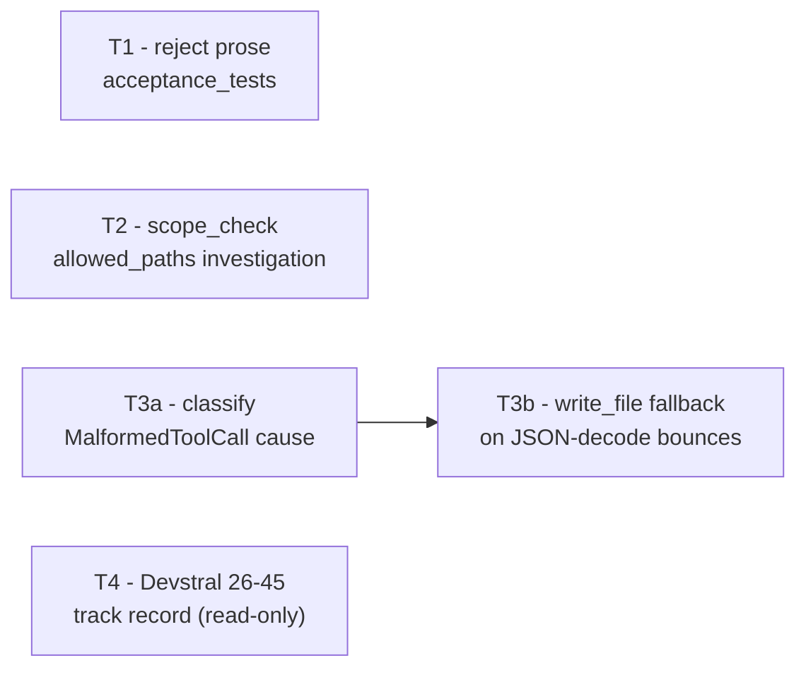

# Tasks: Local-Agent Delegation Packet Hardening

> **Plan:** `docs/plan/local-agent-packet-hardening.md`

## Status legend

- [ ] Not started · [x] Done · [~] In progress · [!] Blocked

## Dependency graph

T1, T2, T3a, and T4 have no dependency on each other — different files, no
shared state — but follow the repo's normal one-task-at-a-time discipline
(§ "Work on the approved or delegated task only" in
`docs/playbooks/AGENT_WORKFLOW_GUIDE.md`) rather than true parallel
execution. T3b depends on T3a's cause-classification landing first: it
consumes the counter/classification T3a introduces.

## Task table

| Task | RRI | Band | Effort | Depends on |
|---|---:|---|---|---|
| T1 — reject prose `acceptance_tests` before dispatch | 55 | Med-high | L | — |
| T2 — root-cause `allowed_paths` vs. `scope_check` contradiction | 55 | Med-high | L | — |
| T3a — classify `MalformedToolCall` by cause | 55 | Med-high | L | — |
| T3b — `write_file` fallback on repeated JSON-decode bounces | 55 | Med-high | L | T3a |
| T4 — Devstral RRI 26-45 track record since 2026-09-07 | 25 | Low | S | — |

All Med-high tasks require their own approval, Qwen3.6 27B advisory
refinement, and 3 Reflection passes per ADR-038; none may start
implementation without an explicit approval on its own six-block card. See
the plan's § Routing note for why these tooling fixes are not guaranteed a
local-first implementation path.

---

## T1 — Reject prose `acceptance_tests` entries before dispatch

- **Status:** [ ] Not started
- **Type:** development
- **Effort:** L (RRI 55, Med-high)
- **Depends on:** —
- **RRI:** `python3 scripts/rri.py --cc 4 --D 2 --K 1 --P 2 --T 1 --A 1 --X 1 --touches scripts/local-agent/cli.py --touches scripts/local-agent/run_local_task.py --touches scripts/local-agent/run_local_task_test.py --touches docs/plan/local-agent-packet-hardening.md --touches docs/tasks/local-agent-packet-hardening.md` → **55, Med-high**.

### Objective

Before a task card's `acceptance_tests` are handed to the runner's
`test_runner`, validate that each entry is plausibly an invocable command
(not prose) and fail closed with a clear error naming the offending entry
and the card's `task_id`, instead of letting the runner `shlex`/whitespace-
split a sentence into `argv` and fail with an opaque `Errno 2`.

### In scope

- `scripts/local-agent/cli.py` (`load_card`, and wherever `acceptance_tests`
  is first consumed before being passed into `run_loop`/the test runner).
- A minimal heuristic is sufficient — e.g. `shlex.split` succeeds, the
  resulting argv is non-empty, and `argv[0]` resolves via
  `shutil.which(...)` or matches a small allow-list of known
  interpreters/wrappers already used in existing cards (`cargo`, `python3`,
  `npm`, `bash`, `sh`, `rustfmt`). Do not attempt NLP/prose detection beyond
  this.

### Out of scope

- `scripts/delegate-low-rri.py`'s own packet generation (not implicated —
  this defect was in a hand-authored card, not generator output). No change
  to how `delegate-low-rri.py` builds `acceptance_tests`.
- `session_loop.py`'s tool-call parsing (T3a/T3b's surface).

### Happy paths considered

- **HP-1:** a card whose every `acceptance_tests` entry is a real,
  `shlex`-parseable command with a resolvable `argv[0]` (e.g.
  `"cargo check -p dubbridge-p2p"`) loads and runs unchanged from today's
  behavior.

### Edge cases considered

- **EC-1:** a card with one prose entry (e.g. `"Validation code uses only
  real existing fields and dependencies"`) is rejected at load time with an
  error naming the entry and the card's `task_id`, before any Ollama call
  is made — not a runtime `command failed to start` surfaced mid-session.
- **EC-2:** a card whose command uses a project-local script not on `PATH`
  (e.g. `"python3 scripts/rri.py ..."`) is accepted — the heuristic must not
  false-positive on real, valid commands already in use elsewhere in the
  repo's existing task cards.

### Evidence to emit

- New unit tests in `run_local_task_test.py` covering HP-1, EC-1, EC-2.
- A short before/after note in the closure record quoting the exact error
  message EC-1 now produces.

### Status artifacts affected

- This task list (`[x] Done` + closure record).
- `docs/plan/local-agent-packet-hardening.md` if the chosen heuristic
  differs materially from the "Design decisions" section's description.

### Agent handoff prompt

Task T1. Goal: reject a non-command `acceptance_tests` entry at card-load
time instead of letting it fail mid-session as a shell error.
Governing docs: `docs/plan/local-agent-packet-hardening.md`,
`docs/tasks/local-agent-packet-hardening.md` § T1.
File: `scripts/local-agent/cli.py`, card-loading path (`load_card` and its
caller before `run_loop`).
Acceptance: HP-1, EC-1, EC-2 above, each with a passing test in
`run_local_task_test.py`.
Stop condition: once HP-1/EC-1/EC-2 have passing tests and `cli.py`'s
existing tests still pass, stop — do not touch `delegate-low-rri.py` or
`session_loop.py`.

---

## T2 — Root-cause `allowed_paths` vs. `scope_check` contradiction

- **Status:** [ ] Not started
- **Type:** development (investigation-first; fix is conditional on findings)
- **Effort:** L (RRI 55, Med-high)
- **Depends on:** —
- **RRI:** `python3 scripts/rri.py --cc 5 --D 2 --K 1 --P 2 --T 1 --A 2 --X 1 --touches scripts/local-agent/scope_check.py --touches scripts/local-agent/scope_check_test.py --touches docs/plan/local-agent-packet-hardening.md --touches docs/tasks/local-agent-packet-hardening.md` → **55, Med-high**.

### Objective

Determine why `s1b-source-repair-card.json`
(`allowed_paths: ["crates/p2p/src/package_writer.rs",
"crates/p2p/src/lib.rs"]`) produced a `scope_check` result of `in_scope:
false, offending_paths: ["crates/p2p/src/lib.rs"]` — a path present in its
own `allowed_paths`. Fix `scope_check.py` if the root cause is a real
matching/normalization bug; otherwise document the actual cause (e.g. a
stale diff from a shared disposable worktree) and add a regression test or
an operational guard as appropriate to what was found.

### In scope

- `scripts/local-agent/scope_check.py` (`_is_allowed`, `_git_paths`,
  `check_scope`).
- Reproducing the exact card + a synthetic diff touching
  `crates/p2p/src/lib.rs` in a disposable worktree to confirm or rule out a
  path-normalization mismatch (e.g. leading `./`, trailing null-byte
  handling from `_git_paths`'s NUL-separated `git` output, or a worktree
  whose `git diff` base differs from what the caller assumed).

### Out of scope

- Re-litigating `P2.T3c-S1b`'s closure or its `CLOUD_REQUIRED` outcome —
  that task is already `[x] Done` and owner-verified; this task only
  explains the tooling artifact left behind.
- Any change to `allowed_paths` semantics or the ADR-038/040 routing rules
  that consume `scope_check`'s result.

### Happy paths considered

- **HP-1:** a path listed verbatim in `allowed_paths` and actually the only
  path in the worktree's diff is reported `in_scope: true` — this must keep
  passing (regression guard on existing behavior).

### Edge cases considered

- **EC-1:** reproducing the exact `s1b-source-repair-card.json` scenario
  (its `allowed_paths`, a diff touching only `lib.rs`) either (a) now
  correctly reports `in_scope: true`, proving and fixing a real bug, or (b)
  reproduces `in_scope: false` only when the worktree's `git diff` base
  includes an unrelated prior change — in which case the finding is
  documented as a worktree-reuse hazard, not a `scope_check.py` defect, and
  T2 closes with that explanation plus a doc note instead of a code fix.
- **EC-2:** a path in `allowed_paths` with a trailing slash or a `./`
  prefix is still matched correctly (existing `_normalise_allowed_path`
  behavior) — regression guard, not new behavior.

### Evidence to emit

- The reproduction transcript/command output showing which of EC-1's two
  branches occurred.
- If (a): a new regression test in `scope_check_test.py` covering the exact
  failure shape.
- If (b): a short note in `docs/playbooks/AGENT_WORKFLOW_GUIDE.md` or this
  closure record warning that a Low-band decomposition candidate's
  `scope_check` result can reflect a shared worktree's accumulated diff,
  not just that leaf's own edit — and whether that warrants a follow-up
  (recorded as a forward pointer, not built here).

### Status artifacts affected

- This task list (`[x] Done` + closure record, including which of EC-1's
  branches was confirmed).

### Agent handoff prompt

Task T2. Goal: explain (and fix only if it's a real bug) why
`scope_check` flagged a path as out-of-scope despite it being listed in
`allowed_paths`.
Governing docs: `docs/plan/local-agent-packet-hardening.md`,
`docs/tasks/local-agent-packet-hardening.md` § T2,
`.agent/p2-t3c/s1b-source-repair-card.json`,
`.agent/p2-t3c/s1b-source-repair-transcript.json`.
File: `scripts/local-agent/scope_check.py`.
Acceptance: HP-1, EC-1 (both branches), EC-2 above.
Stop condition: once the root cause is confirmed and either a fix + test
(branch a) or a documented explanation (branch b) is recorded, stop — do
not modify `allowed_paths` semantics elsewhere in the pipeline.

---

## T3a — Classify `MalformedToolCall` by cause

- **Status:** [ ] Not started
- **Type:** development
- **Effort:** L (RRI 55, Med-high)
- **Depends on:** —
- **RRI:** `python3 scripts/rri.py --cc 3 --D 2 --K 1 --P 2 --T 1 --A 1 --X 1 --touches scripts/local-agent/session_loop.py --touches scripts/local-agent/run_local_task_test.py --touches docs/plan/local-agent-packet-hardening.md --touches docs/tasks/local-agent-packet-hardening.md` → **55, Med-high**.

### Objective

Distinguish, in `session_loop.py`'s `MalformedToolCall` handling
(`run_loop`, around lines 318-361), a `json.JSONDecodeError`-caused failure
(raised at `session_loop.py:67`/`cli.py:150-153`, i.e. the model's raw
response or its `arguments` string wasn't valid JSON) from every other
`MalformedToolCall` cause (unknown tool name, missing required argument,
wrong argument type). Track a separate counter for the JSON-decode class.
This task adds no new externally visible behavior — it is pure
instrumentation that T3b consumes.

### In scope

- `session_loop.py`: `MalformedToolCall` needs a way to carry or expose its
  cause class (e.g. a `cause: Literal["json_decode", "other"]` attribute
  set where it's raised, or a dedicated `JsonDecodeToolCall(MalformedToolCall)`
  subclass raised only from the two `json.JSONDecodeError` sites).
  A second counter (`json_decode_bounces`) alongside the existing
  `malformed_bounces`, incremented only for that class.

### Out of scope

- Any change to what happens on a JSON-decode bounce (that's T3b).
- The non-JSON-decode `MalformedToolCall` paths' existing behavior/messages.

### Happy paths considered

- **HP-1:** an unknown-tool-name `MalformedToolCall` (e.g. `name not in
  ALLOWED_TOOL_NAMES`) increments only `malformed_bounces`, not
  `json_decode_bounces` — existing retry behavior for this class is
  unchanged.

### Edge cases considered

- **EC-1:** a `json.JSONDecodeError`-caused failure (long/malformed anchor
  string) increments `json_decode_bounces` and is distinguishable from
  other causes by whatever the model reads (transcript event, exception
  type/attribute).
- **EC-2:** a session with a mix of both classes across turns keeps both
  counters accurate independently (one class recovering doesn't reset the
  other's count).

### Evidence to emit

- Unit tests in `run_local_task_test.py` covering HP-1, EC-1, EC-2 using
  synthetic `chat_fn` responses (the existing test file already fakes
  `chat_fn`; extend rather than introduce a new test harness).

### Status artifacts affected

- This task list (`[x] Done` + closure record).

### Agent handoff prompt

Task T3a. Goal: classify `MalformedToolCall` failures by cause
(JSON-decode vs. other) with a dedicated counter, no behavior change.
Governing docs: `docs/plan/local-agent-packet-hardening.md`,
`docs/tasks/local-agent-packet-hardening.md` § T3a.
File: `scripts/local-agent/session_loop.py:44-76` (raise sites),
`:318-361` (`run_loop`'s bounce handling).
Acceptance: HP-1, EC-1, EC-2 above.
Stop condition: once both counters are correctly and independently tracked
with passing tests, stop — do not implement the `write_file` fallback
itself (T3b).

---

## T3b — `write_file` fallback on repeated JSON-decode bounces

- **Status:** [ ] Not started
- **Type:** development
- **Effort:** L (RRI 55, Med-high)
- **Depends on:** T3a
- **RRI:** `python3 scripts/rri.py --cc 5 --D 2 --K 1 --P 2 --T 2 --A 1 --X 1 --touches scripts/local-agent/session_loop.py --touches scripts/local-agent/run_local_task_test.py --touches docs/plan/local-agent-packet-hardening.md --touches docs/tasks/local-agent-packet-hardening.md` → **55, Med-high**.

### Objective

When `json_decode_bounces` (T3a) reaches 2 for the same target path within
one session, stop retrying the same `apply_patch`-with-anchor shape and
instead inject a message instructing the model to use `write_file` with the
complete file content for that path on its next turn — trading a surgical
patch for a full-file write once the anchor-escaping approach has
demonstrably failed twice. Falls back to the existing
`malformed_tool_call_repeated`/`aborted` path if the model still can't
produce valid output after the degraded instruction.

### In scope

- `session_loop.py`'s `run_loop`: on the 2nd `json_decode_bounces` count
  for an in-flight target path, replace the generic `"Malformed tool call:
  {exc}. Retry."` message with an explicit instruction naming `write_file`
  and the target path, reusing the existing `messages.append(...)` /
  `checkpoint_fn` pattern already in the bounce-handling block.
- Existing `MAX_MALFORMED_BOUNCES` ceiling and `aborted` terminal status are
  unchanged — this only changes what the model is told to try, not the
  budget.

### Out of scope

- Raising `MAX_MALFORMED_BOUNCES` or `max_total_turns` — those remain
  band-resolved constants set elsewhere (`run_local_task.py:113` and the
  band's `effective_limits`).
- Any change to the non-JSON-decode `MalformedToolCall` retry message.

### Happy paths considered

- **HP-1:** a session that hits `json_decode_bounces == 1` on a given path,
  then succeeds with a valid `apply_patch` on the very next turn, never
  triggers the fallback message — unchanged from today.
- **HP-2:** a session that hits `json_decode_bounces == 2` on the same
  path, receives the `write_file`-fallback instruction, and succeeds with a
  `write_file` call on the following turn — session completes instead of
  exhausting its turn budget the way `s1b-tree-compare-repair` did.

### Edge cases considered

- **EC-1:** `json_decode_bounces` reaching 2 across *different* target
  paths (not the same path twice) does not trigger the fallback — the
  counter/threshold is scoped per path, not session-global, since a
  fallback instruction for the wrong path would be actively misleading.
- **EC-2:** the model ignores the fallback instruction and sends another
  malformed `apply_patch` anyway — normal bounce/abort handling still
  applies; the fallback message is advisory, not enforced by the runner.

### Evidence to emit

- Unit tests in `run_local_task_test.py` covering HP-1, HP-2, EC-1, EC-2
  with synthetic `chat_fn` sequences.
- A closure-record note quoting the exact fallback instruction text sent to
  the model.

### Status artifacts affected

- This task list (`[x] Done` + closure record).
- `docs/playbooks/AGENT_WORKFLOW_GUIDE.md` § "Mandatory workflow before
  implementing, Step 0" only if the fallback changes any operator-visible
  precheck/warm-up behavior (expected: no).

### Agent handoff prompt

Task T3b. Goal: on a 2nd consecutive JSON-decode-classified malformed tool
call for the same target path, instruct the model to use `write_file`
instead of continuing to retry `apply_patch` with an anchor.
Governing docs: `docs/plan/local-agent-packet-hardening.md`,
`docs/tasks/local-agent-packet-hardening.md` § T3b. Depends on T3a's
`json_decode_bounces` counter being in place.
File: `scripts/local-agent/session_loop.py`, `run_loop`'s
`MalformedToolCall` handling (around lines 318-361).
Acceptance: HP-1, HP-2, EC-1, EC-2 above.
Stop condition: once HP-1/HP-2/EC-1/EC-2 have passing tests and existing
`MAX_MALFORMED_BOUNCES`/`aborted` behavior is unchanged, stop.

---

## T4 — Devstral RRI 26-45 track record since 2026-09-07 (read-only)

- **Status:** [ ] Not started
- **Type:** analysis / documentation (non-development; decision-weight
  heuristic, not the code-CC formula)
- **Effort:** S (RRI 25, Low)
- **Depends on:** —
- **RRI:** `python3 scripts/rri.py --cc 1 --D 0 --K 0 --P 1 --T 0 --A 1 --X 0 --touches docs/audit/devstral-26-45-track-record-2026-09.md --touches docs/plan/local-agent-packet-hardening.md --touches docs/tasks/local-agent-packet-hardening.md` → **25, Low**.

### Objective

Read-only: enumerate every RRI 26-45 (Moderate, and Med-high 41-45
`GO_LOCAL`) task closed since 2026-09-07 (the ADR-045 Devstral merge) that
routed through `run_local_task.py`, and tabulate outcome (success first
attempt / success after repair / repair-budget exhausted -> decomposed /
escalated to cloud) with a source citation per row (task ledger closure
record or `.agent/` receipt). No code changes; no new local-agent
invocation.

### In scope

- Reading `docs/plan/roadmap.md`, `docs/tasks/*.md` closure records, and
  `.agent/` receipts/transcripts dated on or after 2026-09-07.
- Producing `docs/audit/devstral-26-45-track-record-2026-09.md` — a table:
  task ID, RRI, outcome class, turns used / budget, source citation.

### Out of scope

- Drawing a conclusion about whether to extend local-first implementation
  into 46-55 or 56-70 — that is a separate governance decision (an ADR),
  not this task's output. T4 supplies evidence; it does not recommend.
- Any new task execution — this is purely retrospective over already-closed
  work.

### Happy paths considered

- **HP-1:** every RRI 26-45 task closed since 2026-09-07 with a discoverable
  `run_local_task.py` route is included in the table with a working
  citation link.

### Edge cases considered

- **EC-1:** if no qualifying closed task is found at all (Devstral track
  record is empty so far), the table says so explicitly rather than being
  silently omitted — an empty result is itself the finding.

### Evidence to emit

- `docs/audit/devstral-26-45-track-record-2026-09.md` (the table itself).

### Status artifacts affected

- None beyond the new audit doc — this task does not change any task's
  status, RRI, or routing.

### Agent handoff prompt

Task T4. Goal: build a factual, citation-backed table of every RRI 26-45
local-agent outcome since the 2026-09-07 Devstral migration. Read-only.
Governing docs: `docs/plan/local-agent-packet-hardening.md`,
`docs/tasks/local-agent-packet-hardening.md` § T4.
Output: `docs/audit/devstral-26-45-track-record-2026-09.md`.
Stop condition: once every discoverable qualifying task is in the table
with a citation (or the table explicitly states none were found), stop —
do not propose or draft any band-expansion ADR.

## Related

- `docs/plan/local-agent-packet-hardening.md`
- `docs/adr/ADR-038-med-high-architect-refined-single-attempt.md`
- `docs/adr/ADR-045-devstral-local-implementer-binding.md`
- `docs/policies/RRI_POLICY.md`
