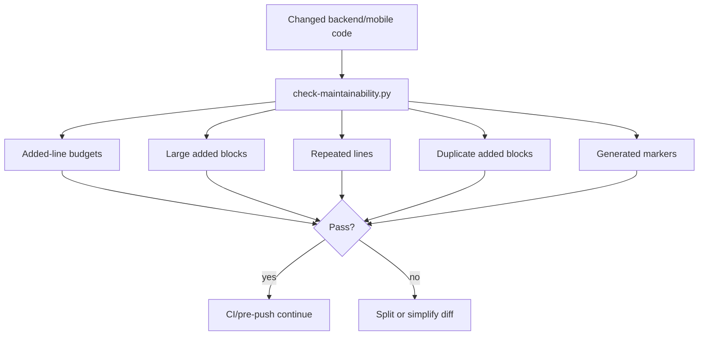
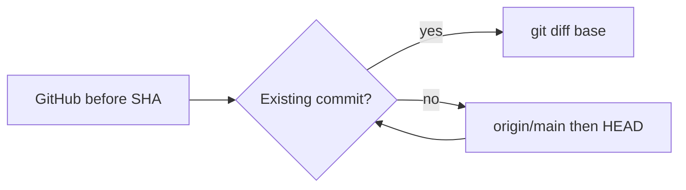

# Tasks: Maintainability Quality Gate

Governing plan: `docs/plan/maintainability-quality-gate.md`
Governing guides: `docs/playbooks/AGENT_WORKFLOW_GUIDE.md`, `docs/policies/RRI_POLICY.md`

## Status Legend
- [ ] Not started
- [x] Done
- [~] In progress
- [!] Blocked

## RRI

```md
**Platform:** dubbridge

| Variable | Score | Evidence | Confidence |
|---|---|---|---|
| C cyclomatic | 2 | raw CC 12 -> score 2 (policy CC table) | High |
| F files | 3 | --touches -> 7 files | High |
| D domain | 1 | agent-supplied (no rubric match) | High |
| T coverage | 2 | agent-supplied | High |
| A ambiguity | 0 | agent-supplied | High |
| K coupling | 3 | agent-supplied (no rubric match) | High |
| P impact | 2 | agent-supplied (no rubric match) | High |
| X context | 2 | agent-supplied | High |

**Base value:** 100 x (weighted / 5) = 37
**Penalties applied:** arch_decision (+12, manual flag)
**Final RRI:** 49 -> band Med-high (41-55) -> Effort L . Codex Balanced -> Premium . Claude Balanced -> Premium . thinking On
**Gates for this band:** Plan + explicit acceptance criteria required before approval.
**Decomposition:** not triggered
```

## Task MQG-T1 — Add diff-based maintainability gate

**Status:** [x] Done
**Effort:** L
**Complexity:** Med-high
**Depends on:** none
**Recommended model:** Codex `GPT-5.2-Codex` / Claude Code `Claude Sonnet 4`

### Objective

Add a repo-level maintainability gate that blocks likely generated-code bloat in
backend Rust and mobile TypeScript/TSX changes while preserving the current code
baseline.

### Context

This task belongs to the Maintainability Quality Gate plan. The backend already
has strong compile/test/coverage gates, and mobile has typecheck/test scripts.
Neither surface currently blocks oversized generated diffs, large pasted code
blocks, repeated added lines, duplicated added blocks, or generated-source
markers before review.

### Related documents

- Source task file: `docs/tasks/maintainability-quality-gate.md`
- Linked plan: `docs/plan/maintainability-quality-gate.md`
- Workflow: `docs/playbooks/AGENT_WORKFLOW_GUIDE.md`
- RRI policy: `docs/policies/RRI_POLICY.md`

### Inputs

- Changed backend paths under `apps/**/*.rs` and `crates/**/*.rs`
- Changed mobile paths under `mobile/src/**/*.ts`, `mobile/src/**/*.tsx`,
  `mobile/__tests__/**/*.ts`, and `mobile/__tests__/**/*.tsx`
- Git diff metadata against an explicit or discovered base

### Outputs

- New `scripts/check-maintainability.py` gate
- Unit tests in `scripts/check_maintainability_test.py`
- `make qa-maintainability`
- CI job for maintainability
- pre-push maintainability execution

### Acceptance criteria

- [x] The checker passes on narrow/empty changes and exits non-zero with readable
      diagnostics for oversized generated-like diffs.
- [x] Backend Rust and mobile TypeScript/TSX paths are both covered by the same
      gate.
- [x] The gate checks added-line budget, uninterrupted added-code block size,
      repeated added lines, declaration bursts, total diff budgets, file-count
      budgets, generic-name bursts, long-line bursts, duplicate added blocks,
      and generated-code markers.
- [x] The gate can be run through `make qa-maintainability`.
- [x] CI runs `make qa-maintainability`.
- [x] The pre-push hook runs `make qa-maintainability`.
- [x] Unit tests cover the happy paths and edge cases below.

### Happy path examples

- HP-1: a small Rust backend diff under `crates/**` with unique added lines passes.
- HP-2: a small React Native diff under `mobile/src/**` with unique added lines
  passes.

### Edge case examples

- EC-1: a mobile source diff that exceeds the added-line budget fails with the
  affected file named.
- EC-2: a backend Rust diff containing a generated-source marker fails closed.
- EC-3: repeated added code lines in one changed file fail.
- EC-4: duplicated normalized added blocks across changed code fail.

### Execution summary

1. Add the Python maintainability checker and unit tests.
2. Wire the checker into `Makefile` as `qa-maintainability`.
3. Add the gate to GitHub Actions.
4. Add the gate to the pre-push hook.
5. Run targeted verification and update this task ledger with evidence.

### Happy paths considered

- HP-1: small backend Rust changes stay frictionless.
- HP-2: small mobile TS/TSX changes stay frictionless.

### Edge cases considered

- EC-1: oversized generated-like mobile diffs are blocked.
- EC-2: generated-source markers are blocked in backend/mobile app code.
- EC-3: repeated added lines are blocked before they become review noise.
- EC-4: duplicated added blocks are blocked across backend/mobile changed files.
- EC-5: oversized multi-file source diffs are blocked even if no single file
  individually exceeds its budget.
- EC-6: declaration/import bursts in a changed file are blocked.
- EC-7: too many changed source files in one diff are blocked.
- EC-8: bursts of generic generated-style identifiers are blocked.
- EC-9: bursts of long added lines are blocked.

### Reflection strategy

Required passes: 3 (`49` -> `Med-high`)

- Pass 1: Draft the checker and tests, then critique whether the gate covers both
  backend and mobile without depending on external packages.
- Pass 2: Wire Makefile/CI/pre-push, then critique whether the gate can run in
  local and GitHub contexts without relying on unavailable git refs.
- Pass 3: Re-read thresholds and diagnostics as a reviewer, then revise any
  noisy or under-specified checks before certification.

### Diagram



### Reflection log

Required passes: 3 (`49` -> `Med-high`)

#### Pass 1

- **Draft verdict:** The first draft added a standard-library Python checker and
  unit tests for backend/mobile diff signals.
- **Critique findings:** Dynamic import of `check-maintainability.py` failed in
  tests because the module was not registered before dataclass processing.
- **Revisions applied:** Registered the dynamically loaded module in
  `sys.modules` before executing it.

#### Pass 2

- **Draft verdict:** Makefile, CI, and pre-push wiring were added without changing
  the existing Rust or mobile test gates.
- **Critique findings:** The CI job needs full history for reliable pull-request
  and push diffs.
- **Revisions applied:** Set `fetch-depth: 0` and passed
  `DUBBRIDGE_MAINTAINABILITY_BASE` from the GitHub event context.

#### Pass 3

- **Draft verdict:** Thresholds and diagnostics are explicit and scoped to changed
  backend/mobile app code.
- **Critique findings:** A full-repo Clippy cognitive-complexity gate would fail
  existing test baseline (`crates/domain/src/audit.rs`) and create unrelated
  cleanup work.
- **Revisions applied:** Kept the new gate diff-oriented and dependency-free so
  it prevents new generated bulk without blocking historical large files.

### Unit coverage certification

| Case ID | Type | Behavior | Unit test evidence | Result |
|---|---|---|---|---|
| HP-1 | Happy path | small Rust backend diff under `crates/**` with unique added lines passes | `scripts/check_maintainability_test.py::MaintainabilityGateTest.test_hp1_small_backend_rust_diff_passes` | passed |
| HP-2 | Happy path | small React Native diff under `mobile/src/**` with unique added lines passes | `scripts/check_maintainability_test.py::MaintainabilityGateTest.test_hp2_small_mobile_source_diff_passes` | passed |
| EC-1 | Edge case | mobile source diff exceeding the added-line budget fails with the file named | `scripts/check_maintainability_test.py::MaintainabilityGateTest.test_ec1_mobile_source_added_line_budget_fails` | passed |
| EC-2 | Edge case | backend Rust diff containing a generated-source marker fails closed | `scripts/check_maintainability_test.py::MaintainabilityGateTest.test_ec2_backend_generated_marker_fails` | passed |
| EC-3 | Edge case | repeated added code lines in one changed file fail | `scripts/check_maintainability_test.py::MaintainabilityGateTest.test_ec3_repeated_added_lines_fail` | passed |
| EC-4 | Edge case | duplicated normalized added blocks across changed code fail | `scripts/check_maintainability_test.py::MaintainabilityGateTest.test_ec4_duplicate_added_blocks_across_files_fail` | passed |
| EC-5 | Edge case | oversized multi-file source diffs fail even when split across files | `scripts/check_maintainability_test.py::MaintainabilityGateTest.test_ec5_total_source_diff_budget_fails` | passed |
| EC-6 | Edge case | declaration/import bursts in a changed file fail | `scripts/check_maintainability_test.py::MaintainabilityGateTest.test_ec6_mobile_declaration_burst_fails` | passed |
| EC-7 | Edge case | too many changed source files in one diff fail | `scripts/check_maintainability_test.py::MaintainabilityGateTest.test_ec7_source_file_count_budget_fails` | passed |
| EC-8 | Edge case | generic generated-style identifier bursts fail | `scripts/check_maintainability_test.py::MaintainabilityGateTest.test_ec8_generic_name_burst_fails` | passed |
| EC-9 | Edge case | long-line bursts fail | `scripts/check_maintainability_test.py::MaintainabilityGateTest.test_ec9_long_line_burst_fails` | passed |

### Owner final verification

- Owner: `Codex`
- Date: `2026-06-19`
- Statement: I verified every happy path and edge case defined for this task has
  unit test evidence that replicates the expected behavior.
- Commands run: `python3 -m unittest scripts/check_maintainability_test.py`;
  `python3 -m py_compile scripts/check-maintainability.py scripts/check_maintainability_test.py`;
  `make qa-maintainability DUBBRIDGE_MAINTAINABILITY_BASE=HEAD`;
  `make qa-maintainability`; `make qa-docs`; `bash -n scripts/hooks/pre-push`

## Task MQG-T2 — Handle new-branch null base revisions

**Status:** [x] Done
**Effort:** S
**Complexity:** Low
**RRI:** 16
**Depends on:** MQG-T1
**Recommended model:** Local Gemma via Ollama (delegated simple code patch;
primary agent remains orchestrator and reviewer)

### Objective

Keep the maintainability gate operational for the first push of a new branch,
where GitHub supplies an all-zero `github.event.before` SHA that is syntactically
valid but is not a commit in the checkout.

### Context

`discover_base()` currently accepts a base with `git rev-parse --verify`. Git
accepts the null SHA at that stage, but a later `git diff` fails because the
object does not exist. This follow-up task preserves the gate's existing fallback
order while requiring that a selected base resolves to a commit object.

### Related documents

- Source task file: `docs/tasks/maintainability-quality-gate.md`
- Linked plan: `docs/plan/maintainability-quality-gate.md`
- Workflow: `docs/playbooks/AGENT_WORKFLOW_GUIDE.md`
- RRI policy: `docs/policies/RRI_POLICY.md`

### Inputs

- Explicit `--base` and `DUBBRIDGE_MAINTAINABILITY_BASE` candidates
- GitHub's new-branch all-zero `before` SHA
- Existing local refs, including `origin/main` and `HEAD`

### Outputs

- Commit-object validation in `discover_base()`
- Unit coverage for rejecting a non-existent/null SHA and selecting the next
  valid fallback

### Acceptance criteria

- [x] A candidate is accepted only when it resolves to an existing commit
      object.
- [x] An all-zero explicit base is skipped and `origin/main` is returned when
      it is the next valid candidate.
- [x] Existing valid candidate priority is preserved.
- [x] When no candidate resolves to a commit (including a checkout without a
      usable `HEAD`), `discover_base()` returns `None` and preserves the
      existing no-base diff behavior.
- [x] The focused Python tests and a local zero-SHA fallback reproduction pass.

### Happy path examples

- HP-1: a valid explicit base is returned without consulting lower-priority
  candidates.

### Edge case examples

- EC-1: an all-zero explicit GitHub base is rejected and the next existing
  fallback commit is selected.
- EC-2: when every candidate is absent or non-commit, no invalid revision is
  passed to `git diff`.

### Execution summary

1. Review the task card with Gemma and delegate the isolated script/test patch.
2. Validate the resulting in-scope diff and run focused tests and reproduction.
3. Run code-solution review, record evidence, and close this task and plan.

### Happy paths considered

- HP-1: normal push and pull-request bases remain valid and keep their current
  precedence.

### Edge cases considered

- EC-1: GitHub's all-zero SHA cannot reach `git diff`.
- EC-2: no available commit base retains the existing `None` fallback rather
  than failing revision discovery.

### Technical constraint

The GitHub null base is exactly forty ASCII `0` characters. Candidate validation
must use Git's commit-object resolution (for example, `git cat-file -e
<candidate>^{commit}`), so a syntactically valid but absent object is rejected.

### Diagram



Task-analysis review: gemma `/tmp/dubbridge-mqg-t2-task-review.json` - PASS

### Gemma Reviewer evidence

- Model: `gemma4:12b-mlx`
- Command: scoped `python3 scripts/gemma-code-review.py --passes 3 --out /tmp/dubbridge-mqg-t2-code-review.json -` (the Makefile target was not used because its `HEAD` diff would include unrelated dirty worktree code)
- Passes run / usable: `3/2`
- Aggregate status: `BLOCKED` (the third pass did not yield an aggregate artifact)
- Consensus findings: `n/a` | Pass-specific: `n/a` | Disagreement: `n/a`
- Artifacts: `/tmp/dubbridge-mqg-t2-code-review.pass1.json`, `/tmp/dubbridge-mqg-t2-code-review.pass2.json`
- Isolated adjudicator: `spawned` — trigger: no usable consolidated Gemma result
- disposition_divergence: `none`
- Primary-agent disposition: D14 returned `PASS`; no further code change was required.

Code-solution review: d14 `/tmp/dubbridge-mqg-t2-d14-review.txt` - PASS

### Unit coverage certification

| Case ID | Type | Behavior | Unit test evidence | Result |
|---|---|---|---|---|
| HP-1 | Happy path | valid explicit base remains first choice | `scripts/check_maintainability_test.py::MaintainabilityGateTest.test_hp3_discover_base_keeps_valid_explicit_commit` | passed |
| EC-1 | Edge case | all-zero GitHub base falls back to `origin/main` | `scripts/check_maintainability_test.py::MaintainabilityGateTest.test_ec10_discover_base_skips_github_null_sha` | passed |
| EC-2 | Edge case | no commit candidate returns `None` | `scripts/check_maintainability_test.py::MaintainabilityGateTest.test_ec11_discover_base_returns_none_without_a_commit` | passed |

### Owner final verification

- Owner: `Codex`
- Date: `2026-07-12`
- Statement: I verified every happy path and edge case defined for this task has unit test evidence that replicates the expected behavior.
- Commands run: `python3 -m unittest scripts/check_maintainability_test.py`; `python3 -m py_compile scripts/check-maintainability.py scripts/check_maintainability_test.py`; `DUBBRIDGE_MAINTAINABILITY_BASE= python3 scripts/check-maintainability.py --base 0000000000000000000000000000000000000000 --files scripts/check-maintainability.py`; `make qa-maintainability`
