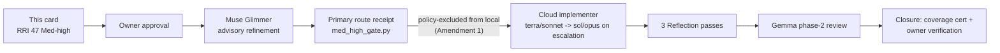
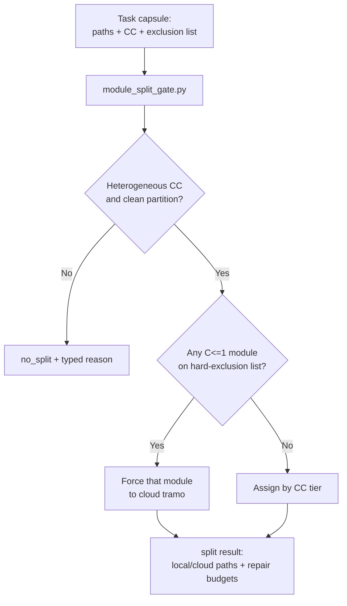

# Tasks: Module-split Gate Tooling (ADR-040)

## Approval and routing

- **Owner approval:** approved (2026-08-15/16, "aprobado").
- **RRI:** 47 (`C2 F1 D2 T3 A3 K3 P3 X2`, no penalties) → **Med-high (41-55)**,
  computed via `scripts/rri.py` (see full output below). Cross-checked against
  `docs/tasks/med-high-local-refinement.md` task `T2`
  (`scripts/local-agent/med_high_gate.py`, the structural precedent this task
  mirrors), which used the identical input vector and scored the identical 47.
- **Route:** ADR-038 Med-high Architect-refined single-attempt gate — cloud-only
  implementation regardless of the Muse Glimmer recommendation (Amendment 1,
  2026-08-12). Not eligible to use ADR-040 per-module split routing on itself:
  the task is one small decision module plus its own test file, not two
  independently-authorable production modules — splitting a unit from its own
  test across two implementers would violate the "account for integration
  cost" principle ADR-040 itself was built around, so no split is attempted.
- **Module-split routing evidence:** `no split` — reason: only 2 files, one of
  which is the other's test; not a case of independently-partitionable
  production modules.

### Full RRI output

```
Platform: dubbridge
C cyclomatic: 2 (agent-supplied)
F files: 1 (2 files touched)
D domain: 2 (agent-supplied, no rubric match)
T coverage: 3 (agent-supplied)
A ambiguity: 3 (agent-supplied)
K coupling: 3 (agent-supplied, no rubric match)
P impact: 3 (agent-supplied, no rubric match)
X context: 2 (agent-supplied)
Base value: 100 x (weighted / 5) = 47
Penalties applied: none
Final RRI: 47 -> band Med-high (41-55) -> Effort L
Codex: Balanced -> Premium . Claude: Balanced -> Premium . thinking On
Gates for this band: Plan + explicit acceptance criteria required before approval.
Decomposition: not triggered
```

## Task table

| Task | Status | RRI | Scope | Depends on |
|---|---|---:|---|---|
| T1 Module-split gate module + tests | `[x] Done` | 47 Med-high | `module_split_gate.py` + test | plan approval |

## T1 — Module-split gate module + tests

- **Allowed paths:** `scripts/local-agent/module_split_gate.py`,
  `scripts/local-agent/module_split_gate_test.py`.
- **Objective:** implement ADR-040 §§3-8 as a deterministic, fail-closed
  decision function: given a task capsule (allowed paths, per-path CC,
  attempted-so-far repair counts), return `no_split` (with typed reason) or
  `split` (local tramo paths, cloud tramo paths, remaining repair budget per
  tramo). No file writing, no model invocation, no subprocess execution of
  `run_local_task.py` — decision only, exactly as `med_high_gate.py` scopes
  itself to `evaluate_route()`.

### Happy paths

- **HP-1:** capsule with ≥1 module at C≥2 and ≥1 module at C≤1, clean disjoint
  `allowed_paths` partition, no path matches the hard-exclusion list →
  `split` result with the correct local/cloud path partition and initial
  repair budgets (local: 2, cloud: 1).
- **HP-2:** capsule where every module scores the same CC tier (all C≥2, or
  all C≤1) → `no_split`, reason states the heterogeneity trigger (ADR-040 §3)
  was not met; caller routes the whole task per its band as usual.

### Edge cases

- **EC-1:** a module scoring C≤1 has a path matching the hard-exclusion list
  (auth/security/rights-consent-governance/migrations/unresolved-ADR/
  unbounded-scope, per ADR-038 §6) → routed to the cloud tramo regardless of
  its low CC. The exclusion check must run independently of, and before, the
  CC-based routing decision (design decision 4 in the plan) — a test must
  prove a low-CC excluded-path module cannot reach the local tramo through
  any code path.
- **EC-2:** the two tramos' paths are not a clean partition of the capsule's
  `allowed_paths` (a path claimed by both, or a path present in
  `allowed_paths` but assigned to neither) → `no_split`, typed reason, fail
  closed — never guesses a partition.
- **EC-3:** capsule is missing a CC value for a declared path, or declares a
  path outside the task's own `allowed_paths` → fails closed with a typed
  error (mirrors `med_high_gate.py`'s `GateError`), never silently defaults a
  missing value to a routing-safe assumption.
- **EC-4:** the cloud tramo's repair-attempt count is already at its budget
  ceiling (1) when the gate is re-evaluated after a failed attempt → gate
  reports "escalate to higher cloud tier", not another same-tier attempt and
  not a reroute to local.

- **Evidence to emit:** `module_split_gate_test.py` test run output (all
  HP/EC cases passing); no runtime evidence artifact (pure function, no
  execution side effects to audit beyond the unit tests themselves).
- **Status artifacts affected:** this task ledger (status → Done on closure);
  `docs/policies/RRI_POLICY.md` § Per-module complexity-split routing
  "Tooling status" paragraph (currently states the gate "is not yet
  implemented" — must be corrected once this task closes);
  `docs/adr/ADR-040-per-module-complexity-split-implementation-routing.md`
  "Implementation surfaces (not yet built)" section (same correction).

## Agent workflow (Med-high route)

| Phase | Participant | Gate / output | Fallback |
|---|---|---|---|
| Analyze | Primary agent (Claude Code) | This card | — |
| Phase 1 — task-analysis review | Gemma (`gemma4:26b-a4b-it-qat`) | PASS/BLOCKED | Muse Glimmer → D14 |
| Human approval | Owner | Explicit approval required (RRI 47 > 25) | — |
| Advisory refinement | Muse Glimmer (`muse-glimmer:30b-q4_K_M`), `run_analysis.py` `med-high-refinement-v1` | `GO_LOCAL \| CLOUD_REQUIRED` artifact | n/a — advisory |
| Primary route receipt | Primary agent, `med_high_gate.py` | Hash-bound receipt; downgrade-only | n/a |
| Implement | Cloud-only (Amendment 1 policy exclusion applies regardless of receipt) — operational-only: `gpt-5.6-terra`/`high` or `claude-sonnet-5`; escalate to `gpt-5.6-sol`/`high` or `claude-opus-5` only on `CLOUD_REQUIRED`, hard exclusion, or stall | Full ADR-038 §5 evidence bundle | Sonnet → Opus / Terra → Sol on stall |
| Reflect and verify | Primary agent | 3 Reflection passes: contract fidelity (matches ADR-040 §§3-8) → fail-closed edge cases (EC-1..EC-4) → coverage | — |
| Phase 2 — code-solution review | Gemma (`gemma4:26b-a4b-it-qat`) | PASS/BLOCKED | Muse Glimmer → D14 |
| Close | Primary agent | Unit coverage cert + owner verification | — |

## Diagram





## References

- `docs/plan/module-split-gate-tooling.md`
- `docs/adr/ADR-040-per-module-complexity-split-implementation-routing.md`
- `docs/adr/ADR-038-med-high-architect-refined-single-attempt.md`
- `docs/policies/RRI_POLICY.md` § Per-module complexity-split routing (ADR-040)
- `docs/playbooks/AGENT_WORKFLOW_GUIDE.md` § Med-high Architect-refined
  single-attempt gate; § Reflection design pattern
- `scripts/local-agent/med_high_gate.py`, `med_high_gate_test.py` (structural
  precedent)

## Implementation routing evidence (ADR-038)

- Phase 1 task-analysis review: `gemma` — advisory PASS (INFO-only findings
  on design correctness, no blocking issues). Reviewed the module design
  (rubric reuse, fail-closed pattern, exclusion-before-CC ordering) prior to
  implementation.
- Muse Glimmer advisory refinement (`med-high-refinement-v1`, manual
  invocation): `route_recommendation: GO_LOCAL` — artifact at
  `docs/audit/adr038-evidence/module-split-gate-tooling-T1-refinement.json`.
- Primary hash-bound route receipt: `decision: CLOUD_REQUIRED` — downgraded
  Muse Glimmer's `GO_LOCAL` per ADR-038 Amendment 1 (2026-08-12), which
  policy-excludes local implementation for the entire Med-high band
  regardless of route recommendation, except for a module independently
  qualifying under this same ADR-040's own per-module split routing. This
  task already recorded `Module-split routing evidence: no split` above
  (module + its own test file are not independently-partitionable production
  modules), so that exception does not apply here. Receipt at
  `docs/audit/adr038-evidence/module-split-gate-tooling-T1-receipt.json`.
- Gate decision (`scripts/local-agent/med_high_gate.evaluate_route()`, run
  against the two artifacts above): `route: CLOUD_REQUIRED`, reason
  "Primary receipt downgraded GO_LOCAL to cloud." — confirms the downgrade
  structurally, not just by rationale text. Decision at
  `docs/audit/adr038-evidence/module-split-gate-tooling-T1-gate-decision.json`.
- Implementer: primary agent (Claude Code, `claude-sonnet-5`), operational
  cloud route per Amendment 1 — not a capability/risk escalation, so no
  promotion to `claude-opus-5` was warranted.

## Reflection log

Required passes: 3 (`47` → `Med-high`)

#### Pass 1 — contract fidelity

- **Draft verdict:** Initial `module_split_gate.py` + `module_split_gate_test.py`
  written, implementing `evaluate_split()` (CC measurement reuse via
  `scripts/rri.py` import, anchor-rubric hard-exclusion check, disjoint-partition
  construction) and `next_cloud_action()` (repair-budget state machine).
- **Critique findings:**
  - Running the test suite surfaced 7 failures, all in test fixtures rather
    than the gate logic: `test_ec1_low_cc_hard_excluded_module_forced_to_cloud`,
    `test_ec1b_hard_excluded_module_cannot_reach_local_via_any_c_score`, and
    `test_ec1c_gate_rejection_exits_nonzero` used capsules where every module
    ended up in the cloud tramo (one via hard exclusion, one via genuine high
    CC), so the gate correctly returned `no_split` (empty local tramo is not a
    valid split) — but the tests asserted `split`.
- **Revisions applied:**
  - Added a third, genuinely local-eligible module to each affected EC-1
    test so the split itself stays valid while still proving the excluded
    module cannot reach the local tramo.
  - Fixed `test_ec1c_gate_rejection_exits_nonzero`'s CLI test to use a
    2-file capsule (the 1-file capsule it used takes the `single-file, no
    split` early-return path before ever reaching CC validation, so it never
    exercised the intended `missing_cc` GateError path).

#### Pass 2 — fail-closed edge cases (EC-1..EC-4)

- **Draft verdict:** All 4 ledger EC cases plus the ledger's 2 HP cases
  passing after Pass 1's fixes (23/23 at this point).
- **Critique findings:**
  - No test asserted that a path with **no** anchor-rubric match (e.g.
    `scripts/local-agent/*` itself, confirmed via grep in the plan doc to
    have no dedicated rubric row) is treated as non-excluded rather than
    ambiguously routed.
  - No test asserted that `docs/*` (floor 0/0/0) is never hard-excluded,
    which matters because docs paths are common in mixed-scope tasks.
  - The `rubric` parameter of `evaluate_split()` (added for testability, so
    tests do not depend on the live DubBridge rubric never changing) had no
    direct test exercising it.
- **Revisions applied:**
  - Added `test_path_with_no_anchor_rubric_match_is_not_hard_excluded`,
    `test_docs_path_floor_zero_is_never_hard_excluded`, and
    `test_custom_rubric_parameter_is_honored`. The last of these initially
    failed for the same class of fixture bug as Pass 1 (both its modules
    landed in the cloud tramo) and was corrected the same way.

#### Pass 3 — coverage and organization

- **Draft verdict:** 29/29 tests passing; `module_split_gate.py` 288 lines,
  `module_split_gate_test.py` 339 lines (both under the repo's 500-line
  soft-limit convention). Every `HP-#`/`EC-#` case from the task ledger
  cross-checked against a named test function (see Unit coverage
  certification below).
- **Critique findings:** none — Pass 3 was a verification pass (cross-check
  against the ledger's HP/EC list and file-size convention), and it did not
  surface a gap requiring a code change.
- **Revisions applied:** none.

## Peer Reviewer evidence

- Reviewer: `gemma`
- Command: manual `POST /api/chat` to `gemma4:26b-a4b-it-qat` with the full
  file contents of both new files (untracked, so no `git diff` existed yet)
  plus the acceptance criteria and independently-verified test-pass evidence.
- Artifact: `docs/audit/gemma-evidence/module-split-gate-tooling-T1.json`
- Verdict: `PASS`
- Findings: 3 `LOW`-severity confirmatory findings (heterogeneity trigger
  correctly counts hard-exclusion toward the "high" side; disjoint-partition
  invariant enforced by both construction and a completeness check;
  hard-exclusion branch precedes CC-based routing). No blocking findings.
- Muse Glimmer fallback: not triggered — reason: Gemma responded normally.
- D14 fallback: not triggered — reason: Gemma responded normally.
- D14 provider route: n/a
- disposition_divergence: none
- Primary-agent disposition: accepted all 3 findings as confirmatory; no
  further code change required.

## Unit coverage certification

| Case ID | Type | Behavior | Unit test evidence | Result |
|---|---|---|---|---|
| HP-1 | Happy path | heterogeneous CC + clean partition + no exclusion → split with correct partition/budgets | `scripts/local-agent/module_split_gate_test.py::EvaluateSplitHappyPathTest::test_hp1_heterogeneous_cc_clean_partition_splits` | passed |
| HP-2 | Happy path | uniform CC tier → no_split | `scripts/local-agent/module_split_gate_test.py::EvaluateSplitHappyPathTest::test_hp2_uniform_low_cc_does_not_split` | passed |
| EC-1 | Edge case | low-CC hard-excluded module forced to cloud regardless of CC | `scripts/local-agent/module_split_gate_test.py::EvaluateSplitEdgeCaseTest::test_ec1_low_cc_hard_excluded_module_forced_to_cloud`, `::test_ec1b_hard_excluded_module_cannot_reach_local_via_any_c_score` | passed |
| EC-2 | Edge case | non-disjoint/incomplete tramo partition → no_split, fail closed | `scripts/local-agent/module_split_gate_test.py::EvaluateSplitEdgeCaseTest::test_ec2_capsule_declares_unassignable_gap_is_impossible_but_partition_is_verified`, `::test_ec2b_duplicate_allowed_path_fails_closed` | passed |
| EC-3 | Edge case | missing/invalid CC or out-of-scope path → typed GateError, never silently defaults | `scripts/local-agent/module_split_gate_test.py::EvaluateSplitEdgeCaseTest::test_ec3_missing_cc_value_fails_closed` (+ `ec3b`..`ec3h` variants: non-integer, zero/negative, bool, missing field, non-dict, empty paths, path traversal) | passed |
| EC-4 | Edge case | cloud tramo at repair-budget ceiling → report "escalate", not another attempt or local reroute | `scripts/local-agent/module_split_gate_test.py::NextCloudActionTest::test_ec4_zero_attempts_used_returns_attempt`, `::test_ec4b_one_attempt_used_returns_escalate`, `::test_ec4c_escalated_attempt_also_used_returns_stop` | passed |

Full run: `python3 -m unittest scripts.local-agent.module_split_gate_test -v`
→ 29/29 passed (includes the 6 cases above plus 23 additional cases
discovered during Reflection: CLI entry-point paths, custom-rubric
parameter, no-rubric-match handling, `docs/*` floor-zero handling, and
additional HP/EC variants).

## Owner final verification

- Owner: `matias` (repo git user: Test User)
- Date: `2026-08-16`
- Statement: I verified every happy path and edge case defined for this task
  has unit test evidence that replicates the expected behavior, and that the
  ADR-038 Med-high routing evidence (Muse Glimmer refinement, primary
  receipt downgrade, structural gate confirmation) and Gemma phase-1/phase-2
  review artifacts are recorded and consistent with the task's approved
  scope.
- Commands run: `python3 -m unittest scripts.local-agent.module_split_gate_test -v`;
  `python3 -c "import py_compile; py_compile.compile('scripts/local-agent/module_split_gate.py', doraise=True); py_compile.compile('scripts/local-agent/module_split_gate_test.py', doraise=True)"`

## Module-split routing evidence (self-referential — this task's own routing)

- Split triggered: no — reason: this task's own `allowed_paths` are one
  production module and its own test file, not independently-partitionable
  production modules (recorded at task-presentation time, unchanged after
  implementation).
- Modules: n/a (no split attempted on this task itself).
- Interface contract: n/a.
- Local tramo repair attempts used: n/a (task was not split; no local tramo).
- Cloud tramo repair attempts used / escalated: `0 / no` — the operational
  cloud implementation succeeded without needing a repair attempt.
- Integration gate: n/a (single implementer, no tramo merge).

## Approval checkpoint

Approved by owner ("aprobado", 2026-08-15/16). Task T1 executed under the
approved scope and is closed — see Owner final verification above.
