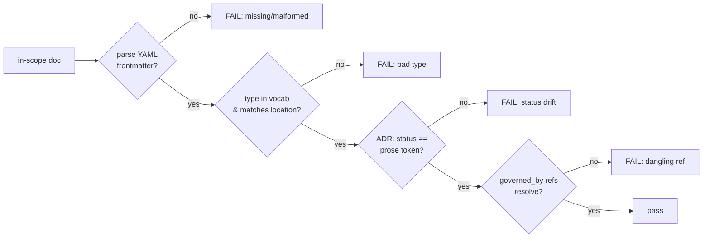

# Tasks: OKF — Open Knowledge Format adoption

**Plan:** `docs/plan/okf-knowledge-format-adoption.md`
**ADR:** `docs/adr/ADR-033-open-knowledge-format-adoption.md` (Proposed)

> **Status: design package — nothing implemented.** Initiative RRI **69 (Complex)**;
> gate = plan first + human reviews the plan + decompose. The decomposition below
> brings every subtask to ≤ 55. Each task is independently gated: RRI > 25 ⇒ explicit
> human approval before execution. OKF-T0 (accept ADR-033 + publish the vocabulary) is
> the governance entry point and must be approved before any migration task begins.

## Progress ledger

| Task | Title | Effort | RRI → band | Depends on | Status |
|---|---|---|---|---|---|
| OKF-T0 | Accept ADR-033 + publish `type` vocabulary | M | 40 Moderate (`scripts/rri.py`) | — | ✅ Done |
| OKF-T1 | OKF frontmatter validator + `qa-docs`/CI wiring | L | 43 Med-high (`scripts/rri.py`) | T0 | ✅ Done |
| OKF-T2 | Frontmatter on 18 ADRs (status mirrors prose) | M | 38 Moderate (`scripts/rri.py`) | T1 | ✅ Done |
| OKF-T3 | Frontmatter on playbooks + policies | S | ~26 Moderate (est.) | T1 | ✅ Done |
| OKF-T4 | Frontmatter on plans + task ledgers | M | ~40 Moderate (est.) | T1 | ✅ Done |
| OKF-T5 | Frontmatter on architecture + proposals + audits + prompts | S | ~28 Moderate (est.) | T1 | ⬜ Not started |
| OKF-T6 | Add frontmatter clause to ADR change-propagation contract | M | ~40 Moderate (est.) | T2–T5 | ⬜ Not started |

Subtask RRIs marked `(est.)` are pending a fresh `scripts/rri.py` run at presentation
time (the workflow requires a fresh run before each task is presented). T0/T1/T2 were
computed with `scripts/rri.py`; see each task's anchor note.

**Behavioral coverage contract:** unit-v1 (applies to OKF-T1, the only development
task; the migration tasks are docs-only and exempt).

---

## OKF-T0 — Accept ADR-033 and publish the `type` vocabulary

- **Type:** docs / governance (no code). **Effort:** M. **RRI:** 40 → Moderate
  (`scripts/rri.py`, arch_decision +12). **Gate:** explicit approval (adopts a binding
  process contract).
- **Depends on:** —
- **Objective:** On approval, move ADR-033 to `Accepted`; create
  `docs/knowledge/README.md` defining the closed `type` vocabulary and the field
  schema (the contract OKF-T1 will validate against).
- **Acceptance criteria:**
  - ADR-033 `Status: Accepted`; `docs/adr/README.md` index row matches.
  - `docs/knowledge/README.md` exists with the closed `type` table (matching ADR-033
    §Decision 2 and the plan's vocabulary table) and one valid example per type.
  - `make qa-docs` passes (index parity, no dangling refs).
- **Reflection passes:** N/A (docs/governance).
- **Handoff prompt:**
  1. OKF-T0 — accept ADR-033, publish the vocabulary doc.
  2. Govern: `docs/playbooks/AGENT_WORKFLOW_GUIDE.md §ADR change propagation`;
     `docs/adr/ADR-033-...md`; `docs/plan/okf-knowledge-format-adoption.md`.
  3. Files: `docs/adr/ADR-033-...md` (status), `docs/adr/README.md` (index),
     `docs/knowledge/README.md` (new).
  4. AC: status flipped; index parity; vocabulary doc complete; `make qa-docs` green.
  5. Stop after `make qa-docs` passes; do NOT start T1.

---

## OKF-T1 — OKF frontmatter validator + `qa-docs`/CI wiring

- **Type:** development. **Effort:** L. **RRI:** 43 → Med-high (`scripts/rri.py`).
  **Gate:** plan + explicit acceptance criteria before approval. **Reflection passes:**
  3 (Med-high band). **Model:** Balanced→Premium, thinking On.
- **Depends on:** T0 (the vocabulary is the validator's contract).
- **Anchor RRI:** raw CC 12 → C=2; D=1 K=3 P=2 T=4 A=1 X=2; no penalties → 43.
- **Objective:** Implement `scripts/check_okf_frontmatter.py` and wire it into
  `qa-docs` and CI. The validator enforces the OKF contract fail-closed.
- **Acceptance criteria:**
  - For every in-scope file, a parseable YAML frontmatter block exists with a `type`
    from the closed vocabulary, and `type` matches the file's location.
  - For ADRs, frontmatter `status:` equals the prose `- **Status:**` token.
  - For `Plan`/`TaskList`, every `governed_by:`/`supersedes:` ADR reference resolves
    to an existing `docs/adr/ADR-*.md` file.
  - Out-of-scope paths (`docs/daily/*`, `*/TEMPLATE.md`, pure index READMEs) are
    skipped.
  - `make qa-docs` runs the validator; `.github/workflows/ci.yml` invokes it; a
    malformed/missing/mismatched frontmatter fails the gate with a clear message.
  - `scripts/check_okf_frontmatter_test.py` covers each rule; ≥ 90% line coverage.
- **Happy paths considered:**
  - **HP-1:** a file with valid frontmatter, correct `type` for its location, and
    matching status → validator reports pass.
  - **HP-2:** a `TaskList` whose `governed_by:` lists only existing ADRs → pass.
- **Edge cases considered:**
  - **EC-1:** ADR whose frontmatter `status:` ≠ prose `- **Status:**` → fail with the
    file path and both tokens.
  - **EC-2:** a file with a `type` not in the closed vocabulary (or `type` not
    matching its directory) → fail.
  - **EC-3:** `governed_by: [ADR-099]` (non-existent) → fail (dangling metadata ref).
  - **EC-4:** a file missing the frontmatter block entirely → fail; an out-of-scope
    file missing it → skipped, not failed.
- **Diagram:**

- **Reflection strategy (3 passes, RRI 43 → Med-high):**
  - **Pass 1** — correctness of each rule against HP-1/2 and EC-1..4; YAML parsing of
    real files.
  - **Pass 2** — fail-closed behavior and message clarity; ensure out-of-scope
    skipping cannot hide a missing in-scope file; CI exit codes.
  - **Pass 3** — coverage gaps vs. the 90% gate; alignment with the existing
    `check-doc-consistency.sh` conventions (paths, output style).
- **Handoff prompt:**
  1. OKF-T1 — implement the OKF frontmatter validator + wire into qa-docs/CI.
  2. Govern: `docs/plan/okf-knowledge-format-adoption.md`; `docs/knowledge/README.md`;
     `scripts/check-doc-consistency.sh` (style reference).
  3. Files: `scripts/check_okf_frontmatter.py` (new), its test (new), `Makefile`
     (`qa-docs`), `.github/workflows/ci.yml`.
  4. AC: the six bullets above; ≥ 90% coverage; clear fail messages.
  5. Stop after `make qa-docs` is green with the validator wired; do NOT start T2.

---

## OKF-T2 — Frontmatter on 18 ADRs (status mirrors prose)

- **Type:** docs (mechanical). **Effort:** M. **RRI:** 38 → Moderate
  (`scripts/rri.py`, many_files +8). **Gate:** confirm the validator passes the area.
- **Depends on:** T1 (validator must exist to verify the migration).
- **Objective:** Add `type: ADR` frontmatter to every `docs/adr/ADR-*.md`, with
  `status:` mirroring the prose token and `supersedes:`/`superseded_by:` where the ADR
  declares supersession.
- **Acceptance criteria:**
  - All 18 ADRs have valid frontmatter; `status:` matches prose for each.
  - Supersession ADRs (e.g. ADR-031→023/024) carry consistent `supersedes:`/
    `superseded_by:`.
  - `make qa-docs` (including the new validator) passes.
- **Reflection passes:** N/A (docs, no logic).
- **Handoff prompt:**
  1. OKF-T2 — add OKF frontmatter to all ADRs; status mirrors prose.
  2. Govern: `docs/knowledge/README.md`; the validator from T1.
  3. Files: `docs/adr/ADR-*.md` (18 files).
  4. AC: validator green; status parity; supersession keys consistent.
  5. Stop after `make qa-docs` passes; do NOT start T3.

---

## OKF-T3 — Frontmatter on playbooks + policies

- **Type:** docs (mechanical). **Effort:** S. **RRI:** ~26 Moderate (est.; fresh run
  at presentation). **Gate:** validator passes the area.
- **Depends on:** T1.
- **Objective:** Add `type: Playbook` / `type: Policy` frontmatter (with `governs:`)
  to `docs/playbooks/*.md` and `docs/policies/*.md`.
- **Acceptance criteria:** valid frontmatter on each; `make qa-docs` passes.
- **Reflection passes:** N/A.
- **Handoff prompt:** OKF-T3 — frontmatter on playbooks/policies; validator green;
  stop before T4.

---

## OKF-T4 — Frontmatter on plans + task ledgers

- **Type:** docs (mechanical). **Effort:** M. **RRI:** ~40 Moderate (est.; many_files).
  **Gate:** validator passes the area.
- **Depends on:** T1.
- **Objective:** Add `type: Plan` (with `status:`, `slice:`, `governed_by:`) to
  `docs/plan/*.md`, `type: Roadmap` to `docs/plan/roadmap.md`, and `type: TaskList`
  (with `status:`, `slice:`, `plan:`, `governed_by:`) to `docs/tasks/*.md`.
- **Acceptance criteria:**
  - Each plan/task has valid frontmatter; `status:` reflects real lifecycle
    (active / planned / closed) per the roadmap and plan headers.
  - Every `governed_by:` ADR resolves (validator enforces).
  - `make qa-docs` passes.
- **Reflection passes:** N/A.
- **Handoff prompt:** OKF-T4 — frontmatter on plans + tasks (status/slice/governed_by);
  validator green; stop before T5.

---

## OKF-T5 — Frontmatter on architecture + proposals + audits + prompts

- **Type:** docs (mechanical). **Effort:** S. **RRI:** ~28 Moderate (est.).
  **Gate:** validator passes the area.
- **Depends on:** T1.
- **Objective:** Add frontmatter to `docs/architecture.md` (`type: Architecture`),
  `docs/proposals/*.md`, `docs/audit/*.md`, `docs/prompts/*.md`.
- **Acceptance criteria:** valid frontmatter on each in-scope file; `make qa-docs`
  passes.
- **Reflection passes:** N/A.
- **Handoff prompt:** OKF-T5 — frontmatter on architecture/proposals/audits/prompts;
  validator green; stop before T6.

---

## OKF-T6 — Add frontmatter clause to the ADR change-propagation contract

- **Type:** process / policy (no code). **Effort:** M. **RRI:** ~40 Moderate (est.;
  arch_decision). **Gate:** explicit approval (changes a binding contract).
- **Depends on:** T2–T5 (the frontmatter must exist before the contract mandates
  keeping it in sync).
- **Objective:** Extend the **ADR change-propagation** contract in
  `docs/playbooks/AGENT_WORKFLOW_GUIDE.md` so every ADR status/scope change updates the
  ADR's frontmatter (`status:`/`supersedes:`/`superseded_by:`) in the same pass,
  alongside the prose line and index row it already requires. Add "frontmatter parity
  passes" to the ADR-change Definition of Done.
- **Acceptance criteria:**
  - The propagation table and DoD reference frontmatter parity.
  - `make qa-docs` passes (validator included).
  - No contradiction introduced with `CLAUDE.md`/`AGENTS.md` (workflow guide remains
    highest authority).
- **Reflection passes:** N/A (process doc).
- **Handoff prompt:** OKF-T6 — add the frontmatter clause to the ADR-propagation
  contract + DoD; `make qa-docs` green; this closes the OKF initiative.

---

## Deferred follow-ups (not in this package)

- **OKF-X1:** OKF wrappers for non-Markdown artifacts (`docs/bdd/*.feature`, JSON
  schemas) — only when an agent needs them.
- **OKF-X2:** derive `docs/adr/README.md` index from frontmatter (frontmatter as sole
  source of truth) — revisit once the additive layer is trusted.
- **OKF-X3:** cross-check `Plan.slice` frontmatter against roadmap rows in
  `check-roadmap-drift.sh`.
