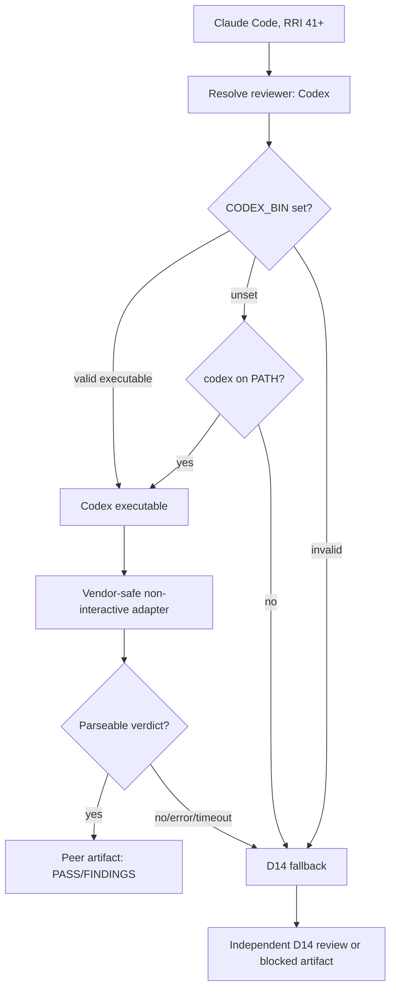

# Tasks: Codex Binary Resolution for High-RRI Peer Review

## Task Card

- **Task ID:** PPR-4
- **Task title:** Make Codex peer-review resolution explicit and executable from Claude Code
- **Status:** Pending — approval required (RRI 53, Med-high).
- **Effort:** L
- **Complexity:** Med-high (RRI 53).
- **Recommended model:**
  - Codex: `GPT-5.2-Codex`
  - Claude Code: `Claude Sonnet 4`
- **Objective:** Make the RRI 41+ `claude-code → codex` reviewer route reliably locate and invoke Codex when the executable is outside Claude Code's inherited `PATH`.
- **Context:** PPR-2/PPR-3 implemented the band-routed peer-review script, but its availability probe only uses `shutil.which("codex")` and its invocation assumes an undocumented `codex review --stdin` interface. The configured VS Code extension binary is executable at `/Users/matias/.vscode/extensions/openai.chatgpt-26.707.41301-darwin-arm64/bin/macos-aarch64/codex`, yet it is not on `PATH`. This task hardens only the peer-review adapter; the RRI routing rule and D14 fallback remain unchanged.
- **Related documents:**
  - `docs/plan/portable-peer-review-gate.md`
  - `docs/playbooks/AGENT_WORKFLOW_GUIDE.md` (§ Band-routed peer review)
  - `docs/policies/RRI_POLICY.md`
  - `docs/policies/HITL_AUTONOMY_POLICY.md`
  - `scripts/peer-workflow-review.py`
  - `scripts/peer_workflow_review_test.py`
  - `Makefile`
- **Inputs:** `CODEX_BIN` set to the absolute Codex executable; peer-review packet; caller identity `claude-code`; existing D14 fallback behavior.
- **Outputs:** A documented, validated executable-resolution policy; an invocation adapter that uses Codex's supported non-interactive interface; regression tests; `Makefile` pass-through/documentation for `CODEX_BIN`.
- **Acceptance criteria:**
  1. For `caller=claude-code` and RRI ≥41, the adapter resolves Codex from non-empty `CODEX_BIN` before `PATH`.
  2. `CODEX_BIN` must point to an executable regular file; an empty, non-executable, or directory value is rejected as unavailable and routes to D14 without trying a shell.
  3. When `CODEX_BIN` is absent, the adapter retains the `PATH` lookup fallback for `codex`.
  4. The Codex adapter uses a documented non-interactive command shape and sends the review packet without shell interpolation; the Claude adapter remains independently supported.
  5. The artifact records the actual resolved executable path (never secrets) and the exact argument vector or a safe command representation needed for auditability.
  6. An invocation failure, timeout, invalid response, or unavailable binary preserves the mandatory D14 fallback and never downgrades to self-review.
  7. Tests cover: valid `CODEX_BIN`, `PATH` fallback, invalid `CODEX_BIN`, and the Codex argument vector/stdin packet behavior.
  8. `make qa-peer-workflow-review` documents or passes through `CODEX_BIN` without embedding a machine-specific extension version/path.
- **Execution summary:** Add a small resolver that returns an executable path rather than a peer name alone, split peer CLI invocation into vendor-specific adapters, carry the resolved path into the artifact, and test the resolution/invocation boundary. Update the operational instructions so Claude Code can export `CODEX_BIN` once per shell/profile or set it in its execution environment.

### Happy paths considered

- **HP-1:** `caller=claude-code`, RRI 53, and `CODEX_BIN` points to an executable Codex binary → Codex receives the task/diff packet non-interactively, returns a parseable `VERDICT: PASS`, and the artifact names Codex plus the resolved binary path.
- **HP-2:** `CODEX_BIN` is unset but `codex` is on `PATH` → the same Codex peer-review flow proceeds through the `PATH` executable.

### Edge cases considered

- **EC-1:** `CODEX_BIN` is set to a missing file, directory, or non-executable file → no shell is launched; the review artifact requests D14 fallback with an actionable reason.
- **EC-2:** Codex exits non-zero, times out, or omits `VERDICT:` → the task remains independently reviewed through D14; it is never self-approved.

### Reflection strategy

Three passes for RRI 53: (1) validate reviewer resolution and fallback semantics; (2) challenge command safety, CLI compatibility, and artifact auditability; (3) reconcile tests, documentation, and the unchanged RRI/HITL contract.

### Pseudocode

```text
resolve_peer_executable(peer):
  if peer == "codex" and CODEX_BIN is set:
    return CODEX_BIN only if it is an executable regular file
    otherwise return unavailable (do not consult PATH)
  return PATH lookup for peer, if executable

run_peer(peer, packet):
  executable = resolve_peer_executable(peer)
  if unavailable: request D14 fallback
  args = vendor_specific_noninteractive_args(peer, executable)
  run args with packet on stdin, timeout bounded
  parse verdict; invalid/error -> request D14 fallback
```

### Diagram



Task-analysis review: d14 `.agent/peer-task-review-ppr-4-d14-1.json` - PASS
The initial D14 review blocked the `CODEX_BIN`/`PATH` precedence ambiguity; after
revision, the context-isolated D14 re-review passed. D14 was used because the
resolved Claude peer CLI returned no usable review output.
Code-solution review: pending — development task; the same RRI band requires the cross-vendor peer before closure.

Execution has not started. Approval is pending after task-analysis review passes.
