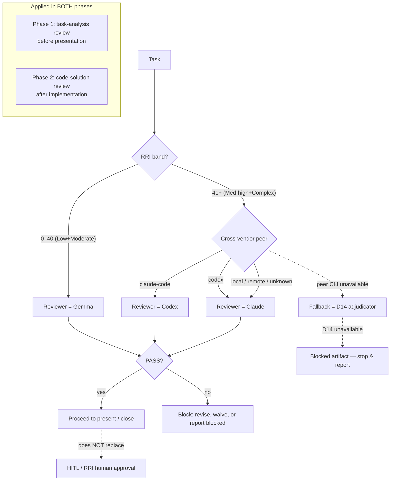

# Tasks: Band-Routed Two-Phase Peer-Review Policy and Reporting Contract

> **Origin**: Adapted from fenix `docs/tasks/task_paw_f1_peer_review_policy_contract.md`
> (PAW-F1, Phase F of the Portable Agent Workflow Port Plan). Fenix ported the
> DubBridge workflow and, downstream, designed a provider-aware peer-review layer.
> This task brings that idea back into DubBridge **re-anchored to DubBridge
> conventions** (`AGENT_WORKFLOW_GUIDE.md` is the highest authority, `docs/adr/`,
> `docs/plan/`, OKF `type` vocabulary, `DUBBRIDGE_*` env) **and reshaped** into a
> band-routed, two-phase model instead of the flat cross-vendor scheme:
>
> - **Two review phases**, not one: (1) **task analysis** review — before a task
>   is presented/executed; (2) **code solution** review — after implementation.
>   Today DubBridge only has a formal reviewer in phase 2 (Gemma Reviewer / D14);
>   phase 1 gets a symmetric reviewer added "on top".
> - **Routing by RRI band**, not a single scheme:
>   - **RRI 0–40 (Low + Moderate) → Gemma** (the existing local-model reviewer).
>   - **RRI 41+ (Med-high + Complex) → cross-vendor peer** (Claude Code → Codex,
>     Codex → Claude, other local/remote providers → Claude). In this band the
>     cross-vendor peer **replaces Gemma as the reviewer**; **D14** remains the
>     fallback when the peer CLI is unavailable/unauthenticated.

## Task Card

- **Task ID:** PPR-1
- **Task title:** Define band-routed, two-phase peer-review policy and reporting contract
- **Status:** Pending — approval required (RRI 24, Low band; docs-only, but it
  changes the task-presentation and closure contract, so present before editing).
- **Effort:** S
- **Complexity:** Low (RRI 24)
- **Recommended model:**
  - Codex: `GPT-5.2-Codex`
  - Claude Code: `Claude Sonnet 4.6`
- **Objective:** Define the policy-level contract for independent peer review at
  **two phases** of the task lifecycle (task-analysis review and code-solution
  review), **routed by RRI band**: Gemma reviews Low/Moderate work; a cross-vendor
  peer reviews Med-high/Complex work (Claude↔Codex, others→Claude), with D14 as
  the band-high fallback.
- **Context:** DubBridge already owns the full RRI / preflight / Gemma stack (it
  was the source of the fenix port). Two gaps this task closes:
  1. **Phase asymmetry** — a formal reviewer exists only for the *code solution*
     (Gemma Reviewer / D14). The *task-analysis* phase has no symmetric reviewer
     checkpoint. This adds one, routed by the same band rule.
  2. **Provider independence at high risk** — for the riskiest work (RRI 41+), a
     single-vendor self-review (agent + its own local Gemma) is weak. A
     cross-vendor peer makes the reviewer independent of the author's vendor.
  This is the **policy/contract** step only; it unlocks PPR-2 (script + tests)
  and PPR-3 (wiring). It sits alongside HITL and RRI policies and weakens neither.
- **Related documents:**
  - `docs/playbooks/AGENT_WORKFLOW_GUIDE.md` (highest authority; both review
    phases, the band-routing table, and closure order are added here)
  - `AGENTS.md` (shared task-presentation contract)
  - `CLAUDE.md`, `README_AGENT_ORDER.md` (authority-order references)
  - `docs/policies/HITL_AUTONOMY_POLICY.md` (peer review must not replace HITL)
  - `docs/policies/RRI_POLICY.md` (band table gains the reviewer-routing column)
  - `docs/playbooks/LOW_RRI_LOCAL_MODEL_HANDOFF.md` (Gemma stays the low-band reviewer)
  - `docs/plan/portable-peer-review-gate.md` (parent plan for PPR-1..3)
  - fenix `docs/tasks/task_paw_f1_peer_review_policy_contract.md` (source)
- **Inputs:** Existing workflow/policy prose; the current Gemma Reviewer / D14
  section; RRI band table; fenix PAW-F1 contract wording.
- **Outputs:** Additive policy and contract text in the files listed below. No
  script, Makefile target, hook, or CI change.
- **Acceptance criteria:** see the numbered list below.
- **Execution summary:** Add the two-phase peer-review model and the band-routing
  table to the workflow guide; add two report lines (one per phase) to the shared
  task-card / closure contract; add the reviewer-routing column and failure-mode
  wording to RRI/HITL policies; register the parent plan. Documentation-only.

## The two-axis model (band × phase)

Reviewer is selected by the pair `(RRI band, review phase)`:

| Review phase | RRI 0–40 (Low + Moderate) | RRI 41+ (Med-high + Complex) |
|---|---|---|
| **Phase 1 — Task-analysis review** (before presentation/execution) | **Gemma** (advisory, read-only, per existing low-band handling) | **Cross-vendor peer** reviews the task card / plan for readiness; falls back to **D14** if peer CLI unavailable |
| **Phase 2 — Code-solution review** (after implementation) | **Gemma Reviewer** (existing N-pass reconciliation) | **Cross-vendor peer** reviews the diff and **replaces Gemma** as reviewer; **D14** is the fallback |

Cross-vendor resolution (only applies in the RRI 41+ column):

```
caller = claude-code    -> reviewer = codex
caller = codex          -> reviewer = claude
caller = local-provider -> reviewer = claude
caller = remote-provider-> reviewer = claude
caller = unknown        -> reviewer = claude
```

Ordering vs. existing gates: in the RRI 41+ band the cross-vendor peer **is** the
reviewer role for that band (it replaces Gemma, it does not stack on top of it).
The **D14 context-isolated adjudicator remains the mandatory fallback** and still
runs whenever the peer CLI is unavailable, unauthenticated, returns invalid JSON,
or a `D14-OVERRIDE` is recorded. Peer review never removes the D14 safety net.

### Report line contract

Exactly two lines, one per phase. The reviewer token is resolved at report time
by band and availability; the artifact path points to the review record.

```
Task-analysis review: <reviewer> <artifact path> - <verdict>
Code-solution review: <reviewer> <artifact path> - <verdict>
```

- `<reviewer>` ∈ `gemma | codex | claude | d14`
  - `gemma` — RRI 0–40 (both phases).
  - `codex | claude` — RRI 41+ cross-vendor peer, resolved from the caller
    (`claude-code → codex`, `codex → claude`, others → `claude`).
  - `d14` — RRI 41+ where the resolved peer CLI was unavailable/unauthenticated
    and the context-isolated adjudicator handled the review.
- `<verdict>` ∈ `PASS | BLOCKED`
  - `PASS` — presentation (phase 1) or closure (phase 2) may proceed.
  - `BLOCKED` — a non-pass verdict, or peer **and** D14 unavailable. Presentation
    or closure stops; `<artifact path>` is the blocked-artifact record. Clearing
    it requires revision, an explicit user waiver, or reporting the task blocked.
- Phase 1 appears in the task card; phase 2 appears in the closure report. A task
  that is exempt from a phase (e.g. docs-only skips phase 2 code review) records
  `n/a` in place of the reviewer/verdict for that phase and states the exemption.

## Scope

- **In:** Policy wording; the band × phase reviewer-routing table; two report
  lines (phase 1 + phase 2); cross-vendor caller→reviewer resolution; failure-mode
  wording (unavailable peer → D14 fallback → blocked artifact); registering the
  parent plan with OKF frontmatter.
- **Out:** No `scripts/peer-workflow-review.py`, no `make qa-peer-workflow-review`
  target, no `PreToolUse`/pre-push hook enforcement, no CI job, no product code.
  Those are PPR-2 (script + tests) and PPR-3 (wiring). No change to Gemma
  Reviewer's existing low/mid-band behaviour beyond naming it as the phase-1/phase-2
  reviewer for RRI 0–40.

## Acceptance Criteria

1. `AGENT_WORKFLOW_GUIDE.md` defines peer-review checkpoints at **two phases**:
   **task-analysis review** (before task-card presentation) and **code-solution
   review** (before code-task closure).
2. `AGENT_WORKFLOW_GUIDE.md` and `RRI_POLICY.md` state the band routing:
   **RRI 0–40 → Gemma**; **RRI 41+ → cross-vendor peer** (with D14 fallback), for
   both phases.
3. Cross-vendor resolution is explicit and unambiguous and applies only in the
   RRI 41+ band: `claude-code -> codex`, `codex -> claude`, `local-provider ->
   claude`, `remote-provider -> claude`, `unknown -> claude`.
4. The task-card contract includes a **phase-1** line whose reviewer token is
   resolved by band (Gemma for RRI 0–40; the cross-vendor peer name for RRI 41+):
   `Task-analysis review: <gemma|codex|claude> <artifact path> - PASS`.
5. The code-task closure report contract includes a **phase-2** line, same
   band-resolved reviewer token:
   `Code-solution review: <gemma|codex|claude> <artifact path> - PASS`.
   When the band-high peer is unavailable and D14 handled the review, the token
   is `d14`; a blocked review reports `- BLOCKED` with the blocked-artifact path.
6. The docs state that a non-`PASS` verdict in either phase **blocks** presentation
   or closure until the work is revised, explicitly waived by the user, or reported
   as blocked.
7. The docs state that peer review **does not replace** the human approval required
   by RRI / HITL — it is an additional, independent check at every band.
8. The docs state that in the RRI 41+ band an unavailable/unauthenticated peer CLI
   routes to **D14** (context-isolated adjudicator) and, if D14 is also
   unavailable, is reported as a **blocked artifact** — never silently downgraded
   to self-review by the authoring vendor.
9. The docs preserve the existing four closure blocks (Gemma Reviewer/D14 gate,
   Reflection log, Unit-coverage certification, Owner verification) for RRI 26+
   development tasks; the band-high peer simply occupies the reviewer slot inside
   the first block.
10. No script, Makefile target, hook, or CI change is implemented in this task.

## Adaptation Mapping (fenix source → DubBridge target)

| Concern | Fenix source (PAW-F1) | DubBridge target |
|---|---|---|
| Review shape | Flat cross-vendor for all peer work | **Band-routed**: Gemma ≤40, cross-vendor ≥41 |
| Review phases | Readiness + closure (both cross-vendor) | Both phases kept, but **reviewer chosen by band** |
| Highest authority | `CLAUDE.md` | `docs/playbooks/AGENT_WORKFLOW_GUIDE.md` (CLAUDE.md defers to it) |
| Plans / ADRs dir | `docs/plans/`, `docs/decisions/` | `docs/plan/`, `docs/adr/` |
| Task frontmatter | `doc_type: task` + `hp`/`ec` | OKF `type: TaskList` + `rri`/`band`/`effort` |
| Env prefix | `FENIX_*` | `DUBBRIDGE_*` |
| Peer CLIs present | claude + codex assumed | claude present; **codex not installed** — see R2 |
| Band-high fallback | blocked artifact | **D14 first**, then blocked artifact |

## Risks

- **R1 — Overlapping reporting language.** DubBridge workflow docs already define
  task-card and closure reporting. Keep the two peer-review lines additive and
  consistent; do not fork a second incompatible task-card format.
- **R2 — Codex CLI not installed locally.** `codex` is not on PATH in this
  environment. The policy defines resolution and the D14/blocked fallback
  regardless; PPR-2 implements the actual availability probe. This task must not
  assume codex is present.
- **R3 — Enforcement creep.** A too-broad policy could imply hook enforcement
  before the script exists. Phrase enforcement as a workflow/reporting contract
  (blocking at report time) until PPR-2 and PPR-3 land.
- **R4 — Band boundary ambiguity.** RRI exactly at 40/41 must resolve
  deterministically. State the rule as inclusive `0–40 → Gemma`, `41–70 →
  cross-vendor`, matching the existing Moderate/Med-high boundary in `RRI_POLICY.md`.
- **R5 — Double-reviewer confusion at high band.** Be explicit that the
  cross-vendor peer **replaces** Gemma as the reviewer for RRI 41+ (it does not
  run both), while D14 remains the fallback — otherwise agents may run Gemma and
  the peer redundantly or skip D14.

## Closure Requirements (this task)

This is a docs/policy-only task (RRI 24, Low band), so the Gemma Reviewer / D14
development gate does **not** apply. Closure order:

1. Confirm task is docs/policy-only (exempt from D14).
2. Verify all 10 acceptance criteria are satisfied in the edited files.
3. Run `make qa-docs` (OKF frontmatter + doc-consistency) and confirm the new
   plan file and this task file pass.
4. Sync the parent plan `docs/plan/portable-peer-review-gate.md` status.
5. Mark `[x] Done`.

## Diagram



Execution has not started. Approve this task to proceed.
