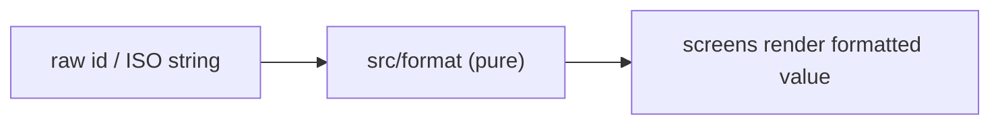
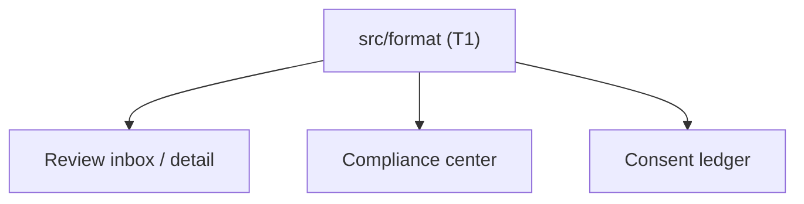
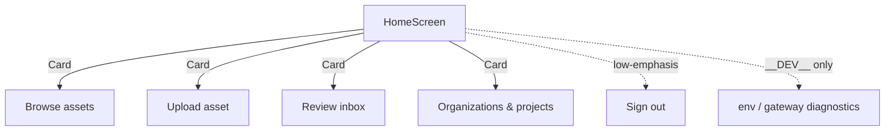
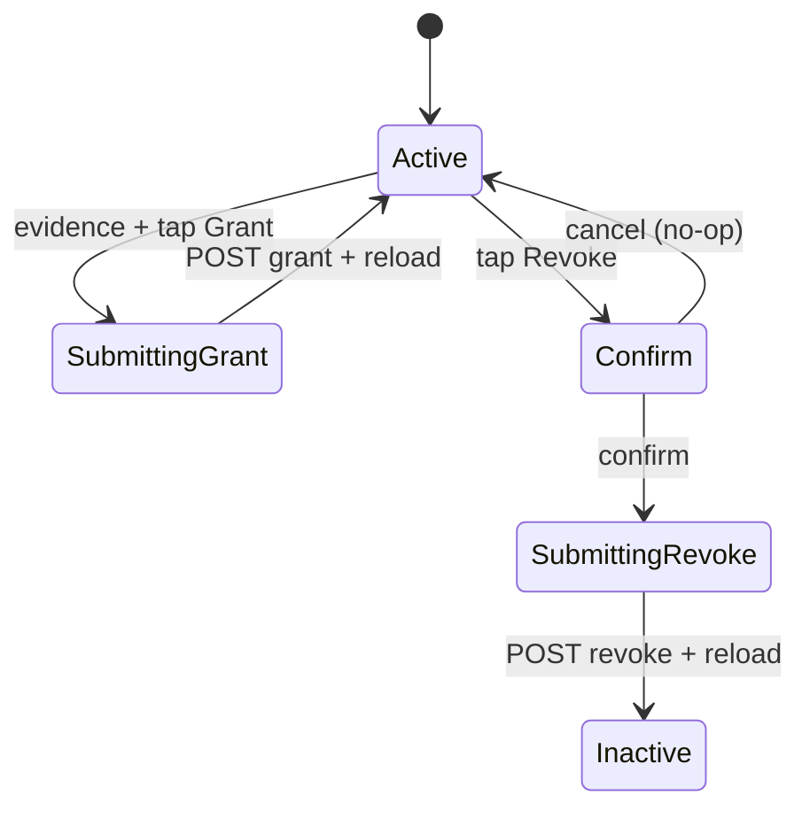
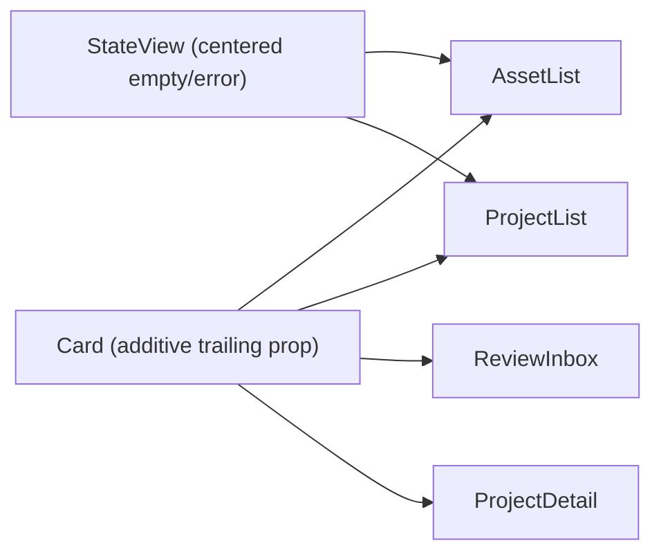
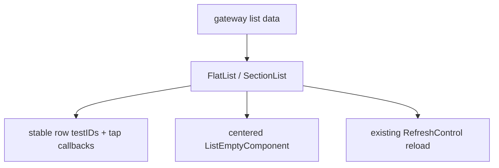
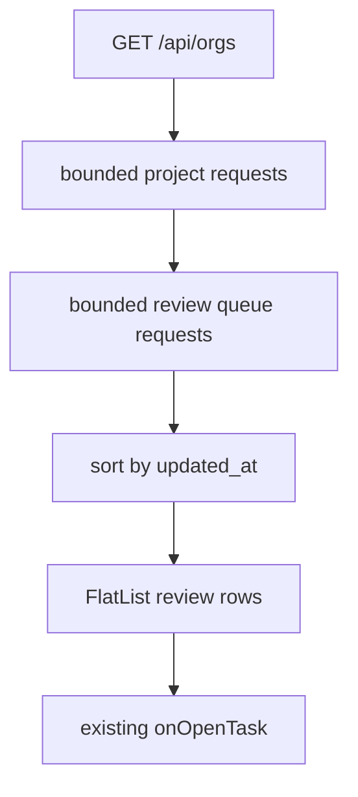
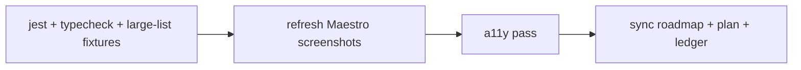

# Tasks: S-190 — Mobile UX Usability, Performance & Product-Polish Pass

Plan: `docs/plan/s-190-mobile-ux-usability-pass.md`.
All RRI values computed or recomputed with `scripts/rri.py --platform rn` on
2026-06-19 after the mobile performance/usability review; each task records the
resulting score, band, effort, and Reflection gate.
Language: code/docs English (per workflow guide §Language).

## Task summary

| ID | Title | RRI → band | Effort | Status | Depends on |
|---|---|---|---|---|---|
| S-190-T1 | Shared id + timestamp formatters | 24 → Low | S | ✅ Done | — |
| S-190-T2 | Apply formatting (Review / Compliance / Consent) | 24 → Low | S | ✅ Done | T1 |
| S-190-T3 | Home dashboard hierarchy + demote sign-out/diagnostics | 33 → Moderate | M | ✅ Done | — |
| S-190-T4 | Consent destructive-confirm + mutation guards + toggle clarity | 46 → Med-high | L | ✅ Done | — |
| S-190-T5 | List affordance + centered empty-states | 30 → Moderate | M | ✅ Done | T1 |
| S-190-T7a | Virtualize high-growth mobile lists | 33 → Moderate | M | ✅ Done | T5 |
| S-190-T7b | Review inbox bounded loading + virtualization | 39 → Moderate | M | ✅ Done | T2,T5 |
| S-190-T6 | Visual QA, a11y pass, screenshot baselines, docs sync | n/a (closeout) | S | ✅ Done | T2,T3,T4,T5,T7a,T7b |

> **Approval gating.** T1–T2 are RRI 0–25 (Low) → eligible for local Gemma
> delegation, no full-approval presentation required. T3, T5, T7a, and T7b are
> RRI 26–40 (Moderate) → require explicit approval presentation + 2 Reflection
> passes before implementation. T4 is RRI 46 (Med-high) → requires explicit
> approval presentation + 3 Reflection passes before implementation.

> **Performance decomposition note.** A single combined "virtualize all lists +
> review inbox fan-out" task scored RRI 56 (Complex) and triggered decomposition.
> T7a/T7b keep UI virtualization separate from Review-specific async loading.

---

## S-190-T1 — Shared id + timestamp formatters

- **Status:** ✅ Done
- **Effort:** S
- **RRI:** 24 → band Low (0–25) → Effort S · thinking Off (local Gemma eligible)
- **Depends on:** —
- **Affected:** `mobile/src/format/` (new), `mobile/__tests__/`

### Objective
Add pure, framework-free formatters so identifiers are never cut mid-token and
timestamps are never shown raw.

### Inputs / Outputs
- In: raw entity ids (`asset-seed-1`), ISO-8601 strings (`2026-01-01T11:00:00Z`).
- Out: `formatId(id, opts?)` (full value, optional safe trailing ellipsis at a max
  length on a *complete* token), `formatTimestamp(iso)` (locale absolute),
  `formatRelative(iso, now?)` (optional "5 months ago").

### Acceptance criteria
- `formatId` never returns a string cut in the middle of a token; default returns the
  full id; with a max-length it elides with `…` only past the limit.
- `formatTimestamp` returns a locale-formatted absolute string; invalid input returns
  a stable fallback (e.g. the original string) and never throws.
- Timestamp formatter tests pin locale/timezone (or use explicit formatter options)
  so CI output is deterministic while runtime UI can still use the device locale.
- 100% line coverage on the new module; no React/RN imports in `src/format/`.

### Behavioral examples
- **HP-1:** `formatId("asset-seed-1")` → `"asset-seed-1"` (unchanged, not `"asset-se"`).
- **HP-2:** `formatTimestamp("2026-01-01T11:00:00Z")` → locale absolute string (no raw `T…Z`).
- **EC-1:** `formatId("", { max: 8 })` → `""` (empty input, no throw).
- **EC-2:** `formatTimestamp("not-a-date")` → fallback string, no throw.

### Diagram

### Handoff prompt (local Gemma delegation)
1. S-190-T1 — add pure id/timestamp formatters; no truncation mid-token, no raw ISO.
2. Docs: `docs/tasks/s-190-mobile-ux-usability-pass.md`, `docs/plan/s-190-mobile-ux-usability-pass.md`.
3. New file `mobile/src/format/index.ts` + tests in `mobile/__tests__/format.test.ts`.
4. AC: HP-1/HP-2/EC-1/EC-2 above; no RN imports; 100% line coverage on the new module.
5. Stop after tests green; do NOT touch any screen yet (that is T2).

---

## S-190-T2 — Apply formatting (Review / Compliance / Consent)

- **Status:** ✅ Done
- **Effort:** S
- **RRI:** 24 → band Low (0–25) → Effort S · thinking Off (local Gemma eligible)
- **Depends on:** T1
- **Affected:** `ReviewInboxScreen.tsx`, `ReviewDetailScreen.tsx`, `ComplianceScreen.tsx`, `ConsentScreen.tsx`

### Objective
Replace every `.slice(0, 8)` on an identifier and every raw ISO timestamp on the
current S-190 user-facing surfaces with the T1 formatters; lead list cards with the
human-readable title where the API already provides one.

### Acceptance criteria
- No `.slice(0, 8)` (or equivalent mid-token cut) remains on any rendered identifier.
- No user-facing raw ISO timestamp remains (Compliance audit/ledger, Consent history,
  Review updated/created/published).
- Screen tests include rendered-tree or targeted assertions that reject raw ISO
  patterns (`YYYY-MM-DDT...Z`) on the touched surfaces.
- All existing `testID`s and view-state logic unchanged; existing screen tests pass.

### Behavioral examples
- **HP-1:** Review inbox card shows full `asset-seed-1` (or the asset title) — never `asset-se`.
- **HP-2:** Consent history row shows a formatted timestamp, not `2026-01-01T11:00:00Z`.
- **EC-1:** Missing/empty id field renders a stable placeholder, not a crash or `undefined`.
- **EC-2:** Malformed timestamp renders the T1 fallback, not raw `T…Z`.

### Diagram

### Handoff prompt (local Gemma delegation)
1. S-190-T2 — route ids/timestamps through T1 formatters; lead cards with title.
2. Docs: ledger + plan (paths above).
3. Files: the 4 screens above; replace `.slice(0,8)` at `ReviewInboxScreen.tsx:322,326,328`,
   `ReviewDetailScreen.tsx:136,141,143` and ISO renders in Compliance/Consent history
   plus Review created/updated/published copy.
4. AC: HP-1/HP-2/EC-1/EC-2; preserve every testID; screen tests green.
5. Stop after tests + typecheck green; do NOT change Home/lists (T3/T5).

---

## S-190-T3 — Home dashboard hierarchy + demote sign-out/diagnostics

- **Status:** ✅ Done
- **Effort:** M
- **RRI:** 33 → band Moderate (26–40) → Effort M · thinking Off
- **Required Reflection passes:** 2 (Moderate band)
- **Depends on:** —
- **Affected:** `HomeScreen.tsx`, `components/Card.tsx` (additive)

### Objective
Turn Home from a flat wall of 5 identical buttons into a scannable dashboard:
navigation as menu cards, Sign out demoted, diagnostics hidden outside dev.

### Acceptance criteria
- The 4 navigation destinations render as tappable `Card`s (title + one-line subtitle).
- `Sign out` is visually demoted (text/`secondary sm`), separated from navigation.
- Gateway URL + env panel render only when `__DEV__` (or an explicit env flag).
- Every existing testID (`home-open-assets`, `home-open-upload`, `home-open-review`,
  `home-open-organizations`, `home-sign-out`, `home-screen`) is preserved and wired to
  the same `onOpen*` / logout callbacks.

### Happy paths considered
- Tapping each menu card invokes its existing `onOpen*` callback.
- Sign out still calls `auth.logout()`.

### Edge cases considered
- Production build (`__DEV__ === false`) hides the diagnostics panel entirely.
- Long gateway URL / long destination subtitle does not break layout (`numberOfLines`).

### Behavioral examples
- **HP-1:** Tap "Browse assets" card → `onOpenAssets` fires (same as today's button).
- **HP-2:** `__DEV__ === true` → diagnostics panel visible with env + gateway.
- **EC-1:** `__DEV__ === false` → no gateway URL/env rendered anywhere on Home.
- **EC-2:** `home-sign-out` press → `auth.logout()` called exactly once.

### Reflection strategy
RRI 33 → Moderate → **2 passes**.
- **Pass 1 (correctness/wiring):** every testID maps to the same callback as before;
  no navigation-graph change; dev-flag gating correct.
- **Pass 2 (UX/a11y + side effects):** card touch targets ≥44pt, `accessibilityRole`,
  Sign-out demotion does not orphan the logout action; no leaked diagnostics in prod.

### Diagram

### Handoff prompt
1. S-190-T3 — Home dashboard hierarchy; demote sign-out; gate diagnostics to `__DEV__`.
2. Docs: ledger + plan (paths above).
3. File: `mobile/src/screens/HomeScreen.tsx` (+ additive prop on `components/Card.tsx` if needed).
4. AC: HP-1/HP-2/EC-1/EC-2; preserve all `home-*` testIDs; no nav-graph change.
5. Stop after 2 Reflection passes + tests/typecheck green; do NOT touch Consent (T4).

---

## S-190-T4 — Consent destructive-confirm + mutation guards + toggle clarity

- **Status:** ✅ Done
- **Effort:** L
- **RRI:** 46 → band Med-high (41–55) → Effort L · thinking On
- **Required Reflection passes:** 3 (Med-high band)
- **Depends on:** —
- **Affected:** `ConsentScreen.tsx`, `components/Button.tsx` (added `selected` prop)

### Objective
Protect the append-only consent ledger: confirm before Revoke, guard both Grant and
Revoke while a mutation is in flight, and make scope chips read unambiguously as
selectable toggles.

### Acceptance criteria
- `Revoke` requires an explicit confirm (Alert or in-screen) before the mutation; cancel
  performs no network call and no ledger change.
- `Grant` remains evidence-gated but does not need an extra confirm; it enters the
  same submitting guard as Revoke so rapid taps cannot double-post.
- Both Grant and Revoke are disabled/busy while the POST + ledger reload cycle is in
  flight; double-tap tests prove at most one network mutation is sent per action.
- Scope chips expose selected/unselected token styling and `accessibilityState.selected`.
- `Grant` flow unchanged in behavior; all existing consent testIDs preserved.

### Happy paths considered
- Confirming Revoke posts the revoke mutation exactly once.
- Granting with evidence posts one grant mutation exactly once and reloads active status.
- Selecting a scope chip toggles its selected state and feeds the mutation payload.

### Edge cases considered
- Cancelling the Revoke confirm performs zero network calls and leaves state ACTIVE.
- Rapid double-tap on Revoke does not double-submit (guarded while submitting).
- Rapid double-tap on Grant does not double-submit and still requires evidence.

### Behavioral examples
- **HP-1:** Tap Revoke → confirm → one revoke request; status → INACTIVE.
- **HP-2:** Enter evidence → tap Grant → one grant request; status → ACTIVE.
- **HP-3:** Tap `voice clone` chip → chip shows selected, payload scope updates.
- **EC-1:** Tap Revoke → cancel → no request, status stays ACTIVE.
- **EC-2:** Double-tap Revoke while submitting → single request only.
- **EC-3:** Double-tap Grant while submitting → single request only.

### Reflection strategy
RRI 46 → Med-high → **3 passes**.
- **Pass 1 (safety/correctness):** confirm gates the mutation; cancel is a true no-op;
  Grant remains evidence-gated; append-only semantics respected.
- **Pass 2 (submission guards):** both mutation paths disable repeat taps until POST +
  reload settle; failure paths re-enable controls without changing ledger state.
- **Pass 3 (UX/a11y):** toggle states legible + `accessibilityState.selected`; confirm
  copy names the irreversible action; destructive button retains `danger` tone.

### Diagram

### Handoff prompt
1. S-190-T4 — confirm destructive Revoke; guard Grant/Revoke submissions; scope chips read as toggles.
2. Docs: ledger + plan (paths above).
3. File: `mobile/src/screens/ConsentScreen.tsx`.
4. AC: HP-1/HP-2/HP-3/EC-1/EC-2/EC-3; preserve consent testIDs; cancel = zero IO.
5. Stop after 3 Reflection passes + tests/typecheck green; do NOT touch Home (T3).

---

## S-190-T5 — List affordance + centered empty-states

- **Status:** ✅ Done
- **Effort:** M
- **RRI:** 30 → band Moderate (26–40) → Effort M · thinking Off
- **Required Reflection passes:** 2 (Moderate band)
- **Depends on:** T1
- **Affected:** `AssetListScreen.tsx`, `ProjectListScreen.tsx`, `ProjectDetailScreen.tsx`,
  `ReviewInboxScreen.tsx`, `AssetDetailScreen.tsx`, `components/Card.tsx`,
  `components/StateView.tsx`

### Objective
Make tappable cards visibly tappable through a persistent trailing affordance, preserve
the existing pressed feedback, and stop empty-states from reading as broken.

### Acceptance criteria
- `Card` gains an optional trailing affordance (chevron) prop, default off → existing
  call sites unchanged; tappable lists opt in.
- The existing `Card` pressed feedback is preserved; the chevron is decorative and not
  exposed as a separate accessibility target.
- `StateView` empty/error layouts center within available space, including parent
  container changes where needed (`flexGrow`, `justifyContent`, or equivalent).
- `AssetDetailScreen` primary action ("Open compliance center") is full-width within
  its card (no left-aligned chip with dead space).
- All existing testIDs preserved; existing screen tests pass.

### Happy paths considered
- Asset/project/review/project-detail list cards show a trailing chevron and preserve
  clear pressed feedback.
- Empty asset list renders a vertically centered empty-state.

### Edge cases considered
- A `Card` without the affordance prop renders exactly as before (no regression).
- Very long titles truncate with ellipsis without pushing the chevron off-screen.
- Centering works on both the standard 390x844 screenshot viewport and a shorter test
  viewport without clipping or overlap.

### Behavioral examples
- **HP-1:** Asset list card renders trailing chevron; tap → asset detail (existing nav).
- **HP-2:** Empty asset list → centered "No assets yet" state, not top-pinned.
- **HP-3:** Review task card renders trailing chevron; tap → review detail (existing nav).
- **EC-1:** Existing `Card` call site without the new prop is visually unchanged.
- **EC-2:** Long asset title + chevron → title ellipsizes, chevron stays visible.
- **EC-3:** Short viewport keeps centered empty-state visible without clipping.

### Reflection strategy
RRI 30 → Moderate → **2 passes**.
- **Pass 1 (no-regression):** additive `Card` prop defaults preserve every current call
  site; testIDs intact; nav unchanged.
- **Pass 2 (UX/a11y):** chevron is decorative (not a separate a11y target), pressed
  feedback preserved, empty-state centering robust across screen sizes.

### Diagram

### Handoff prompt
1. S-190-T5 — tappable affordance (chevron) on cards + centered empty-states.
2. Docs: ledger + plan (paths above).
3. Files: `components/Card.tsx`, `components/StateView.tsx`, the affected screens above.
4. AC: HP-1/HP-2/HP-3/EC-1/EC-2/EC-3; additive prop default = no change to existing call sites.
5. Stop after 2 Reflection passes + tests/typecheck green.

---

## S-190-T7a — Virtualize high-growth mobile lists

- **Status:** ✅ Done
- **Effort:** M
- **RRI:** 33 → band Moderate (26–40) → Effort M · thinking Off
- **Required Reflection passes:** 2 (Moderate band)
- **Depends on:** T5
- **Affected:** `AssetListScreen.tsx`, `ProjectListScreen.tsx`,
  `ProjectDetailScreen.tsx`, `OrganizationListScreen.tsx`,
  `OrganizationMembersScreen.tsx`, `mobile/__tests__/{asset,project,organization}.screens.test.tsx`

### Objective
Replace eager `ScrollView` + `.map` list rendering with RN virtualized list primitives
on high-growth list surfaces that do not require Review-specific loading changes.

### Acceptance criteria
- Asset, project, project-linked asset, organization, and member lists use `FlatList`
  or `SectionList` with stable `keyExtractor`s and row renderers.
- Pull-to-refresh, empty/error states, row `testID`s, and tap callbacks are preserved.
- Empty states render through `ListEmptyComponent` or an equivalent virtualized-list
  pattern and remain vertically centered after T5.
- Large-list fixtures (100+ rows) verify stable rendering, preserved row testIDs for
  representative items, and no layout break with long titles/ids.
- No gateway/API contract, navigation graph, or persisted data behavior changes.

### Happy paths considered
- 100 assets render through a virtualized list and tapping an asset row opens the same
  asset detail callback as before.
- 100 organization members render with stable member row testIDs.

### Edge cases considered
- Empty asset/project/member lists still render centered empty states.
- Pull-to-refresh still calls the existing reload path exactly once.
- Long project/asset names ellipsize without pushing the trailing affordance off-screen.

### Behavioral examples
- **HP-1:** 100 assets → `asset-list-screen` renders; `asset-card-asset-050` is reachable; tap opens asset detail.
- **HP-2:** 100 members → `member-row-user-050` is reachable and preserves role copy.
- **EC-1:** Empty project list → centered `project-list-empty-state`, no extra blank rows.
- **EC-2:** Pull-to-refresh on asset list → one `/api/assets` reload and no duplicate rows.
- **EC-3:** Long organization name → row text ellipsizes and action buttons remain visible.

### Reflection strategy
RRI 33 → Moderate → **2 passes**.
- **Pass 1 (behavior preservation):** row testIDs, tap callbacks, refresh paths, and
  empty/error states match the pre-virtualization behavior.
- **Pass 2 (performance/UX):** high-row fixtures do not eagerly require custom row
  state; long text and trailing affordances remain stable on mobile widths.

### Diagram

### Handoff prompt
1. S-190-T7a — virtualize high-growth mobile lists except Review inbox.
2. Docs: ledger + plan (paths above).
3. Files: affected screens/tests above.
4. AC: HP-1/HP-2/EC-1/EC-2/EC-3; preserve testIDs, refresh, empty/error states, navigation callbacks.
5. Stop after 2 Reflection passes + tests/typecheck green; do NOT change Review inbox loading (T7b).

---

## S-190-T7b — Review inbox bounded loading + virtualization

- **Status:** ✅ Done
- **Effort:** M
- **RRI:** 39 → band Moderate (26–40) → Effort M · thinking Off
- **Required Reflection passes:** 2 (Moderate band)
- **Depends on:** T2, T5
- **Affected:** `ReviewInboxScreen.tsx`, `mobile/__tests__/ReviewInboxScreen.test.tsx`

### Objective
Improve review inbox perceived performance by virtualizing review-task rows and avoiding
strictly sequential org → project → queue fan-out inside the current API contract.

### Acceptance criteria
- Review task rows render through `FlatList` (or another RN virtualized primitive) with
  stable `review-task-card-*` testIDs and the T5 trailing affordance.
- Project/queue requests are issued with bounded concurrency (documented cap, e.g. 3–4)
  rather than one strict serial chain per accessible scope.
- Session expiry remains fail-closed: logout happens once and pending work is ignored.
- Forbidden scopes are skipped as before; network/HTTP failures still surface a clear
  error state.
- Notification unread count, mark-read behavior, `initialTaskId` auto-open, sorting, and
  pull-to-refresh semantics are preserved.
- Tests use delayed promises or ordered mocks to prove the inbox no longer waits for a
  slow earlier scope before processing all later independent scopes.

### Happy paths considered
- Reviewer with multiple org/project scopes sees all tasks sorted by `updated_at` and can
  tap a virtualized row to open detail.
- Unread notifications are counted and marked read after queue resolution as before.

### Edge cases considered
- One forbidden project scope is skipped without failing the whole inbox.
- One session-expired response aborts loading and calls `auth.logout()` once.
- A slow first project does not block independent later project queue requests from
  being started within the concurrency cap.

### Behavioral examples
- **HP-1:** Two organizations with two projects each → all returned review tasks render sorted newest first.
- **HP-2:** `initialTaskId` matches a returned task → `onOpenTask` fires once after bounded loading settles.
- **EC-1:** One project returns forbidden → remaining projects still contribute tasks.
- **EC-2:** One request returns `session_expired` → logout once, no partial ready state.
- **EC-3:** Delayed first project + fast second project → second request starts before first resolves.

### Reflection strategy
RRI 39 → Moderate → **2 passes**.
- **Pass 1 (concurrency correctness):** bounded fan-out preserves failure semantics,
  sorting, notification side effects, and initial-task auto-open.
- **Pass 2 (rendering/performance):** virtualized review rows preserve testIDs, card
  affordance, refresh behavior, and accessible labels.

### Diagram

### Handoff prompt
1. S-190-T7b — virtualize Review inbox rows and replace strict serial fan-out with bounded loading.
2. Docs: ledger + plan (paths above).
3. Files: `ReviewInboxScreen.tsx`, `ReviewInboxScreen.test.tsx`.
4. AC: HP-1/HP-2/EC-1/EC-2/EC-3; preserve notification, sorting, initialTaskId, refresh, and failure semantics.
5. Stop after 2 Reflection passes + tests/typecheck green.

---

## S-190-T6 — Visual QA, a11y pass, screenshot baselines, docs sync

- **Status:** ✅ Done
- **Effort:** S
- **RRI:** n/a (closeout / QA + docs task)
- **Depends on:** T2, T3, T4, T5, T7a, T7b
- **Affected:** `mobile/maestro/*`, `mobile/artifacts/screenshots/*`,
  `docs/plan/roadmap.md`, this ledger, the plan

### Objective
Confirm the slice end-to-end, refresh screenshot baselines, run the a11y pass, and
sync all status artifacts before reporting completion.

### Acceptance criteria
- `cd mobile && npm test -- --runInBand` and `npm run typecheck` green.
- Maestro flows syntax-valid; testIDs intact; `compliance.yaml` is updated for the
  Revoke confirm step and still captures active + revoked consent screenshots.
- Refreshed screenshots reviewed: no truncated ids, formatted timestamps, dashboard
  Home, confirm-on-revoke, tappable cards, centered empty-states, virtualized lists.
- Large-list and bounded-loading tests pass; rendered-tree assertions prove no raw ISO
  user-facing timestamp remains on S-190 surfaces.
- a11y: toggles expose `selected`; destructive confirm present; targets ≥44pt; AA contrast.
- Roadmap S-190 row + this ledger + the plan moved to their done state in the same pass.

### Diagram

### Handoff prompt
1. S-190-T6 — verify, refresh screenshots, a11y pass, sync status docs.
2. Docs: ledger + plan + `docs/plan/roadmap.md` S-190 row.
3. Run the verification commands in the plan; review refreshed baselines and updated
   consent-confirm Maestro flow.
4. AC: all checks green; status artifacts consistent.
5. Stop after `make qa-docs` passes and roadmap/plan/ledger are consistent.
