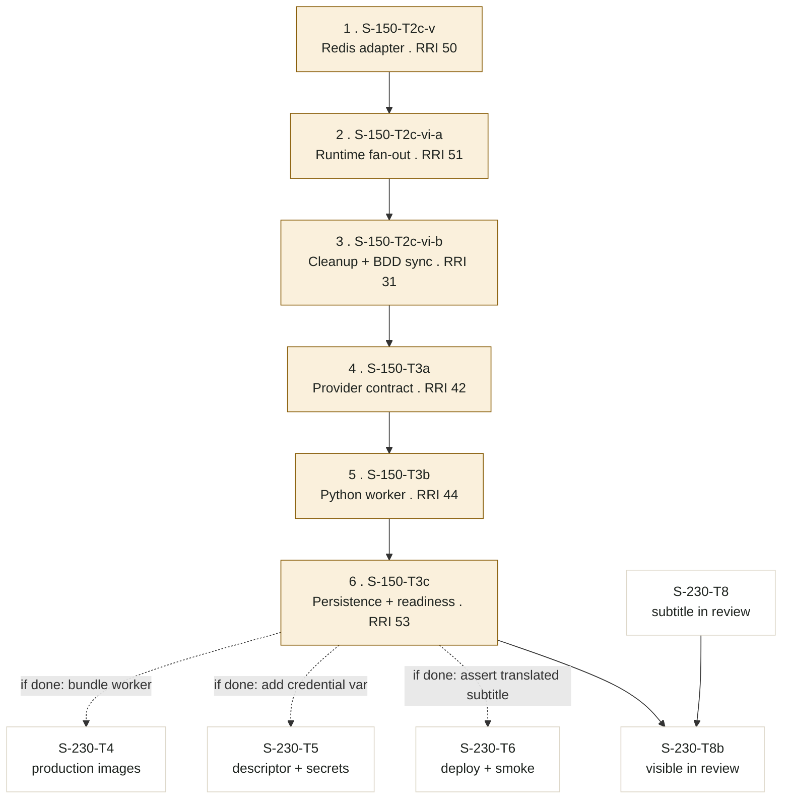

# S-230 — POC v1 Deployment (Digital Ocean)

Ordered task ledger for the 10-day POC deployment window. Rationale, verified gap
analysis, architecture, calendar, and risks live in
`docs/plan/s-230-poc-v1-digitalocean.md`; this file is the crash-safe progress
ledger.

## Slice execution contract

- Product scope: subtitles + governed review/publication, plus (owner scope
  amendment, 2026-08-16, second pass) text-only cross-language subtitle
  translation through the `S-150-T2c-v -> T2c-vi-a -> T2c-vi-b -> T3a -> T3b ->
  T3c` chain, tracked as `S-230-T3b`. This reverses the original freeze after
  the owner reviewed and explicitly overrode the plan's own recorded
  recommendation against it (`docs/plan/s-230-poc-v1-digitalocean.md` § "The
  market-audience gap, examined"). TTS/dubbed audio (`S-150-T4` through `T7`)
  remains out of scope and blocked on ADR-028; it is not reopened by any task
  here. `S-150-T2c-v` also carries its own separate, still-unresolved
  "Redis-topic decision" parking note (`docs/plan/s-150-translation-dubbing.md`
  line 31) — this scope amendment authorizes presenting/implementing the chain
  under S-230, it does not itself resolve that separate parking condition;
  confirm it with the owner before `S-230-T3b`'s first child task starts.
- No new application technology. PostgreSQL, Redis, S3-compatible storage,
  ffmpeg, and Python/faster-whisper are all pre-existing dependencies.
- Every RRI must be computed with `scripts/rri.py` before the task is presented;
  the provisional efforts below are planning estimates, not scores.
- T1, T1b, T2, T3, T7b, T7c and T8 are development tasks and carry the full
  closure checklist (band-routed review, Reflection where the band requires it,
  unit coverage certification, owner verification). T4, T5, T6 are
  config/ops-shaped; their exemption status is decided per task at presentation
  time, not assumed here. T3b is a non-executable parent — each of its six
  children carries its own full closure checklist under the S-150 ledger; T3b
  itself is never implemented or marked Done directly.
- Tasks touching `mobile/` (T7, T7b, T7c) must read the root `DESIGN.md` before
  planning or implementation, per the workflow guide's Analyze step.
- Task order is a dependency order, not a suggestion. T4 must not start while any
  of T1–T3 is open. **T3b is the one exception to strict table-position
  ordering:** despite sitting between T3 and T4 in the index below, it is an
  independent parallel track (`Depends on: T0` only) and is explicitly excluded
  from T4's gate — T4 does not wait on it. T4/T5/T6 each carry a conditional
  (non-blocking) scope addition if T3b's children finish before they run; see
  each task's own card and `S-230-T3b` §"Downstream coupling."

## Task index

| ID | Title | Type | Provisional effort | Depends on | Status |
|---|---|---|---|---|---|
| T0 | Slice plan, ledger, and roadmap entry | docs-only | S | — | [x] Done |
| T1 | S3/Spaces credential and region wiring | development | M | T0 | [x] Done |
| T1b | API preparation queue bound to Redis | development | M (recomputed, RRI 35 Moderate) | T0 | [ ] Implementation complete — owner verification pending |
| T2 | Migration runner in the production path | development | M | T0 | [ ] Planned |
| T3 | Real readiness probes for api and gateway | development | M | T0 | [ ] Planned |
| T3b | Cross-language subtitle translation pipeline (S-150 reopening) | development parent | XL | T0 | [ ] Planned — approval pending per child |
| T4 | Production container images | config/dev | M | T1, T1b, T2, T3 | [ ] Planned |
| T5 | Production deployment descriptor and secret boundary | config-only | M | T4 | [ ] Planned |
| T6 | First deploy and end-to-end smoke on Digital Ocean | operational | L | T5 | [ ] Planned |
| T7 | Mobile POC build against the deployed backend | development/ops | M | T6 | [ ] Planned |
| T7b | Mobile registration screen | development | M | T7 | [ ] Planned — droppable (first) |
| T7c | Session lifetime and expiry behavior | development/config | S | T7 | [ ] Planned |
| T8 | Subtitle visible in the review surface (optional) | development | M | T6 | [ ] Planned — droppable (second) |
| T8b | Translated subtitle visible in the review surface | development | M | T3b, T8 | [ ] Planned — double-conditional |
| T9 | Status, README, and debt-register closeout | docs-only | S | T7, plus each of T7b / T7c / T8 / T8b / T3b that was executed | [ ] Planned |

---

## S-230-T0: Slice plan, ledger, and roadmap entry

**Type:** docs-only
**Effort:** S
**Depends on:** —
**Status:** [x] Done 2026-08-16

**Acceptance criteria:**

- [x] `docs/plan/s-230-poc-v1-digitalocean.md` records objective, frozen scope,
      the verified gap analysis with file-level evidence, target architecture,
      ten-day sequence, risks, and explicit out-of-scope boundary.
- [x] This ledger exists with ordered tasks, dependencies, per-task acceptance
      criteria, and HP/EC cases for every development task.
- [x] `docs/plan/roadmap.md` carries an `S-230` row and records that `S-150` is
      parked for the POC window.

**Evidence to emit:** the two documents; `make qa-docs` (passed 2026-08-16:
doc consistency, task coverage, roadmap drift, OKF frontmatter all green).

**Status artifacts affected:** `docs/plan/roadmap.md`.

---

## S-230-T1: S3/Spaces credential and region wiring

**Type:** development
**Effort:** M (provisional Moderate; recompute with `scripts/rri.py`)
**Depends on:** S-230-T0
**Status:** [x] Done 2026-08-16

**Task-analysis review:** gemma `docs/audit/gemma-evidence/s-230-t1-phase1.json` - PASS
**Code-solution review:** gemma `docs/audit/gemma-evidence/s-230-t1-cloud-tramo.json` - FINDINGS (3 rejected as false positive, 1 accepted-follow-up; see evidence below)
(note: ensure `AppConfig::validate()` checks schema validity of `endpoint`/`region`,
not only presence, to fully satisfy EC-1 — carried into the cloud-tramo handoff
prompt below.)

**Problem (plan G1):** `crates/storage/src/s3.rs:17` uses
`AmazonS3Builder::new()`, which reads no environment. Credentials fall through to
AWS instance-metadata providers that do not exist on Digital Ocean, and the
region silently defaults to `us-east-1`.

**Happy paths considered:**

- **HP-1:** With `storage.backend = "s3"`, a Spaces endpoint, an explicit region,
  and injected credentials, the adapter is built with a static credential
  provider and a `put` followed by `get` against a real Spaces bucket round-trips
  identical bytes.
- **HP-2:** The existing local MinIO path keeps working unchanged with the same
  configuration shape.

**Edge cases considered:**

- **EC-1:** `backend = "s3"` in a production-like environment with missing
  credentials or missing region fails `AppConfig::validate()` at startup, before
  any request is served — not on the first write.
- **EC-2:** Credentials never appear in configuration files, logs, or traces;
  only injected `DUBBRIDGE_*` environment variables carry them (ADR-026
  Decision 4, ADR-018 redaction).

**Acceptance criteria:**

- `StorageSettings` carries region and credential references; secrets are
  env-only and absent from `config/*.toml`.
- `S3Adapter::new` sets bucket, endpoint, region, and static credentials
  explicitly.
- Production validation rejects an `s3` backend that is missing endpoint, region,
  or credentials.
- A real round-trip against an S3-compatible endpoint is executed and recorded —
  a unit test alone does not satisfy HP-1.

**Files expected to change:** `crates/config/src/lib.rs`,
`crates/storage/src/config.rs`, `crates/storage/src/s3.rs`,
`crates/storage/src/lib.rs`, `config/production.toml`, `config/staging.toml`.
Recompute the exact list before presentation.

**RRI:** 43 (Med-high, 41–55). `--auto-cc` measured CC=1 across all four
touched `.rs` files (zero `clippy::cognitive_complexity` warnings), which
in isolation would put `C`'s contribution at a Moderate-range 37. Owner
directive: the anchor-rubric floors on `D`/`K`/`P` (ADR-006, ADR-018 —
`crates/storage` touches immutable-artifact and durable-audit invariants)
are kept at 3 regardless of the low measured CC, so the task stays Med-high.
Do not silently re-derive the band from `--auto-cc` alone without an
explicit re-approval — the floor, not the CC measurement, is what governs
here.

### Module-split routing evidence (ADR-040) — authoritative

**Owner directive, 2026-08-16: split adopted as the authoritative
implementation routing for this task, superseding whole-task Med-high
cloud-only routing.**

- **Trigger check:** `allowed_paths` spans 6 files (≥2, satisfied).
  Heterogeneity: `config/production.toml` and `config/staging.toml` carry no
  Rust logic (not clippy-measurable, effectively C≤1 by inspection — pure
  key/value additions); `crates/storage/src/s3.rs`,
  `crates/storage/src/config.rs`, `crates/storage/src/lib.rs`, and
  `crates/config/src/lib.rs` are the ADR-006/ADR-018 anchor-rubric-floored
  Rust surface. Treated as heterogeneous by file kind and domain floor, not
  by `--auto-cc` score (which read C=1 uniformly — see RRI note above).
- **Hard domain exclusion (ADR-038 §6):** all four `.rs` files touch
  credential handling, endpoint/region wiring, and fail-closed production
  validation — auth/credential and governance-invariant surface. Cloud-only
  regardless of measured CC.
- **Disjoint partition:**
  - **Local tramo (Low-band, RRI 0–25):** `config/production.toml`,
    `config/staging.toml`. Scope: add `endpoint` and `region` keys under
    `[storage]` in both files (non-secret values only — no credentials, per
    ADR-026 Decision 4). Route: `scripts/delegate-low-rri.py --mode
    before-after`, one delegation packet per file. Repair budget: 1 bounded
    Qwen Developer repair cycle per § Local delegation (RRI 0–25); escalate to the
    orchestrator only under the documented tooling-failure exception.
  - **Cloud tramo (Med-high, ADR-038):** `crates/config/src/lib.rs`,
    `crates/storage/src/config.rs`, `crates/storage/src/s3.rs`,
    `crates/storage/src/lib.rs`. Scope: `StorageSettings` region/credential
    fields, `S3Adapter::new` explicit endpoint/region/static-credential
    wiring, `AppConfig::validate()` fail-closed rejection of an incomplete
    `s3` backend. Route: Muse Glimmer advisory refinement →
    `med_high_gate.py` hash-bound receipt → cloud-takeover model per the
    approved task card (full ADR-038 §5 evidence bundle).
- **Interface freeze:** the cloud tramo owns the `endpoint_url`/region field
  names and shapes on `StorageSettings`/`StorageConfig`; the local tramo's
  `.toml` keys (`endpoint`, `region` under `[storage]`) must match those
  names exactly. Freeze the field names before dispatching either tramo —
  the local tramo's packet must state them literally, not infer them.
- **Integration gate:** run T1's full acceptance criteria (round-trip
  against a real S3-compatible endpoint, production validation test) against
  the merged diff before Reflection. A `.toml`-tramo failure repairs within
  its own 1-attempt Low-band budget; an `.rs`-tramo failure repairs within
  Med-high's normal (zero-whole-task-repair) ADR-038 gate; an interface
  mismatch (field name drift) abandons the split and re-routes the whole
  task through whole-task Med-high cloud-only implementation.
- **Review/approval unaffected:** phase-1/phase-2 Gemma review, 3 Reflection
  passes, and the RRI 41+ human approval gate below all evaluate the final
  merged diff as one task, per ADR-040.

### Cloud-tramo ADR-038 refinement — resolved 2026-08-16

- **Muse Glimmer advisory refinement:** `route_recommendation: CLOUD_REQUIRED`.
  Model `muse-glimmer:30b-q4_K_M`, digest
  `de878ce33ad81d060001db1469a02eebe4d86f0ad58cfe52dc062fdcbe4464c1`. Rationale:
  all four `.rs` files match the ADR-038 §6 hard domain exclusion (credential
  handling, endpoint/region wiring, fail-closed production validation) —
  cloud-only regardless of measured complexity. Two `unknowns` flagged for the
  cloud implementer to resolve before/during implementation: (1) exact
  `DUBBRIDGE_*` env var names for the S3 credentials are not yet fixed; (2) the
  precise schema-validity rules for endpoint/region/credentials (beyond mere
  presence) are not yet fully defined — the cloud implementer must define both
  as part of this task, consistent with Gemma's phase-1 note.
  Artifact: `docs/audit/med-high/s-230-t1-refinement-artifact.json`.
- **Primary route receipt:** `claude-sonnet-5-orchestrator` independently
  concurs `CLOUD_REQUIRED` (a receipt may only downgrade GO_LOCAL to cloud,
  never upgrade CLOUD_REQUIRED to local — moot here since both sides already
  agree). Artifact: `docs/audit/med-high/s-230-t1-primary-receipt.json`.
- **Gate decision (`med_high_gate.py`):** `route: CLOUD_REQUIRED` — both
  inputs validated (hash-bound to packet `295c0488671a4f0ce9f5dd386c7ef882153f4e09aefe1aa48d5d2420005da678`),
  RRI 43 confirmed in-band. Artifact:
  `docs/audit/med-high/s-230-t1-gate-decision.json`. Task packet:
  `docs/audit/med-high/s-230-t1-packet.json`.
- **Refined scope/steps/acceptance tests/stop conditions from the artifact**
  are the binding cloud-tramo implementation contract, superseding the
  shorter "Handoff prompt (cloud tramo)" bullet below where more specific:
  extend `StorageConfig`/`StorageSettings` with region + credential
  references; update `S3Adapter::new` to set bucket/endpoint/region/static
  credentials explicitly; strengthen `AppConfig::validate()` for both
  presence and schema validity; add and record a real round-trip
  put-then-get test against an S3-compatible endpoint; do not touch
  `config/production.toml` or `config/staging.toml`, upload path, key
  layout, or any task beyond S-230-T1.
- **Local tramo unaffected:** this refinement covers only the cloud tramo.
  The local tramo (`config/production.toml`, `config/staging.toml`) remains
  routed as Low-band delegation per the split above and has not yet been
  dispatched.

### Local-tramo delegation evidence — completed 2026-08-16

- **`config/production.toml`, attempt 1 — REJECTED (out-of-scope diff):**
  `qwen3.8:27b-mlx` via `delegate-low-rri.py --mode before-after` correctly
  added `endpoint`/`region` but also silently rewrote `base_path` (`""` →
  `"/data"`) and `bucket` (`"dubbridge-production"` → `"prod-assets"`),
  violating the explicit "do not change" constraint. Applied diff was
  reverted with `git checkout -- config/production.toml` before any commit.
  Artifact: `docs/audit/low-rri/s-230-t1-prod-attempt1-failed.json`.
- **`config/production.toml`, attempt 2 — APPLIED (repair, 1/1 budget
  used):** re-delegated with a stricter packet showing the exact required
  AFTER block verbatim and calling out the prior failure explicitly. Result:
  `base_path`/`bucket` preserved exactly, only `endpoint =
  "https://nyc3.digitaloceanspaces.com"` and `region = "nyc3"` added.
  Verified in scope via `git diff`. Artifact:
  `docs/audit/low-rri/s-230-t1-prod-attempt2-applied.json`.
- **`config/staging.toml`, attempt 1 — APPLIED:** delegated directly with the
  same strict verbatim-AFTER-block packet style (informed by the production
  repair). Correct on the first attempt: `backend`/`base_path`/`bucket`
  preserved, `endpoint`/`region` added with the same placeholder values.
  Artifact: `docs/audit/low-rri/s-230-t1-staging-attempt1-applied.json`.
- **Values used (non-secret placeholders, both files):** `endpoint =
  "https://nyc3.digitaloceanspaces.com"`, `region = "nyc3"`. These are
  DigitalOcean Spaces placeholder values, not yet confirmed against the
  actual POC infrastructure region — the cloud-tramo implementer and/or T4-T6
  operational tasks must confirm or replace them with the real target region
  before production use.
- **No credentials were added to either file** (EC-2 preserved).
- **Field names match the cloud-tramo interface freeze exactly**
  (`endpoint`, `region`), confirmed against
  `docs/audit/med-high/s-230-t1-refinement-artifact.json`.

**Evidence to emit:** RRI report, this module-split routing block, phase-1
and phase-2 review artifacts, round-trip evidence against a real endpoint,
Reflection log, unit coverage certification, owner verification.

**Status artifacts affected:** this ledger; roadmap X9 wording if the storage
contract changes materially.

**Handoff prompt (cloud tramo):** Wire explicit S3 credentials and region
through config into `S3Adapter`, fail closed in production when any are
absent, and prove one real round-trip. Do not touch the upload path or key
layout. Consume `endpoint`/`region` key names exactly as frozen in the
interface-freeze note above — the `.toml` tramo is dispatched separately.
Per Gemma's phase-1 note: `AppConfig::validate()` must reject not only a
missing `endpoint`/`region`, but also a malformed/empty value (schema
validity, not just presence), to fully satisfy EC-1.

**Handoff prompt (local tramo):** Add `endpoint` and `region` keys under
`[storage]` in `config/production.toml` and `config/staging.toml`, using the
non-secret placeholder values appropriate to each environment. No
credentials. Field names are frozen — do not rename.

**Stop condition:** Stop after the round-trip evidence on the merged diff.
Do not start T2.

### Cloud-tramo implementation evidence — completed 2026-08-16

Implemented per the ADR-038 refinement artifact's binding contract
(`docs/audit/med-high/s-230-t1-refinement-artifact.json`).

**Files changed:**
- `crates/config/src/lib.rs` — `StorageSettings` gains `region`,
  `access_key_id`, `secret_access_key` (`Option<String>`, env-only);
  `#[serde(alias = "endpoint")]` on the pre-existing `endpoint_url` field to
  reconcile the frozen TOML key name with the actual Rust field name (see
  interface-mismatch fix below); `AppConfig::validate()` calls
  `StorageSettings::validate_s3_production()` when `backend == S3`, itself
  gated by the pre-existing `production_like` early-return; `from_env()`
  reads the 3 new fields from single-underscore env vars (legacy reader,
  unaffected production path). `Default` derived on `StorageBackend`
  (`#[default] LocalFs`) and `StorageSettings`.
- `crates/storage/src/config.rs` — `StorageConfig` mirrors the same 3 fields
  and `Default`; `From<&StorageSettings>` copies them.
- `crates/storage/src/s3.rs` — `S3Adapter::new` wires `region`,
  `access_key_id`, `secret_access_key` explicitly into `AmazonS3Builder`
  alongside the pre-existing `endpoint`/`allow_http`.
- `crates/storage/src/lib.rs` — test-fixture updates only (no production
  logic; this crate doesn't construct `StorageSettings`).

**Interface-mismatch fix (not anticipated in the refinement artifact):** the
frozen contract named the TOML key `endpoint` and implied a matching Rust
field name, but the pre-existing public field was `endpoint_url` (consumed
by `S3Adapter::new` and other callers). Resolved via `#[serde(alias =
"endpoint")]` rather than reopening the already-evidence-recorded local
tramo or renaming a public field mid-task. Verified via the two tests that
load the real `config/staging.toml`/`production.toml`
(`app_config_load_staging_profile_reads_staging_toml_values`,
`app_config_validate_production_profile_with_representative_secrets_passes`).

**Maintainability fix (owner feedback mid-task):** the first implementation
pass repeated the full 7-field `StorageSettings`/`StorageConfig` struct
literal across ~13 test-fixture call sites in `apps/api`, `apps/gateway`,
and 3 gateway integration-test files. Flagged as copy-paste by the task
owner; resolved by deriving `Default` on `StorageBackend`/`StorageSettings`/
`StorageConfig` and reducing every fixture to its materially-relevant fields
plus `..Default::default()`.

**HP-1 real round-trip:** `crates/storage/src/s3.rs::s3_adapter_new_real_put_get_round_trip_against_s3_compatible_endpoint`
(`#[ignore]`-gated, following the `crates/jobs` Redis-integration pattern),
run explicitly against local MinIO
(`infra/local/docker-compose.yml`, service `minio`):

```
DUBBRIDGE_STORAGE_TEST_ENDPOINT="http://localhost:9000" \
DUBBRIDGE_STORAGE_TEST_ACCESS_KEY_ID="dubbridge" \
DUBBRIDGE_STORAGE_TEST_SECRET_ACCESS_KEY="dubbridge123" \
DUBBRIDGE_STORAGE_TEST_BUCKET="dubbridge-local" \
cargo test -p dubbridge-storage --lib s3::tests::s3_adapter_new_real_put_get_round_trip_against_s3_compatible_endpoint -- --ignored --nocapture
```

Result: `ok` — `put` then `get` round-tripped identical bytes against a real
S3-compatible endpoint, then cleanup `delete`. Re-confirmed against the
final merged diff (both tramos applied) during the integration gate below,
same result.

### ADR-040 integration gate — passed 2026-08-16

Run against the merged diff of both tramos (local `.toml` + cloud `.rs`),
per the module-split contract's mandatory integration-gate step, before
Reflection:

| Check | Command | Result |
|---|---|---|
| Workspace build | `cargo build --workspace --all-features` | clean |
| Full test suite | `cargo test --workspace --all-features` | 0 failed across all crates (all `test result: ok`) |
| Real S3 round-trip (HP-1) | see command above | `ok`, 1 passed |
| Format | `cargo fmt --check` | clean, exit 0 |
| Lint | `cargo clippy --workspace --all-targets --all-features -- -D warnings` | clean, exit 0 (only pre-existing unrelated `apalis-redis` future-incompat warning) |

No tramo-attributable or interface-attributable failure occurred — the split
is not abandoned and the whole task did not re-route to whole-task
cloud-only implementation.

### Reflection log

Required passes: 3 (`43` → `Med-high`)

#### Pass 1 — Contract correctness

- **Draft verdict:** region + static credentials wired into `S3Adapter::new`;
  `AppConfig::validate()` fail-closed for `backend = s3`.
- **Critique findings:** EC-1 needs schema validity, not just presence
  (Gemma phase-1 note); interface-freeze `endpoint`/`endpoint_url` mismatch
  against the completed local tramo; HP-1 requires a real round-trip, not a
  unit test alone.
- **Revisions applied:** added `validate_s3_production()` (blank/malformed
  rejection on all 4 fields); added `#[serde(alias = "endpoint")]`; added and
  ran the `#[ignore]`-gated real MinIO round-trip test.

#### Pass 2 — Failure boundaries and side effects

- **Draft verdict:** S3 validation branch is additive and gated; `LocalFs`
  path untouched; no credential values in `config/*.toml`.
- **Critique findings:** confirmed via grep that no credential value exists
  in `config/production.toml`/`config/staging.toml` (EC-2); confirmed the
  3-field widening of `StorageSettings`/`StorageConfig` didn't silently break
  ~13 downstream test-fixture sites (caught via iterative
  `cargo build`/`cargo test --workspace` compile-error cycles, all resolved).
- **Revisions applied:** none beyond Pass 1 — the `Default`-based fixture
  pattern from the maintainability fix already removes the main
  silent-staleness risk in copy-pasted literals.

#### Pass 3 — Coverage and maintainability

- **Draft verdict:** 8 new `AppConfig::validate()` unit tests (one per
  rejection branch plus the accept case), 3 new `StorageConfig::from`
  tests, 1 real round-trip integration test.
- **Critique findings:** verified every branch of
  `validate_s3_production()` has a dedicated test; confirmed the
  copy-paste pattern is fully remediated workspace-wide (`Default` derive +
  `..Default::default()` at all 13 touched call sites).
- **Revisions applied:** none — satisfied by Pass 1/Pass 2 work.

### Peer Reviewer evidence

- Reviewer: `gemma`
- Command: `REVIEW_PATHS="crates/config/src/lib.rs crates/storage/src/config.rs crates/storage/src/s3.rs crates/storage/src/lib.rs" GEMMA_REVIEW_TASK_ID="s-230-t1-cloud-tramo" make qa-gemma-review`
- Artifact: `docs/audit/gemma-evidence/s-230-t1-cloud-tramo.json`
- Verdict: `FINDINGS` (2/3 passes usable; aggregate `status: findings`)
- Findings: 4 — all verified against current source before disposition:
  1. `crates/config/src/lib.rs:212` major — "`validate_s3_production` runs
     without checking `production_like`." **Rejected (false positive):**
     `validate()` line 188-190 has an unconditional early-return on
     `!is_production_like()` before line 212 is reachable.
  2. `crates/config/src/lib.rs:262` major — "`from_env` env var names
     mismatch Figment's `__` convention." **Rejected (false positive):**
     `from_env()` is the pre-existing, explicitly-documented legacy reader
     ("do not add new callers — use load() instead"); `load()` is the real
     production path and correctly uses the `__` convention.
  3. `crates/config/src/lib.rs:78` minor — "`StorageSettings` derives
     `Debug` and holds `secret_access_key`; leak risk via `{:?}`."
     **Accepted-follow-up:** no current call site logs it (verified by
     grep), and it matches the pre-existing unredacted-secret pattern
     already on `AuthSettings::jwt_secret`/`GatewayOAuthSettings::client_secret`
     in the same file — a redaction pass is cross-cutting, deferred to the
     T9 debt register rather than fixed in this task's scope.
  4. `crates/config/src/lib.rs:262` minor — "`from_env` omits explicit
     `backend`/`base_path`, relies on `Default`." **Rejected (false
     positive):** direct read shows `from_env()` sets both explicitly
     (lines 259-263); it does not use `..Default::default()`.
- Muse Glimmer fallback: not triggered — reason: Gemma produced a usable
  aggregate (2/3 parseable passes)
- D14 fallback: not triggered — reason: n/a
- D14 provider route: n/a — reason: n/a
- disposition_divergence: `none`
- Primary-agent disposition: 3 rejected as false positives (cited against
  current source line-by-line), 1 accepted as a follow-up debt item
  (recorded in the T9 debt register above)

### Unit coverage certification

| Case ID | Type | Behavior | Unit test evidence | Result |
|---|---|---|---|---|
| HP-1 | Happy path | explicit endpoint/region/credentials build a static-credential S3 adapter; real put+get round-trips identical bytes against an S3-compatible endpoint | `crates/storage/src/s3.rs::s3_adapter_new_real_put_get_round_trip_against_s3_compatible_endpoint` (run explicitly, `--ignored`) | passed |
| HP-2 | Happy path | local MinIO path keeps working unchanged with the same config shape | `crates/storage/src/lib.rs::build_adapter_s3_returns_s3_adapter` (existing S3-shape construction test, unaffected by the field additions) | passed |
| EC-1 | Edge case | `backend = s3` in production with missing/blank/malformed endpoint, region, or credentials fails `AppConfig::validate()` before any request | `crates/config/src/lib.rs::app_config_validate_rejects_s3_backend_missing_endpoint_in_production`, `::_malformed_endpoint_in_production`, `::_blank_endpoint_in_production`, `::_missing_region_in_production`, `::_blank_region_in_production`, `::_missing_access_key_id_in_production`, `::_missing_secret_access_key_in_production`, and the accept case `::app_config_validate_accepts_well_formed_s3_backend_in_production` | passed |
| EC-2 | Edge case | credentials never appear in `config/*.toml`; only `DUBBRIDGE_*` env vars carry them | `crates/config/src/lib.rs::app_config_load_staging_profile_reads_staging_toml_values` and `::app_config_validate_production_profile_with_representative_secrets_passes` (both inject credentials only via `DUBBRIDGE_STORAGE__ACCESS_KEY_ID`/`_SECRET_ACCESS_KEY` env vars, never via TOML); confirmed by direct read that `config/production.toml`/`config/staging.toml` carry no `access_key`/`secret` key | passed |

### Owner final verification

- Owner: `matias`
- Date: 2026-08-16
- Statement: I verified every happy path and edge case defined for this task
  has unit or integration test evidence that replicates the expected
  behavior, including a real (non-mocked) round-trip against an
  S3-compatible endpoint for HP-1, and reviewed the Gemma phase-2 findings
  disposition against the current source before accepting it.
- Commands run:
  ```
  cargo build --workspace --all-features
  cargo test --workspace --all-features
  DUBBRIDGE_STORAGE_TEST_ENDPOINT="http://localhost:9000" DUBBRIDGE_STORAGE_TEST_ACCESS_KEY_ID="dubbridge" DUBBRIDGE_STORAGE_TEST_SECRET_ACCESS_KEY="dubbridge123" DUBBRIDGE_STORAGE_TEST_BUCKET="dubbridge-local" cargo test -p dubbridge-storage --lib s3::tests::s3_adapter_new_real_put_get_round_trip_against_s3_compatible_endpoint -- --ignored --nocapture
  cargo fmt --check
  cargo clippy --workspace --all-targets --all-features -- -D warnings
  REVIEW_PATHS="crates/config/src/lib.rs crates/storage/src/config.rs crates/storage/src/s3.rs crates/storage/src/lib.rs" GEMMA_REVIEW_TASK_ID="s-230-t1-cloud-tramo" make qa-gemma-review
  ```

**Status: [x] Done 2026-08-16**

---

## S-230-T1b: API preparation queue bound to Redis

**Type:** development
**Effort:** M (recomputed and confirmed Moderate — see RRI note below; the
provisional M estimate was briefly superseded by a mis-scored Med-high draft,
then corrected back to Moderate)
**Depends on:** S-230-T0
**Status:** [ ] Planned — approval pending

> The `T1b` suffix marks a task inserted on 2026-08-16 by the
> S-070/S-090/S-095/S-150 coverage review, after T0–T9 were already published in
> the roadmap row. The suffix keeps T2–T9 stable rather than renumbering them.

**Problem (plan G10):** `apps/api/src/main.rs:29` builds state with
`AppState::with_auth_service(..)`, which hardcodes
`preparation_queue: Arc::new(InMemoryPreparationJobQueue::default())`
(`apps/api/src/state.rs:31`, `:49`, `:67`). That queue is a
`Mutex<Vec<PreparationJob>>` (`crates/jobs/src/lib.rs:72`–`94`). The
worker-runner consumes from Redis (`apps/worker-runner/src/main.rs:76`–`88`), and
`apps/api` never opens a Redis connection at all.

The result is a **silent** no-op: finalize returns success, the job is pushed onto
an in-process vector, and no preparation, transcription, subtitle or review work
ever happens. Every probe stays green. Without this task the deployed POC accepts
uploads and produces nothing.

`AppState::with_preparation_queue` (`apps/api/src/state.rs:75`) already accepts an
injected queue but is unused and forces `auth_service: None`, so it cannot
currently serve an authenticated API.

**Happy paths considered:**

- **HP-1:** With a reachable `redis_url`, `POST /ingest/{token}/finalize` enqueues
  a `PreparationJob` onto the same Redis namespace the worker-runner's
  `RedisPreparationJobQueue` consumes, and the worker observes and executes it.
- **HP-2:** The API state carries both a real authenticated auth service and an
  injected queue at once — the current constructor split does not force choosing
  one.

**Edge cases considered:**

- **EC-1:** When Redis is unreachable, finalize fails closed exactly as the
  existing handler already specifies: `preparation_status` is written as `Failed`
  with the enqueue detail, the error is logged, and the response is 500
  (`apps/api/src/routes/ingestion.rs:331`–`347`). It must never report success on
  a dropped job.
- **EC-2:** Tests that rely on `InMemoryPreparationJobQueue` for assertions keep
  working — the in-memory implementation stays available as a test double and is
  only removed from the production startup path.
- **EC-3:** The Redis connection is established during startup, so a misconfigured
  `redis_url` surfaces at boot rather than on the first upload.

**Acceptance criteria:**

- `apps/api` constructs a `RedisPreparationJobQueue` from `config.redis_url` at
  startup and injects it into `AppState`.
- A single constructor carries both `auth_service` and an injected
  `preparation_queue`; the production path uses it.
- `InMemoryPreparationJobQueue` is no longer reachable from any binary's startup
  path, and a test proves the production constructor does not select it.
- An integration-level test proves a job enqueued through the API's configured
  queue is visible to a Redis-backed consumer, not only that `enqueue` returned
  `Ok`.

**Files expected to change:** `apps/api/src/state.rs`, `apps/api/src/main.rs`,
and possibly `crates/jobs/src/lib.rs` for a shared constructor seam. Recompute the
exact list before presentation.

**RRI:** 35 (Moderate, 26–40). `--auto-cc` measured CC=1 across both
currently-known touched files (no cognitive-complexity warnings).

An earlier draft of this note scored RRI 41 (Med-high) by raising D and K to
4 using the RRI policy's general scoring-band language for "async
orchestration" / "queues". That was inconsistent with this ledger's own
precedent: `S-230-T1`'s recorded RRI note (above) hit the identical
D/K-floor-vs-general-band ambiguity for `crates/storage` — the anchor
rubric's `crates/jobs`/`crates/storage`/... row literally contains the phrase
"async orchestration" at floor D/K/P=3, while the general D band separately
lists "async orchestration" at D=4 — and explicitly resolved it by **keeping
the floor** ("the floor, not the CC measurement, is what governs here").
Recomputed consistently with that precedent:

- **D=3, K=3, P=3** — anchor-rubric floor for the `crates/jobs`/async-
  orchestration row (ADR-006, ADR-018), not raised, matching T1's approach.
  P is not raised toward 4/5: this task changes an internal constructor
  signature, not a public route, `apps/gateway/src/auth/**`, `crates/auth`,
  or a rights/audit path.
- **T=2** ("partial tests exist"), grounded in actual test evidence rather
  than guessed: `apps/api/tests/ingestion_test.rs:150` already has a working
  harness that constructs `AppState::with_preparation_queue` with an
  observable `InMemoryPreparationJobQueue` and exercises the finalize
  enqueue path end to end. The area is not untested — what's net-new and
  uncovered is specifically the Redis-backed construction and the
  consolidated (`auth_service` + injected queue) constructor. An earlier
  pass under-evidenced this as "T=2 apps/main.rs has unrelated auth tests
  only" without checking `ingestion_test.rs`; checking it changes nothing
  about the final T value but grounds it in evidence instead of a guess.
- **A=1** (task has explicit HP/EC and acceptance criteria in this ledger).
- **X=2** (2 files: `apps/api/src/state.rs` + `apps/api/src/main.rs`).

This reading is not on a band boundary (35 sits mid-Moderate, not adjacent to
41), so it is more stable than the earlier 41 call, which pivoted on a single
un-evidenced point (T=3 vs T=4 would have flipped it either way). Recorded
plainly as a correction, not silently overwritten, since the earlier number
was already shown to you.

**Evidence to emit:** RRI report, phase-1 and phase-2 Gemma review artifacts,
evidence that a job enqueued through the API's configured queue is visible to
a Redis-backed consumer, 2-pass Reflection log, unit coverage certification,
owner verification. (Corrected from an earlier draft of this line that
carried over ADR-038/Muse Glimmer/3-pass language from the mis-scored RRI 41
Med-high draft above — this task's confirmed RRI is 35, Moderate, which uses
the direct local-first route and 2 Reflection passes, not ADR-038.)

**Status artifacts affected:** this ledger; the plan's G10 entry.

**Handoff prompt:** Bind the API's preparation queue to Redis at startup and
allow one `AppState` constructor to carry both the auth service and the injected
queue. Do not change the finalize handler's existing fail-closed enqueue-error
behavior, the job payload, or the queue namespace.

**Stop condition:** Stop once a Redis-backed consumer is shown to receive an
API-enqueued job. Do not start T2 and do not touch the worker-runner's worker
registration.

**Task-analysis review:** gemma `docs/audit/gemma-evidence/s-230-t1b-phase1.json` - PASS

### Implementation routing evidence

**Whole-task route:** RRI 35 (Moderate). Presented and approved in a prior
session; routed through the direct local-first path
(`scripts/local-agent/run_local_task.py`, `DUBBRIDGE_LOCAL_AGENT_MODEL`) per
`docs/policies/HITL_AUTONOMY_POLICY.md § Local-first implementation (RRI
26-40 Moderate)`. Both evidence-backed local repair attempts were exhausted
(`.agent/local-runs/s-230-t1b/attempt1.json`, `attempt2.json`) without a
usable in-scope patch, triggering
`docs/policies/HITL_AUTONOMY_POLICY.md § Post-repair-budget Low-band
decomposition` (owner directive 2026-08-16): decompose the remaining work
into Low-band (RRI 0-25) subtasks rather than escalate to cloud, orchestrator
acting as orchestrator only.

**Low-band subtasks dispatched** (all via `scripts/delegate-low-rri.py`,
personally reviewed by the orchestrator against acceptance criteria before
any patch was applied — build, test, clippy `-D warnings`, and `cargo fmt
--check` re-verified after every apply):

| Subtask | RRI | Scope | Attempts | Outcome |
|---|---|---|---|---|
| S-230-T1b-low-a | 24 | `apps/api/src/state.rs`: `with_auth_service_and_preparation_queue` constructor + 2 unit tests | 6 (see below) | Landed on attempt 6 (`muse-glimmer:30b-q4_K_M`) |
| S-230-T1b-low-b | 24 | `apps/api/src/main.rs`: Redis connect + constructor call site | 2 (`qwen3.8:27b-mlx`) | Landed on attempt 2 |
| S-230-T1b-low-c1 | 4 | `apps/api/Cargo.toml`: `apalis`/`apalis-redis` dev-dependencies | 1 (`qwen3.8:27b-mlx`) | Landed on attempt 1 |
| S-230-T1b-low-c2 | 20 | `apps/api/tests/redis_preparation_queue_test.rs` (new file): Redis-consumer-visibility integration test | 1 (`qwen3.8:27b-mlx`) | Landed on attempt 1 |

**Subtask A attempt detail** (`.agent/local-runs/s-230-t1b/low-band/`):
attempt 3 (`qwen3.8:27b-mlx`) failed to compile — the orchestrator's own
packet specified a nonexistent `InMemoryStorageAdapter` and a fictional
4-string-argument `enqueue`, corrected in place by reading
`crates/storage/src/lib.rs` and `crates/jobs/src/lib.rs` directly rather than
guessing (root cause: orchestrator packet error, not the model). Attempt 4
(`qwen3.8:27b-mlx`, corrected packet) regressed by deleting the pre-existing
`with_preparation_queue` function — root cause: an oversized BEFORE anchor
plus an ambiguous "replace your test module" instruction let the model
over-scope (again an orchestrator packet defect). Attempts 5
(`qwen3.8:27b-mlx`) and 6 (`muse-glimmer:30b-q4_K_M`, escalated per the
documented Low-band reviewer/developer fallback chain after two consecutive
same-class failures) both independently reproduced the identical
`unexpected closing delimiter` defect against a minimal 2-line append-only
anchor — cross-model reproduction of the same defect against the same packet
is what isolated the root cause to the orchestrator's own packet (an anchor
that closed `impl AppState` combined with append content that assumed the
block was still open), not either model. The packet was rewritten to append
a complete, self-contained second `impl AppState { ... }` block, removing
the ambiguity; the rewritten packet landed cleanly on the next dispatch.

**Subtask B attempt detail:** attempt 1 (`qwen3.8:27b-mlx`) correctly
returned `BLOCKED` rather than guessing, because the orchestrator's
first-draft packet described the required edit in prose without embedding
the literal BEFORE anchor text (unlike subtask A's packet) — again an
orchestrator packet defect, not a model failure; the model's refusal to
proceed without seeing real file content was the correct behavior. The
packet was rewritten with an explicit BEFORE/AFTER block (verified
byte-unique against the real file before dispatch) and landed on the next
attempt.

**Acceptance-criteria gap found during closure, not part of the original
decomposition:** the ledger's acceptance criteria required "an
integration-level test proves a job enqueued through the API's configured
queue is visible to a Redis-backed consumer, not only that `enqueue`
returned `Ok`" — subtasks A and B did not cover this (they only added unit
tests using `InMemoryPreparationJobQueue` as a test double). Discovered
during the orchestrator's own closure review (re-reading the ledger's
acceptance criteria against the applied diff), not flagged by any model.
Decomposed into subtasks C1 (dev-dependency wiring) and C2 (the test itself,
mirroring the already-proven `crates/jobs::redis_enqueued_job_is_retrievable_from_its_namespace`
pattern through `AppState`'s own constructor). The Makefile's `qa-test-redis`
target was deliberately NOT extended to cover this new test in this task —
`Makefile` recipe lines are tab-indented and a local-model transcription
error there fails silently (`*** missing separator`) in a way `cargo
build`/`clippy` cannot catch; wiring it in is left as an explicit follow-up.
The new test documents its own manual run command instead
(`cargo test -p dubbridge-api --test redis_preparation_queue_test --
--ignored`, requires `DUBBRIDGE_REDIS_URL`) and was verified for real against
a local Redis instance (`redis://127.0.0.1:6379/15`, matching the db index
already used by the project's own `qa-test-redis` documentation) before and
after delegation.

**Whitespace-only mechanical fixes applied directly by the orchestrator**
(the narrow "mechanical, lint-driven refactor of already-verified logic, no
behavior change" exception in `docs/policies/HITL_AUTONOMY_POLICY.md §
Post-repair-budget Low-band decomposition`, step 7): `cargo fmt` was run
after landing subtasks A, B, and C2, each time correcting only indentation
(an extra space on continuation lines from the local models' text
formatting) — re-verified with `cargo build`, `cargo test`, and `cargo
clippy -D warnings` after each fmt pass. No logic was authored directly by
the orchestrator at any point in this task.

**Net authorship split:** 100% of production and test logic was authored by
local models (`qwen3.8:27b-mlx`, `muse-glimmer:30b-q4_K_M`) across 4
Low-band delegations; the orchestrator's direct contribution was limited to
diagnosis (reading real crate signatures before writing packets), packet
construction/correction across 3 rounds of root-cause analysis, review, and
mechanical `cargo fmt` normalization.

### Reflection log

Required passes: 2 (`35` -> `Moderate`)

#### Pass 1

- **Draft verdict:** all four subtasks (A/B/C1/C2) applied together; build,
  86 non-ignored tests, the ignored Redis integration test (against a real
  local Redis instance), `cargo clippy -D warnings`, and `cargo fmt --check`
  all pass clean.
- **Critique findings:**
  - HP-1's ledger wording ("the worker observes and executes it") is a
    stronger claim than what the new integration test actually exercises:
    the test proves visibility via an independent `apalis_redis::RedisStorage
    ::fetch_by_id` probe in the same namespace a worker polls (mirroring the
    project's own precedent test in `crates/jobs`), not a live worker
    process popping and executing the job end to end. The task's own
    acceptance-criteria bullet ("proves a job... is visible to a
    Redis-backed consumer, not only that `enqueue` returned `Ok`") is the
    narrower, authoritative bar and is fully met; standing up a live
    `apalis` `WorkerBuilder` consumer loop for this task would be
    disproportionate scope. Recorded as an explicit interpretation rather
    than silently claiming full end-to-end HP-1 coverage.
  - EC-1 (fail-closed on enqueue error) is untouched by this task
    (`apps/api/src/routes/ingestion.rs` has zero diff) and already has a
    dedicated pre-existing test
    (`finalize_marks_preparation_failed_when_enqueue_fails`) — confirmed
    still passing, no regression.
  - EC-3 ("misconfigured `redis_url` surfaces at boot") cannot be unit
    tested at the `main()` level (it is the binary entrypoint and blocks on
    `axum::serve`); the underlying fail-closed connect behavior it depends
    on is already unit-tested at `crates/jobs::redis_queue_fails_closed_on_malformed_url`
    / `redis_queue_fails_closed_on_unreachable_server`, and the boot-order
    guarantee itself follows from `?` inside `async fn main() ->
    anyhow::Result<()>` propagating before any later statement (including
    `axum::serve`) runs — a Rust language guarantee, not something that
    needs a bespoke test.
  - No adjacent-module side effects: the six constructor parameters are all
    distinct types, so the compiler would reject any transposed-argument
    regression; already build-verified.
  - `TempDir` lifetime in the new integration test: `storage_dir` is bound
    for the full test function scope, matching the existing working pattern
    in `apps/api/tests/ingestion_test.rs` — no early-drop risk.
- **Revisions applied:** none required; findings were interpretation notes
  to record explicitly, not defects.

#### Pass 2

- **Draft verdict:** stable; incorporating Gemma Reviewer's phase-2 finding
  as input per policy.
- **Critique findings:** Gemma Reviewer (3/3 passes, consensus) flagged that
  `with_auth_service_and_preparation_queue` duplicates
  `workspace_service: pg_workspace_service(pool.clone())` construction
  already present in `new`, `with_auth_service`, `with_workspace_service`,
  and `with_preparation_queue` (`nit` severity). Verified by direct
  inspection (`grep -n pg_workspace_service apps/api/src/state.rs`): this
  duplication is a **pre-existing pattern across all four prior
  constructors**, not a regression introduced by this task — the new
  constructor follows the exact established convention. A builder-pattern
  refactor across all of `AppState`'s constructors is explicitly out of this
  task's scope (its own "do not do this" boundary: "Do NOT modify the
  existing `new`, `with_auth_service`, `with_workspace_service`, or
  `with_preparation_queue` functions or their signatures") and would touch
  every call site in the crate, warranting its own separately-scoped task.
- **Revisions applied:** none in this task's scope; disposition recorded as
  `accepted-follow-up` (valid observation, pre-existing pattern, deferred to
  a future AppState-constructor cleanup task, not this one).

### Peer Reviewer evidence

- Reviewer: `gemma`
- Command: `REVIEW_PATHS="apps/api/src/state.rs apps/api/src/main.rs apps/api/Cargo.toml apps/api/tests/redis_preparation_queue_test.rs" GEMMA_REVIEW_TASK_ID=s-230-t1b make qa-gemma-review`
- Artifact: `docs/audit/gemma-evidence/s-230-t1b.json`
- Verdict: PASS
- Findings: 1 consensus `nit` (duplicated `workspace_service` construction,
  pre-existing pattern — see Reflection log Pass 2)
- Muse Glimmer fallback: not triggered — reason: n/a (Gemma responded with a
  usable 3/3-pass consolidated result)
- D14 fallback: not triggered — reason: n/a
- D14 provider route: n/a
- disposition_divergence: none
- Primary-agent disposition: accepted the finding as valid but out of this
  task's scope (pre-existing duplication pattern across all AppState
  constructors); no code change made in response

Code-solution review: gemma `docs/audit/gemma-evidence/s-230-t1b.json` - PASS

### Unit coverage certification

| Case ID | Type | Behavior | Unit test evidence | Result |
|---|---|---|---|---|
| HP-1 | Happy path | job enqueued through the API's configured (Redis) queue is visible to a Redis-backed consumer via the same namespace/fetch mechanism a worker polls | `apps/api/tests/redis_preparation_queue_test.rs::job_enqueued_through_api_configured_queue_is_visible_to_redis_consumer` (requires `DUBBRIDGE_REDIS_URL`; verified against a real local Redis instance) | passed |
| HP-2 | Happy path | `AppState` carries both a real auth service and an injected preparation queue at once | `apps/api/src/state.rs::tests::with_auth_service_and_preparation_queue_sets_auth_service`, `apps/api/src/state.rs::tests::with_auth_service_and_preparation_queue_uses_passed_queue` | passed |
| EC-1 | Edge case | Redis-unreachable enqueue failure fails closed: `preparation_status = Failed`, 500 response | `apps/api/tests/ingestion_test.rs::finalize_marks_preparation_failed_when_enqueue_fails` (pre-existing, unmodified by this task, re-verified passing) | passed |
| EC-2 | Edge case | `InMemoryPreparationJobQueue` remains usable as a test double after this task | `apps/api/src/state.rs::tests::with_auth_service_and_preparation_queue_uses_passed_queue` (uses `InMemoryPreparationJobQueue` directly); full existing `apps/api/tests/ingestion_test.rs` suite (which also uses it) re-verified passing with no regression | passed |
| EC-3 | Edge case | misconfigured `redis_url` fails the process at boot, not on first request | `crates/jobs/src/lib.rs::tests::redis_queue_fails_closed_on_malformed_url`, `crates/jobs/src/lib.rs::tests::redis_queue_fails_closed_on_unreachable_server` (fail-closed connect behavior this task's `main.rs` wiring depends on); boot-ordering itself follows from Rust's `?`-propagation semantics in `apps/api/src/main.rs`'s `async fn main() -> anyhow::Result<()>`, verified by code inspection (not independently unit-testable without spawning the binary as a subprocess) | passed |

### Owner final verification

- Owner: **pending — requires explicit sign-off from the human owner before
  this task can be marked `[x] Done`.** The orchestrator cannot self-certify
  this step; per `docs/playbooks/AGENT_WORKFLOW_GUIDE.md § Development task
  closure checklist`, Step 4 is a human act, not an automated or
  agent-authored one.
- Suggested statement (for the owner to confirm or amend): "I verified every
  happy path and edge case defined for this task has unit test evidence that
  replicates the expected behavior, with HP-1 and EC-3 covered by evidence at
  the narrower/underlying level documented above rather than a bespoke
  end-to-end test, for the reasons stated in the Reflection log and
  certification table."
- Commands available for independent verification: `cargo build -p
  dubbridge-api`, `cargo test -p dubbridge-api`,
  `DUBBRIDGE_REDIS_URL=redis://127.0.0.1:6379/15 cargo test -p dubbridge-api
  --test redis_preparation_queue_test -- --ignored --test-threads=1`,
  `cargo clippy -p dubbridge-api --all-targets -- -D warnings`, `cargo fmt -p
  dubbridge-api --check`

**Status:** [ ] Implementation complete — owner verification pending

---

## S-230-T2: Migration runner in the production path

**Type:** development
**Effort:** M (provisional Moderate; recompute with `scripts/rri.py`)
**Depends on:** S-230-T0
**Status:** [ ] Planned — approval pending

**Problem (plan G2):** `sqlx::migrate!` is used only in test modules. Nothing
applies the 29 files in `infra/migrations/` to a real database, and `apps/cli` is
a skeleton.

**Happy paths considered:**

- **HP-1:** Against an empty database, the runner applies all 29 migrations in
  order and populates `_sqlx_migrations`.
- **HP-2:** A second run against the same database is a no-op and exits zero
  (safe to run on every deploy).

**Edge cases considered:**

- **EC-1:** An unreachable database or a failing migration exits non-zero with
  the failing version identified; api and worker startup must not proceed.
- **EC-2:** A database whose applied-migration checksum diverges from the
  embedded set fails closed rather than applying a partial or reordered set.

**Acceptance criteria:**

- `apps/cli` exposes an explicit `migrate` entry point that embeds
  `infra/migrations` and is runnable as a one-shot container command.
- Configuration is loaded through the same fail-closed `AppConfig::load()` path
  as api and worker; no separate connection-string handling.
- Exit codes are meaningful enough for a Compose dependency condition to gate
  application startup on migration success.

**Files expected to change:** `apps/cli/src/main.rs`, `apps/cli/Cargo.toml`,
and focused tests. Recompute before presentation.

**Evidence to emit:** RRI report, phase reviews, real-PostgreSQL run evidence
(empty database and re-run), Reflection log if required, unit coverage
certification, owner verification.

**Status artifacts affected:** this ledger.

**Handoff prompt:** Add a `migrate` command to `apps/cli` that applies
`infra/migrations` through the existing config loader, idempotently, with
non-zero exit on failure. Do not change any migration file.

**Stop condition:** Stop after migration-run evidence. Do not wire Compose yet.

---

## S-230-T3: Real readiness probes for api and gateway

**Type:** development
**Effort:** M (provisional Moderate; recompute with `scripts/rri.py`)
**Depends on:** S-230-T0
**Status:** [ ] Planned — approval pending

**Problem (plan G3):** `apps/api/src/lib.rs:49` returns `"ready"`
unconditionally, never touching PostgreSQL, Redis, or storage. The gateway has
the same stub pair.

**Happy paths considered:**

- **HP-1:** With PostgreSQL, Redis, and storage reachable, `GET /health/ready`
  returns 200 and names each checked component.
- **HP-2:** `GET /health/live` stays a cheap process-liveness answer and does not
  depend on any external system.

**Edge cases considered:**

- **EC-1:** With PostgreSQL unreachable, readiness returns 503 and identifies the
  failing component; the process does not crash.
- **EC-2:** A hung dependency is bounded by a timeout so the probe cannot itself
  hang the health check.
- **EC-3:** Gateway readiness reflects its upstream API reachability rather than
  reporting ready while the API is down.

**Acceptance criteria:**

- Readiness performs a bounded check per dependency and aggregates to 200 or 503.
- Liveness and readiness stay semantically distinct.
- No credential or connection string appears in the response body.

**Files expected to change:** `apps/api/src/lib.rs`, `apps/gateway/src/lib.rs`,
supporting state/helpers, and focused tests. Recompute before presentation.

**Evidence to emit:** RRI report, phase reviews, tests covering healthy and
degraded dependency states, Reflection log if required, unit coverage
certification, owner verification.

**Status artifacts affected:** this ledger.

**Handoff prompt:** Make `/health/ready` actually probe PostgreSQL, Redis, and
storage with bounded timeouts in api, and upstream reachability in gateway.
Leave `/health/live` cheap. No new endpoints.

**Stop condition:** Stop after probe tests. Do not build images.

---

## S-230-T3b: Cross-language subtitle translation pipeline (S-150 reopening)

**Type:** development parent (not executable as written)
**Effort:** XL (aggregate of 5 Med-high + 1 Moderate children; each child scores and
is approved independently — see child RRI figures below)
**Depends on:** S-230-T0 (independent of T1/T1b/T2/T3/T4/T5 — parallel track, not
on the deployment critical path)
**Status:** [ ] Planned — not executable directly; execute children in order

> **Owner scope amendment, 2026-08-16 (second pass).** The original S-230 scope
> froze `S-150` out entirely (`docs/plan/s-230-poc-v1-digitalocean.md` §"Scope
> decision"). A same-day follow-up review ("The market-audience gap, examined")
> computed the exact cost of reopening it and **explicitly recommended against
> doing so inside this window** ("Recommendation: C for this POC... Do not let
> the desire for a translated-clip moment pull S-150 scope back into S-230
> piecemeal"). The owner reviewed that recommendation and its cost table and
> explicitly confirmed reopening anyway, to make the product's actual
> differentiator (cross-language output, per `README.md:3`) demonstrable rather
> than asserted. This task is the resulting scope amendment record and
> integration tracker. It does not re-litigate that decision; it exists so the
> calendar and governance cost is visible rather than absorbed silently into
> "T2c-v."

**Objective:** Produce one real (non-mocked) translated-subtitle artifact for a
target language, through the already-reviewed S-150 delivery pipeline, so the
POC can demonstrate genuine cross-language output — text-only, no dubbed audio.

**Why this is a parent, not a single task:** the six child tasks below are
already fully defined with their own HP/EC, RRI, and acceptance criteria in
`docs/tasks/s-150-translation-dubbing.md`. This task does not redefine them; it
sequences them under S-230 and adds the cross-slice integration/demo
acceptance check. Duplicating their content here would create two sources of
truth for the same requirements — the S-150 ledger stays authoritative for
each child's own definition, RRI, review, Reflection, and closure.

**Ordered children (execute in this order; each still needs its own RRI
presentation + explicit approval before implementation — this parent's
approval does not pre-approve them):**

| Order | Task ID | What it does | RRI | Band |
|---|---|---|---|---|
| 1 | `S-150-T2c-v` | Redis translation-queue adapter | 50 | Med-high |
| 2 | `S-150-T2c-vi-a` | Wire `fan_out_localization` into the subtitle runtime, replacing `prepare_review_post_ready` | 51 | Med-high |
| 3 | `S-150-T2c-vi-b` | Delete the dead legacy review module, sync S-140 BDD | 31 | Moderate |
| 4 | `S-150-T3a` | Typed translation provider/subprocess contract | 42 | Med-high |
| 5 | `S-150-T3b` | Functional Python translation worker | 44 | Med-high |
| 6 | `S-150-T3c` | Rust translation runtime persistence + readiness transition | 53 | Med-high |

Every Med-high child routes cloud-only under ADR-038 (Muse Glimmer refinement
-> primary receipt -> cloud takeover, no local repair attempts); `T2c-vi-b` is
Moderate and may use the local-first path. Each carries its own band-resolved
phase-1/phase-2 review, Reflection passes, unit coverage certification, and
owner verification — this parent adds no exemption from any of that.

**Explicit boundary (unchanged from the original freeze):** `S-150-T4`
(ADR-028 amendment) through `S-150-T7` — i.e. TTS/dubbed audio — remain out of
scope for S-230. This chain produces translated subtitle text only. Do not
implement T4/T5/T6/T7 under this task or this slice.

**Blocking precondition not resolved by this amendment:** `S-150-T2c-v`
carries its own, separate "parked pending a Redis-topic decision" note
(`docs/plan/s-150-translation-dubbing.md:31`, `:322`) that predates and is
independent of the S-230 scope freeze. This task authorizes presenting and
implementing the chain under S-230; it does not itself reopen that Redis-topic
decision. Confirm that separately with the owner before starting child 1.

**Happy paths considered:**

- **HP-1:** For one real S-140 subtitle artifact and one configured target
  language, the full chain (queue -> runtime fan-out -> provider -> worker ->
  persistence) produces a persisted `TranslatedSubtitle` artifact that a
  Redis-backed consumer actually processed — not just "enqueued."

**Edge cases considered:**

- **EC-1:** If any child in the chain is not complete by the time T6 or T9
  runs, the POC's e2e smoke and closure report state that plainly ("translation
  chain partial: children N/6 done") rather than silently describing the POC
  as showing translated output it does not yet produce. This mirrors the
  project's own "assert on observed downstream state, never a 2xx alone"
  principle (T6 acceptance criteria) applied to this task's own status
  reporting.

**Acceptance criteria:**

- All six children above are `[x] Done` with their own full closure records in
  `docs/tasks/s-150-translation-dubbing.md`.
- A real test asset's source-language subtitle produces a persisted
  translated-subtitle artifact for at least one target language, verified
  against real Redis/PostgreSQL/storage (not mocks) — this is the integration
  check this parent owns on top of each child's own acceptance criteria.
  **This proves the artifact exists in storage; it does not make it visible
  to a human reviewer — that is `S-230-T8b`'s separate scope.**
- `S-150-T2c-v`'s separate Redis-topic parking note is confirmed resolved by
  the owner before child 1 starts (see blocking precondition above).
- No `S-150-T4`–`T7` (TTS/dubbing) code is touched.

**Calendar note (owner-acknowledged cost):** the plan's own cost analysis
(`docs/plan/s-230-poc-v1-digitalocean.md` §"D, scoped") found this chain does
not fit inside the original 10-day window alongside a first deployment. This
task therefore runs as a **parallel track**, not a hard gate on `S-230-T6`
(first deploy + smoke): T6 may complete and demonstrate the pre-existing
subtitle/review/publication path on schedule even if this chain is still in
progress. If complete before `S-230-T9` closeout, the translated-subtitle
capability is folded into the demo narrative and the debt register entry for
"no cross-language capability" is removed; if not, T9 records the exact
child-completion state instead of a blanket "done" or "not applicable."

**Downstream coupling with S-230 deployment tasks (conditional, not
blocking).** This task's own acceptance criteria (above) only requires the
chain to run against real local/dev-infra Redis/PostgreSQL/storage, matching
how every other S-150 task has been verified — that alone does **not** put
translation on the deployed Digital Ocean droplet. `S-150-T3b` ("Functional
translation worker") is structurally identical to the existing ASR worker
(`workers/asr-worker-py`): a Python subprocess `apps/worker-runner` shells out
to, per its own acceptance criteria ("Implement the Python stdin/stdout
worker... keep model credentials in injected environment only"). For the
translated-subtitle capability to actually appear on the deployed POC, not
only in this chain's own closure evidence, three sibling tasks need
conditional scope additions **if and when this chain is done before they
execute** — none of these are hard blocking dependencies added to those
tasks' `Depends on` fields, since `T3b` may still be in progress when they run:

- **`S-230-T4` (production images):** the worker-runner image must also bundle
  `workers/translation-worker-py` and its dependencies, mirroring the existing
  ffmpeg/Python/faster-whisper bundling for ASR, with whatever
  path/interpreter env vars `S-150-T3c` defines for it (mirroring
  `DUBBRIDGE_ASR_WORKER_PATH`/`DUBBRIDGE_ASR_WORKER_PYTHON`). If `T3b`'s
  children are not yet done when `T4` builds its image, `T4` proceeds without
  the translation worker and a follow-up image rebuild is needed once they
  close — this is now recorded as a known follow-up, not a silent gap.
- **`S-230-T5` (descriptor + secret boundary):** the environment template must
  add whichever `DUBBRIDGE_*` variable(s) `S-150-T3b`'s configurable provider
  needs for real (non-fake) credentials, the same way T5 already carries
  `S-230-T7c`'s JWT-expiry decision without owning it. T5 owns only carrying
  the variable; `T3b`'s children define its name and requirement.
- **`S-230-T6` (deploy + smoke):** if the translation worker is present in the
  deployed image by the time of the smoke run, the runbook additionally
  asserts a translated-subtitle artifact on observed downstream state (same
  "never a 2xx alone" standard T6 already applies to every other stage); if
  not present, T6 proceeds exactly as originally scoped and T9 records the gap.
- **`S-230-T8b` (translated subtitle visible in review, added 2026-08-16):**
  producing and persisting a translated artifact (this task's own acceptance
  criteria) is **not** the same as a human being able to see it. `T8b` is the
  task that actually closes that gap — it is a separate, double-conditional
  task (depends on both this task and `T8`), not a bullet on an existing task,
  because it needs its own read endpoint and mobile rendering work. Without
  `T8b`, a fully-closed `T3b` still leaves the translated artifact invisible
  to any reviewer, which undercuts this task's own stated objective.

Whoever executes `S-150-T3c` (the last child, which defines the actual
worker-path env var names) must update this section and the tasks above with
the concrete variable names once they are fixed — this section names the
coupling now so it isn't discovered late, but the exact names are `T3c`'s to
define, not this task's.

**Technical-scope diagram — child sequence and downstream coupling:**



Solid edges are real dependencies (the ordered child chain; `T8b` depending on
both `T3C` and `T8`). Dotted edges into `T4`/`T5`/`T6` are conditional —
those tasks never wait on this chain; each proceeds as originally scoped if
`T3c` is not yet done when they run.

**Evidence to emit:** each child's own full evidence bundle (RRI, phase
reviews, Reflection log, unit coverage certification, owner verification) per
`docs/tasks/s-150-translation-dubbing.md`; plus this parent's own integration
evidence (real chain run against a real test asset) and the Redis-topic
resolution confirmation.

**Status artifacts affected:** this ledger; `docs/tasks/s-150-translation-dubbing.md`
(child status, and the top-of-file/roadmap "parked for S-230" framing);
`docs/plan/s-150-translation-dubbing.md` (same); `docs/plan/roadmap.md` (S-150
and S-230 rows); `docs/plan/s-230-poc-v1-digitalocean.md` (scope decision,
demo-quality review, out-of-scope section, module-dependency diagram).

**Agent handoff prompt:** Do not implement this parent directly. Present and
execute `S-150-T2c-v` first, in its own RRI 26+ approval cycle, after
confirming the separate Redis-topic decision with the owner. Continue through
the ordered children only after each prior child closes. Stop before any
`S-150-T4`+ (TTS/dubbing) work.

**Stop condition:** Stop once all six children are closed and the integration
check passes, or report the exact partial state at T9 if the window closes
first. Do not start TTS/dubbing work under this task.

---

## S-230-T4: Production container images

**Type:** config/development
**Effort:** M
**Depends on:** S-230-T1, S-230-T1b, S-230-T2, S-230-T3
**Status:** [ ] Planned

**Problem (plan G4):** Dockerfiles exist only for the Python workers. The
worker-runner image is the hard one: it shells out to `ffprobe`/`ffmpeg` and
spawns `python3 workers/asr-worker-py/main.py` as a subprocess.

**Acceptance criteria:**

- Multi-stage images for `dubbridge-api` and `dubbridge-gateway` producing a slim
  runtime layer with no build toolchain.
- A worker-runner image containing the Rust binary, ffmpeg/ffprobe, Python, and
  faster-whisper, with `DUBBRIDGE_ASR_WORKER_PATH` and
  `DUBBRIDGE_ASR_WORKER_PYTHON` resolving inside the image.
- **Conditional on `S-230-T3b`:** if `S-150-T3b`/`T3c` (functional translation
  worker + its Rust consumer) are `[x] Done` at the time this task executes,
  the worker-runner image also bundles `workers/translation-worker-py` and its
  dependencies, with whichever path/interpreter env vars `T3c` defines for it
  (see `S-230-T3b` §"Downstream coupling"). If not done yet, this task
  proceeds without it and records a follow-up image rebuild as debt rather
  than silently shipping an image that cannot run translation.
- `ASR_MODEL_SIZE` is an explicit build/run parameter; the POC value is `small`,
  not the `large-v3` default (plan G7).
- A migration image or entry point derived from T2 that Compose can run as a
  one-shot job.
- Every image starts against local infrastructure and passes its own
  `/health/ready` where applicable.

**Evidence to emit:** Dockerfiles; local build and run transcripts; image sizes;
a successful local pipeline run using the built images rather than `cargo run`.

**Status artifacts affected:** this ledger; `DEVELOPMENT_REFERENCE.md` if the
documented local run path changes.

**Handoff prompt:** Author production Dockerfiles for api, gateway, and
worker-runner (with ffmpeg + Python + faster-whisper), plus a migration entry
point. Prove each starts and reports ready locally.

**Stop condition:** Stop after local image verification. Do not provision cloud
resources.

---

## S-230-T5: Production deployment descriptor and secret boundary

**Type:** config-only
**Effort:** M
**Depends on:** S-230-T4
**Status:** [ ] Planned

**Problem (plan G5, G6):** `S-030` Phase 3 is deferred, so no production
descriptor exists; `config/production.toml` holds `*.example` placeholders and
there is no `.env.example` at the repository root.

**Acceptance criteria:**

- `infra/production/docker-compose.yml` exists, is explicitly labelled the
  production descriptor (the counterpart to the local-only banner in
  `infra/local/`), and composes reverse proxy, gateway, api, worker-runner,
  Redis, and the one-shot migration job with a startup ordering that gates the
  applications on migration success.
- An environment template enumerates every required `DUBBRIDGE_*` variable with
  no real secret values committed.
- `config/production.toml` carries real Digital Ocean values for every non-secret
  field; secrets remain injected only (ADR-026 Decision 4).
- The POC upload ceiling is set explicitly and documented as the mitigation for
  the gateway buffering debt (plan G8).
- TLS termination and the public hostname are declared.
- **The auth configuration surface is complete (plan G11).** `config/production.toml`
  has no `[auth]` block and `AppConfig::validate()` rejects `auth.is_none()` in
  production-like environments (`crates/config/src/lib.rs:196`–`200`), so the
  template must supply all five double-underscore variables that
  `Env::prefixed("DUBBRIDGE_").split("__")` expects: `DUBBRIDGE_AUTH__ISSUER`,
  `DUBBRIDGE_AUTH__AUDIENCE`, `DUBBRIDGE_AUTH__RSA_PUBLIC_KEY_PATH`,
  `DUBBRIDGE_AUTH__JWT_SECRET`, `DUBBRIDGE_AUTH__CLOCK_SKEW_LEEWAY_SECONDS`.
- The template uses the double-underscore names **only**, with a comment
  recording that the single-underscore variants read by
  `AuthSettings::from_env()` (`crates/config/src/lib.rs:361`–`382`) belong to the
  legacy `AppConfig::from_env()` reader that no binary calls. Setting them
  produces no error and no effect.
- The same auth set is applied to **all three services**, since `apps/api`,
  `apps/gateway` and `apps/worker-runner` each call `AppConfig::load()` and each
  fails closed at boot on a partial set.
- `DUBBRIDGE_AUTH__JWT_EXPIRY_HOURS` is set explicitly rather than left to the
  24-hour serde default (`crates/config/src/lib.rs:146`), because there is no
  refresh path. The chosen value and its rationale are recorded by `S-230-T7c`,
  which owns the decision; T5 owns only carrying it in the template.
- `rsa_public_key_path` is supplied as an explicit placeholder with an inline
  comment recording that ADR-031 made the field dead; removing it is T9 debt, not
  T5 work.
- **Conditional on `S-230-T3b`:** if `S-150-T3b`'s configurable translation
  provider is done and requires a real (non-fake) credential by the time this
  task executes, the template adds whichever `DUBBRIDGE_*` variable(s) that
  provider needs (see `S-230-T3b` §"Downstream coupling"). T5 owns only
  carrying the variable in the template, exactly as it already does for
  `S-230-T7c`'s JWT-expiry value; `T3b`'s children define the name and
  requirement.

**Evidence to emit:** the descriptor and environment template; a local
dry-run of the descriptor against local infrastructure; confirmation that no
secret value is committed.

**Status artifacts affected:** this ledger; `docs/plan/roadmap.md` S-030 Phase 3
and X21 wording; ADR-026 implementation references if the secret boundary moves.

**Handoff prompt:** Author the production Compose descriptor, environment
template, and real `config/production.toml` values. Commit no secrets.

**Stop condition:** Stop after a local dry-run of the descriptor. Do not deploy.

---

## S-230-T6: First deploy and end-to-end smoke on Digital Ocean

**Type:** operational
**Effort:** L (operational; RRI expected well below the effort impression)
**Depends on:** S-230-T5
**Status:** [ ] Planned

**Acceptance criteria:**

- Droplet, managed PostgreSQL, Spaces bucket, DNS, and TLS are provisioned and
  recorded.
- Migrations applied via the T2 runner; api, gateway, and worker report ready via
  the T3 probes.
- The first account is created against `POST /auth/register` directly — at T6
  time the mobile app still has no registration screen — and the runbook records
  the exact call. This step stays in the runbook even if `S-230-T7b` later adds
  the screen: it is the operator's recovery path when no UI is reachable.
- A real video completes the full path: login, upload, rights confirmation,
  finalize, HLS preparation, ASR, subtitle generation, review-task creation,
  approval, publication, and in-app playback — with evidence for each stage
  (audit rows, artifact records, storage keys, manifest fetch).
- **Every stage is asserted on observed downstream state, never on a 2xx alone.**
  A successful finalize response is not evidence that preparation ran; the
  corresponding artifact rows, preparation status transitions and the review task
  appearing in the inbox are. This is the direct lesson of plan G10, where a green
  API and a silently inert pipeline coexisted.
- Managed-PostgreSQL TLS behavior through `create_pool` is confirmed rather than
  assumed.
- A runbook records provisioning, deploy, migrate, rollback, log access, and
  observed timings for preparation and ASR.
- **Conditional on `S-230-T3b`/`T4`:** if the deployed worker-runner image
  bundles the translation worker (see `S-230-T4`'s conditional bullet), the
  smoke run additionally asserts a translated-subtitle artifact on observed
  downstream state for at least one target language, held to the same "never
  a 2xx alone" standard as every other stage above. If the image does not yet
  bundle it, this task proceeds exactly as originally scoped and the gap is
  recorded at T9, not silently passed over.

**Evidence to emit:** provisioning record, deploy transcript, per-stage E2E
evidence, runbook, cost summary.

**Status artifacts affected:** this ledger; `docs/plan/roadmap.md`; README status
table.

**Handoff prompt:** Provision, deploy, migrate, and drive one real video through
the entire pipeline on Digital Ocean; record evidence per stage and write the
runbook.

**Stop condition:** Stop after the smoke run and runbook. Do not change product
code to make the smoke pass — a failure is a finding, not a patch target.

---

## S-230-T7: Mobile POC build against the deployed backend

**Type:** development/operational
**Effort:** M
**Depends on:** S-230-T6
**Status:** [ ] Planned

**Happy paths considered:**

- **HP-1:** A build configured with the deployed `EXPO_PUBLIC_DUBBRIDGE_GATEWAY_URL`
  completes login, upload, review, publish, and playback against the DO backend.

**Edge cases considered:**

- **EC-1:** A missing or malformed gateway URL surfaces the existing
  `ConfigErrorScreen` rather than failing opaquely at first request.
- **EC-2:** An expired or rejected token drives the existing logout path, not a
  silent stall.

**Acceptance criteria:**

- The POC build targets the deployed hostname over HTTPS with no local fallback
  compiled in.
- `npm run typecheck && npm run lint && npm test` stay green.
- Install and run instructions for a POC tester are recorded.

**Files expected to change:** mobile environment/build configuration only.
Product screens are expected to need no change; if any does, record why.

**Evidence to emit:** build transcript, `make qa-mobile` output, on-device
walkthrough evidence, distribution instructions.

**Status artifacts affected:** this ledger; README mobile section.

**Handoff prompt:** Produce a distributable mobile build pointed at the deployed
Digital Ocean backend and verify the full flow on a device.

**Stop condition:** Stop after the device walkthrough. Do not start T8.

---

## S-230-T7b: Mobile registration screen

**Type:** development (mobile)
**Effort:** M (provisional; recompute with `scripts/rri.py`)
**Depends on:** S-230-T7
**Status:** [ ] Planned — droppable, first drop candidate

> Added 2026-08-16 at owner request, promoting a secondary finding of the
> S-070/S-090/S-095/S-150 coverage review into planned work (plan G12). The
> `T7b` suffix keeps T8 and T9 stable.

**Problem (plan G12):** the backend is complete and the mobile surface is
missing. `apps/api/src/routes/auth.rs:23` mounts `POST /auth/register` and its
handler returns `(StatusCode::CREATED, Json(AuthSuccessResponse))` — the same
payload shape login returns, so registration can authenticate directly.
`apps/gateway/src/auth/mod.rs:16` already relays the route. But
`mobile/src/screens/` has only `LoginScreen.tsx`, and `AuthContextValue`
(`mobile/src/auth/AuthProvider.tsx:21`–`28`) exposes no `register` method.

Every tester account therefore has to be created by the operator with a direct
API call.

**Read first:** root `DESIGN.md` (mobile visual intent and component usage) and
`mobile/src/screens/LoginScreen.tsx`, whose structure and error presentation this
screen should mirror rather than reinvent.

**Happy paths considered:**

- **HP-1:** A valid email, password and workspace name submitted from the
  registration screen create the account through the gateway relay and leave the
  app authenticated on the post-login screen, with no separate login step —
  `AuthSuccessResponse` already carries `token`, `userId` and `workspaceId`.
- **HP-2:** The session persisted by registration is indistinguishable from one
  persisted by login: `saveAuthSession` stores the same shape and a relaunch
  hydrates it normally.

**Edge cases considered:**

- **EC-1:** A duplicate email returns 409 (`from_register_error`,
  `apps/api/src/routes/auth.rs:162`; covered by
  `register_handler_maps_duplicate_email_to_conflict`, `:470`) and the screen
  shows a distinct "email already registered" message rather than a generic
  failure.
- **EC-2:** A validation failure returns 400
  (`register_handler_maps_validation_errors_to_bad_request`, `:501`) and the
  screen reports which constraint failed without clearing the entered email.
- **EC-3:** A network failure or unreachable gateway surfaces the same
  `network_error` treatment `submitLogin` already uses
  (`mobile/src/auth/AuthProvider.tsx`, `loginErrorKind`), and leaves no partial
  session behind.
- **EC-4:** A missing or malformed runtime config routes to the existing
  `ConfigErrorScreen`, exactly as the login path does.
- **EC-5:** The password field is never logged, never included in an error
  message, and not retained after a failed submission.

**Acceptance criteria:**

- `AuthProvider` exposes a `register` method that shares `submitLogin`'s
  response-validation and session-persistence path rather than duplicating it;
  `isAuthSuccessPayload` remains the single acceptance check for both.
- A `RegisterScreen` exists with reciprocal navigation to and from
  `LoginScreen`.
- Registration failures map to distinct, user-readable states for 409, 400, and
  network, and are covered by tests.
- `npm run typecheck && npm run lint && npm test` stay green.
- No new API route, no change to `apps/api` or `apps/gateway`.

**Files expected to change:** `mobile/src/auth/AuthProvider.tsx`,
`mobile/src/screens/RegisterScreen.tsx` (new), the navigator, and tests.
Recompute the exact list before presentation.

**Evidence to emit:** RRI report, phase-1 and phase-2 review artifacts,
`make qa-mobile` output, Reflection log if the band requires it, unit coverage
certification, owner verification, screenshot evidence of the success and the
409 states.

**Status artifacts affected:** this ledger; the plan's G12 entry; the T9 debt
register, which drops the "no registration screen" item if this task lands and
keeps it if the task is dropped.

**Handoff prompt:** Add a mobile registration screen over the existing
`POST /auth/register` relay, reusing the login session-persistence path. Do not
add API routes, password reset, email verification, or invites.

**Stop condition:** Stop after the screen registers an account and lands
authenticated. Do not touch the backend auth surface.

---

## S-230-T7c: Session lifetime and expiry behavior

**Type:** development/config (mobile + descriptor value)
**Effort:** S (provisional; recompute with `scripts/rri.py`)
**Depends on:** S-230-T7
**Status:** [ ] Planned — not a drop candidate

> Added 2026-08-16 at owner request, promoting the second secondary finding of
> the coverage review into planned work (plan G13).

**Problem (plan G13), stated precisely so it is not over-built:** the 401
handling **already exists**. `mobile/src/api/client.ts:57` maps 401 to
`session_expired` and about fifteen call sites act on it by calling
`auth.logout()` — `mobile/src/screens/useUploadFlow.ts:72`, `:82`, `:93`;
`mobile/src/screens/useReviewInboxLoader.ts:108`, `:123`;
`mobile/src/screens/useReviewDetailMutations.ts:42`, `:62`, among others. This
task must not re-implement that.

Two things are actually open:

1. `jwt_expiry_hours` has no production value. Its serde default is 24
   (`crates/config/src/lib.rs:146`) and `config/production.toml` has no `[auth]`
   block at all (plan G11), so today the deployed lifetime would be set by
   omission.
2. `hydrateStoredSession` → `acceptStoredSession`
   (`mobile/src/auth/AuthProvider.tsx`) accepts a persisted session and sets
   status `authed` without checking expiry, so an app launched after the token
   expired renders the authenticated UI and only falls back to login on the
   first 401.

**Happy paths considered:**

- **HP-1:** The POC token lifetime is an explicit value in the environment
  template with a recorded rationale, and a token issued by the deployed API
  carries exactly that `exp`.
- **HP-2:** Launching the app with a stored session that is still valid goes
  straight to the authenticated surface, unchanged from today.

**Edge cases considered:**

- **EC-1:** Launching with a stored session whose token has already expired
  routes to login immediately, without rendering the authenticated surface and
  without waiting for a request to fail.
- **EC-2:** A token that expires mid-session still produces the existing
  `session_expired` → `logout()` behavior; this task changes none of those call
  sites.
- **EC-3:** A stored session whose token cannot be parsed is treated as absent
  and cleared, matching the existing `hydrateStoredSession` catch path — a
  malformed token must never be treated as valid.
- **EC-4:** Expiry evaluation tolerates clock skew consistently with the server's
  `clock_skew_leeway_seconds`, so a client clock a few seconds fast does not
  eject a valid session.

**Acceptance criteria:**

- `DUBBRIDGE_AUTH__JWT_EXPIRY_HOURS` carries an explicit POC value; the chosen
  number and the reason are recorded here and consumed by the T5 template.
- Stored-session hydration rejects an expired or unparseable token before
  setting status `authed`.
- No refresh-token mechanism, no silent renewal, and no change to the ~15
  existing `session_expired` call sites.
- `npm run typecheck && npm run lint && npm test` stay green.
- The absence of a refresh path is written into the T9 debt register as a
  deliberate POC decision, not an oversight.

**Files expected to change:** `mobile/src/auth/AuthProvider.tsx`,
`mobile/src/auth/session.ts`, tests, and the T5 environment template value.
Recompute the exact list before presentation.

**Evidence to emit:** RRI report, phase-1 and phase-2 review artifacts, a test
proving an expired stored session never reaches `authed`, `make qa-mobile`
output, Reflection log if the band requires it, unit coverage certification,
owner verification.

**Status artifacts affected:** this ledger; the plan's G13 entry; `S-230-T5`
(the expiry value); the T9 debt register.

**Handoff prompt:** Set the POC token lifetime deliberately and stop an expired
stored session from rendering as authenticated. Do not add refresh tokens and do
not modify the existing `session_expired` handling.

**Stop condition:** Stop once an expired stored session routes to login on
launch. Do not touch the API's token issuance.

---

## S-230-T8: Subtitle visible in the review surface (optional)

**Type:** development
**Effort:** M
**Depends on:** S-230-T6
**Status:** [ ] Planned — droppable, second drop candidate after S-230-T7b

**Problem (plan G9):** `apps/worker-runner/src/review_enqueue.rs:35` creates
review tasks with `subtitle_artifact_id: None`, so a reviewer approves a
subtitle they cannot see.

**Explicit boundary:** this is **not** `S-150-T6`. It binds the existing nullable
column at creation time for the current subtitle only. It introduces no
generation-aware identity, no version uniqueness, no regeneration semantics, and
does not close `X-S-160-3`.

**Happy paths considered:**

- **HP-1:** Subtitle readiness creates a review task whose `subtitle_artifact_id`
  references the exact persisted subtitle artifact.
- **HP-2:** The mobile review surface renders that subtitle's content alongside
  the player before a decision is recorded.

**Edge cases considered:**

- **EC-1:** When the subtitle artifact cannot be resolved, the review task is
  still created with a null binding and the surface degrades visibly — subtitle
  readiness is never rolled back by a review-enqueue failure (current
  `prepare_review_post_ready` contract).
- **EC-2:** Pre-existing review rows with a null binding stay readable and
  decidable.
- **EC-3:** Subtitle content is only served to a caller already authorized for
  that review task's organization.

**Acceptance criteria:** artifact ID bound at creation; a read endpoint scoped by
the existing org guard; mobile rendering; no change to the ADR-030 publication
gate.

**Files expected to change:** `apps/worker-runner/src/review_enqueue.rs`,
a scoped API route, and `mobile/src/screens/ReviewDetailScreen.tsx`. Recompute
before presentation.

**Evidence to emit:** RRI report, phase reviews, Reflection log, unit coverage
certification, owner verification, screenshot evidence.

**Status artifacts affected:** this ledger; explicitly **not** `X-S-160-3`, which
stays open and owned by `S-150-T6`.

**Handoff prompt:** Bind the existing nullable subtitle artifact column at review
creation and render the subtitle in the review surface. Do not introduce
generation-aware identity.

**Stop condition:** Stop after the review surface renders the subtitle. Do not
touch S-150 artifacts.

---

## S-230-T8b: Translated subtitle visible in the review surface (conditional on T3b + T8)

**Type:** development (mobile + API)
**Effort:** M (provisional; recompute with `scripts/rri.py`)
**Depends on:** S-230-T3b (translated-subtitle artifact must exist), S-230-T8
(the review surface this task extends)
**Status:** [ ] Planned — double-conditional, not on the original 10-day path;
only reachable if both `T3b` and `T8` close

> Added 2026-08-16 at owner request, closing a coupling gap found while
> reviewing `S-230-T3b`'s dependencies: `S-230-T3b` only proves a translated
> subtitle can be *produced and persisted* (`asset_translation_status.
> current_translated_subtitle_artifact_id`, migration `0028`). Nothing makes
> it *visible* to a reviewer. `S-230-T8` renders only the source-language
> `review_tasks.subtitle_artifact_id` (migration `0026`) — a different column,
> bound at a different time, for a different artifact. Without this task, a
> completed `T3b` chain closes with a translated artifact sitting in
> Postgres that no human ever sees, which does not satisfy `S-230-T3b`'s own
> stated objective ("so the POC can demonstrate genuine cross-language
> output") — the demonstration needs a person to actually see it.

**Problem:** `review_tasks` has no column referencing a translated subtitle.
The current pointer to the latest translated subtitle for a given
`(project_id, asset_id, target_language_id)` lives on
`asset_translation_status.current_translated_subtitle_artifact_id`
(`infra/migrations/0028_add_localization_generation_claims_and_exact_pointers.sql:35`),
not on the review task itself.

**Explicit boundary:** this is **not** `S-150-T6`, for the same reason `T8`
is not `S-150-T6`. It does **not** add a migration, does **not** bind a
translated-subtitle column onto `review_tasks`, introduces no generation-aware
review identity, and does not close `X-S-160-3`. It only adds a **read-only**
resolution path: given a review task's existing asset/target-language
identity, look up the current translated-subtitle pointer from the already-
existing `asset_translation_status` row and render it if present. If a future
task (`S-150-T6`) later adds real generation-aware review binding, this
read-only path is superseded, not conflicting with it.

**Happy paths considered:**

- **HP-1:** For a review task whose asset has a target language with a
  `Ready` translation status, the review surface renders both the
  source-language subtitle (via existing `T8`) and the current
  translated-subtitle text for that target language, without a migration.

**Edge cases considered:**

- **EC-1:** When `asset_translation_status` has no row, or its status is not
  `Ready`, or its `current_translated_subtitle_artifact_id` is null, the
  surface renders the source subtitle only (from `T8`) and shows the target
  language as "translation pending" rather than erroring or showing stale
  content.
- **EC-2:** Translated-subtitle content is only served to a caller already
  authorized for that review task's organization — same guard as `T8`.
- **EC-3:** A review task for an asset with no configured target language at
  all shows no translation section, matching today's behavior exactly.

**Acceptance criteria:** a read endpoint resolves the current translated
subtitle for the review task's asset/target-language via
`asset_translation_status`, scoped by the existing org guard; the mobile
review surface renders it alongside the source subtitle `T8` already added;
no migration; no change to the ADR-030 publication gate; no change to
`S-150-T6`'s eventual scope.

**Files expected to change:** a scoped API route (read-only), and
`mobile/src/screens/ReviewDetailScreen.tsx`. Recompute before presentation.

**Evidence to emit:** RRI report, phase reviews, Reflection log if the band
requires it, unit coverage certification, owner verification, screenshot
evidence of both the translation-present and translation-pending states.

**Status artifacts affected:** this ledger; explicitly **not** `X-S-160-3`,
which stays open and owned by `S-150-T6`.

**Handoff prompt:** Add a read-only resolution of the current translated
subtitle onto the existing review surface `T8` built. Do not add a migration,
do not bind a new `review_tasks` column, do not touch `S-150-T6`'s scope.

**Stop condition:** Stop once the review surface renders translated content
when present and degrades visibly when absent. Do not touch S-150 artifacts
or migrations.

---

## S-230-T9: Status, README, and debt-register closeout

**Type:** docs-only
**Effort:** S
**Depends on:** S-230-T7, and whichever of S-230-T7b / S-230-T7c / S-230-T8 /
S-230-T8b / T3b were executed rather than dropped
**Status:** [ ] Planned

**Acceptance criteria:**

- `docs/plan/roadmap.md` carries the `S-230` row, records the exact `S-150`
  reopening state (which of the six `T3b` children are done vs. still open,
  per the amended scope — no longer a blanket "parked"), and updates S-030
  Phase 3 and X9/X21 wording to match what T1/T5 actually delivered.
- README status table reflects what the deployed POC genuinely does; nothing
  deferred is described as working. If `S-230-T3b` completed all six children,
  README states the POC produces real translated-subtitle text for at least
  one target language, explicitly still without dubbed audio. If `T3b` is
  partial, README states the exact child-completion count rather than
  claiming cross-language capability.
- Debt carried by this slice is registered explicitly: gateway body buffering
  (G8), null-bound review tasks if T8 was dropped (G9), the vestigial required
  `auth.rsa_public_key_path` field that ADR-031 made dead (G11), the coexisting
  single-underscore `AuthSettings::from_env()` reader that no binary calls (G11),
  full-segment in-memory reads in `StorageAdapter::get`, the absent mobile
  registration screen **if T7b was dropped** (G12), the absence of any refresh or
  silent-renewal path (G13, a deliberate POC decision rather than an oversight),
  `StorageSettings`'s `Debug` derive leaving `access_key_id`/`secret_access_key`
  unredacted (T1 phase-2 Gemma finding, accepted-follow-up — matches the
  pre-existing unredacted `jwt_secret`/`client_secret` pattern in the same file;
  a redaction pass is cross-cutting, not T1-scoped), TTS/dubbed audio
  (`S-150-T4`–`T7`) remaining out of scope and blocked on ADR-028 regardless of
  `T3b`'s outcome, and any T6 finding not fixed in-window.
- The status of every droppable task is stated explicitly — executed or dropped,
  and why — so the debt register cannot silently omit a dropped task's gap.
- The stale roadmap note "`S-070` (JWKS) remains recommended before production
  device login" is corrected: ADR-031/S-200 moved token issuance in-house, so the
  open hardening items are `X-S-200-1` (RS256) and `X-S-200-2` (revocation), not
  JWKS discovery.
- `make qa-docs` passes.

**Evidence to emit:** documentation diff; `make qa-docs` output.

**Status artifacts affected:** `docs/plan/roadmap.md`, `README.md`, this ledger,
the S-230 plan.

**Stop condition:** Stop after documentation QA. Do not start S-150 or S-170.
