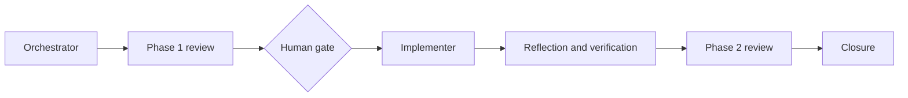

# Compact Approval Task Card v2

Use this projection for tasks that require approval. Keep full task definition
and RRI evidence in the linked task ledger or RRI artifact.

## 1. Decision header

`<Task ID> - <title> | <status> | RRI <score> <band> | Effort <S/M/L/XL> | <approval gate>`

| Routing | Resolved value |
|---|---|
| Orchestrator | `<agent and recommended model>` |
| Primary implementation | `<resolved local or cloud implementer and route>` |
| Cloud takeover | `<RRI 26-55: repair-budget exhaustion defaults to § Post-repair-budget Low-band decomposition (delegate-low-rri.py, orchestrator-only authorship) before cloud; name that step, then the last-resort trigger -> concrete model/reasoning effort. RRI 56+: trigger -> concrete model/reasoning effort directly. Use n/a only when cloud cannot take control>` |
| Fallback selection | `<human-select | preauthorized | n/a>; receipt/artifact and resume condition>` |
| RRI | `<score> -> <band>; gates: <list>; penalties: <none/list>` |
| Main drivers | `<two or three dominant RRI factors>` |
| Full evidence | `<task-ledger or RRI-artifact link>` |

## 2. Scope and acceptance

- **Objective:** `<one sentence>`
- **In scope:** `<allowed paths, modules, or behaviors>`
- **Out of scope:** `<explicit boundaries>`
- **Acceptance:**
  - `<criterion or HP-1>`
  - `<criterion or EC-1>`
- **Evidence / status sync:** `<outputs, commands, ledgers, or reports>`

When a terminal local route needs D14 or a cloud implementer, record the
`fallback-selection-v1` artifact in the task evidence. `human-select` is the
interactive default: it remains `awaiting_fallback_selection` until a human
selects model, effort, and selector. `preauthorized` is valid only when those
fields were frozen in the approved card or preflight. The orchestrator may invoke
the fallback only after validating the receipt against the exact packet; selection
never replaces the HITL gate or changes the selected role.

## 3. Agent workflow

| Phase | Responsible | Action, gate, and fallback |
|---|---|---|
| Analyze and scope | `<primary orchestrator>` | Compute RRI, freeze scope, and prepare the card |
| Phase 1 review | `<resolved reviewer>` | Must PASS; fallback `<chain>` |
| Approval | `<human approver>` | Required for RRI 26+ unless explicitly waived |
| Implement | `<resolved implementer>` | Work only in scope; RRI 26-55: repair-budget exhaustion -> decompose into Low-band subtasks first (orchestrator-only authorship, § Post-repair-budget Low-band decomposition), cloud only as last resort; RRI 56+: cloud takeover `<trigger -> concrete model/effort>` |
| Reflect and verify | `<primary orchestrator>` | `<N>` passes; run `<checks>` |
| Phase 2 review | `<resolved reviewer>` | Must PASS; fallback `<chain>` |
| Close | `<primary orchestrator>` | Emit evidence and synchronize status artifacts |

This table seeds a **live per-task todo list** (Claude Code `TodoWrite` /
Codex's own plan tracking) that the orchestrator keeps updated
phase-by-phase during execution — it is not satisfied by this static
snapshot alone. See `docs/playbooks/AGENT_WORKFLOW_GUIDE.md § Live per-task
phase todo list`.

For RRI 26–55, never state the `Implement` row's fallback as escalating
directly to cloud on repair-budget exhaustion. See
`docs/playbooks/AGENT_WORKFLOW_GUIDE.md § Post-repair-budget Low-band
decomposition` and `docs/policies/HITL_AUTONOMY_POLICY.md § Post-repair-budget
Low-band decomposition` — cloud is the fallback of last resort, not the default
next step.

For reviewed tasks:

`Task-analysis review: <reviewer> <artifact> - <PASS|BLOCKED>`

For exempt tasks:

`Task-analysis review: n/a - <exemption>`

## 4. Diagrams

Use the agent-workflow diagram for approval cards. Add one compact technical
scope diagram for development tasks. Do not exceed two diagrams.

## 5. References

`Task: <path> | Plan: <path> | Governing: <material policies/ADRs only>`

## 6. Approval checkpoint

`Execution has not started. Approve this task to proceed.`

Omit the checkpoint only when the RRI band does not require it or the user has
explicitly waived it for the bounded task. Record the waiver in the card.
